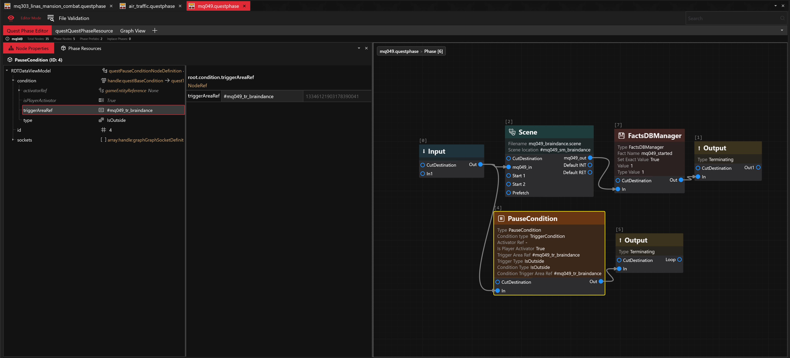

# 8.6 (Latest Stable)


**WolvenKit 8.6 is a big incremental update, expect more and more info being added relating to the changes in the update itself.**


### _Miscellaneous_

* **Launch Game from WolvenKit**\
  Wolvenkit is now able to run Cyberpunk 2077 from the app itself using the '**Launch Game**' button, with support for launching either through platforms (like Steam:// gameid links) or from the executable executable, with support for launching with specific commands (e.g. _-qualityLevel=Cinematic\_RTX)._
  * Pack, Install and Launch game is now included as well to quickly pack mod projects and launch the game.

