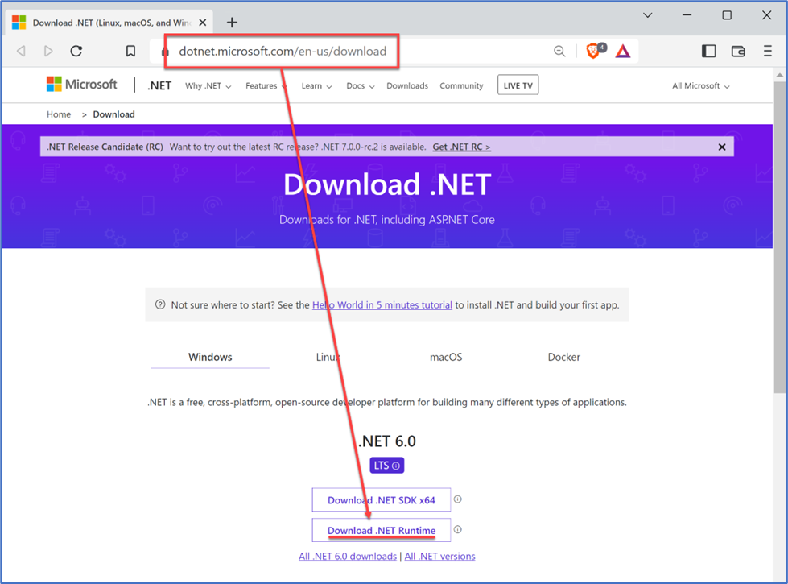
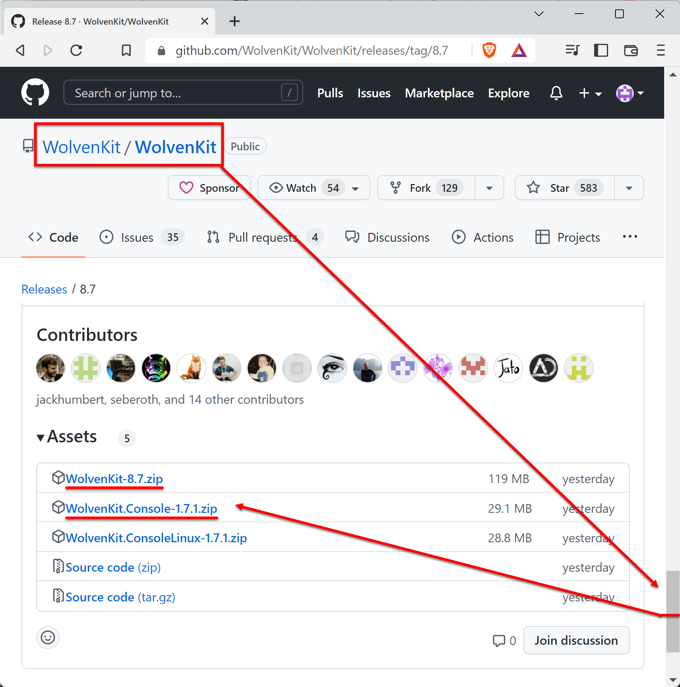
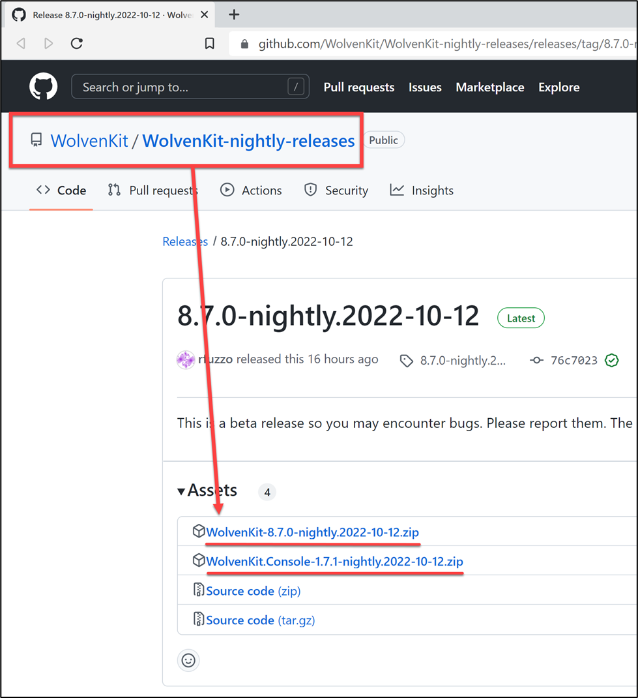
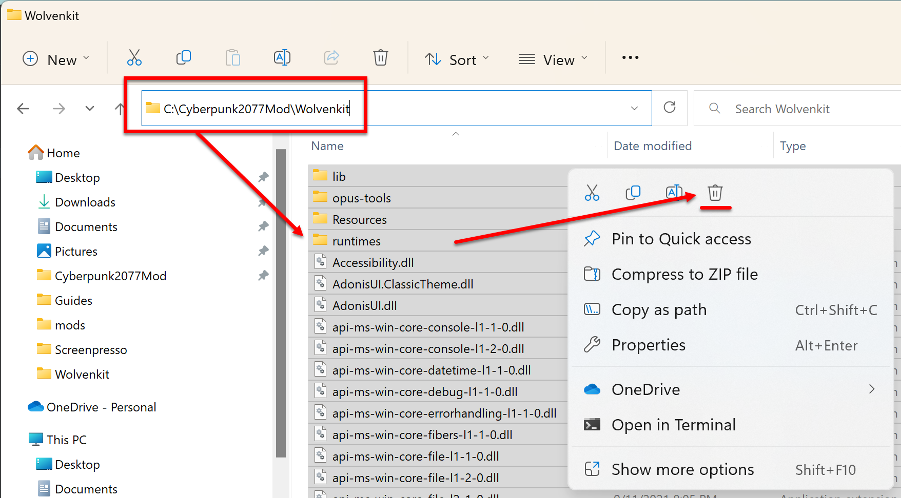
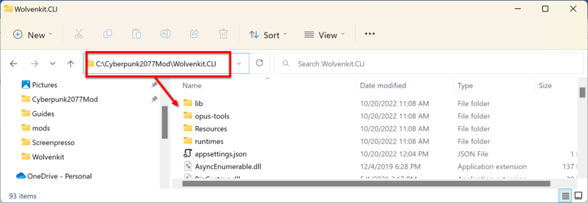

# Download, Install and Setup

## Summary

**Published: October 22 20**\
**Created by @JJTurtle**\
\
**Updated by @manavortex, July 2023**

This section will walk you through the process of downloading and installing Wolvenkit.&#x20;


There is a [Full Install Walkthrough (ELI5)](eli5-getting-started/), which you can follow if you are not very computer-savy or feel insecure about modding. If you've been sent here by the same guide, ignore this box and start with the [prerequisites](download.md#perquisites). :)&#x20;


### TL;DR

1. Install REDMod and .NET from the [Prerequisites](download.md#perquisites) section below
2. Download Wolvenkit-X.X.X.zip from github ([stable](https://github.com/WolvenKit/Wolvenkit/releases) | [nightly](https://github.com/WolvenKit/WolvenKit-nightly-releases/releases/))
3. Extract it to a folder of your choice
4. Run it and do the [initial configuration](download.md#first-launch-tl-dr)
5. Optional: Proceed to the guide how to [set up the modding tools](eli5-getting-started/configure-modding-tools.md)

## Prerequisites

For detailed instructions on installing other software that you might need for mod development, see the section&#x20;

* Windows 10/11 (64-bit) or a Linux build of your choice
* [REDMod](http://127.0.0.1:5000/s/4gzcGtLrr90pVjAWVdTc/for-mod-users/users-modding-cyberpunk-2077/redmod#installation) (Cyberpunk's modding framework)
* [Microsoft .NET 6](https://dotnet.microsoft.com/en-us/download) (<= 8.7.1)
* [Microsoft .NET 7](https://dotnet.microsoft.com/en-us/download/dotnet/7.0) (>= 8.8)


Wolvenkit is mostly developed and used on Windows — if you're on Linux, you probably know what you're doing.


Downloading .NET

Open either of these pages:&#x20;

* [6.0](https://dotnet.microsoft.com/en-us/download)
* [7.0](https://dotnet.microsoft.com/en-us/download/dotnet/7.0)

Download and install the **runtime**. (The SDK is for .NET developers…. unless you are a NET developer, and in which case do whatever you want :smile:)

## Downloading Wolvenkit

You can download Wolvenkti from any of the following links (click on the cards). If you are uncertain, go to [Nexus](https://www.nexusmods.com/cyberpunk2077/mods/2201).

<table data-view="cards"><thead><tr><th></th><th></th><th></th><th data-hidden data-card-target data-type="content-ref"></th><th data-hidden data-card-cover data-type="files"></th></tr></thead><tbody><tr><td></td><td></td><td></td><td><a href="https://github.com/WolvenKit/Wolvenkit/releases">https://github.com/WolvenKit/Wolvenkit/releases</a></td><td><a href="../.gitbook/assets/wkit_stable.png">wkit_stable.png</a></td></tr><tr><td></td><td></td><td></td><td><a href="https://www.nexusmods.com/cyberpunk2077/mods/2201">https://www.nexusmods.com/cyberpunk2077/mods/2201</a></td><td><a href="../.gitbook/assets/wkit_nexus_stable.png">wkit_nexus_stable.png</a></td></tr><tr><td></td><td></td><td></td><td><a href="https://github.com/WolvenKit/WolvenKit-nightly-releases/releases">https://github.com/WolvenKit/WolvenKit-nightly-releases/releases</a></td><td><a href="../.gitbook/assets/wkit_nightly.png">wkit_nightly.png</a></td></tr></tbody></table>


If you don't care about the differences, go to the next section: [Which version do I want?](download.md#which-version-do-i-want)



GitHub (the links with the Wolvenkit icon) is the best way to stay up-to-date with WolvenKit, as this is where development happens. You can download the latest [stable release](https://github.com/WolvenKit/Wolvenkit/releases) or Nightly [tester and developer builds](https://github.com/WolvenKit/WolvenKit-nightly-releases/releases/tag/8.9.1-nightly.2023-07-28) fresh from the pipeline.&#x20;

One of the Wolvenkit developers will download the stable version from github to put it on [Nexus](https://www.nexusmods.com/cyberpunk2077/mods/2201), so you can get it from there as well.


### What's a "Nightly" and do I want it?

The Nightly is a build of the latest development stand, created automatically every night via pipeline (hence the name). It contains new features that are being worked on, but introduces the risk of bugs.

You will usually want to use the stable version, unless you want to try out new features, help with development and testing, or generally like to live dangerously.

Here are links to the most recent build for each repository:

| Package                                                                               | Latest Release                                                                                                                                                                              | Checks                                                                                                         |
| ------------------------------------------------------------------------------------- | ------------------------------------------------------------------------------------------------------------------------------------------------------------------------------------------- | -------------------------------------------------------------------------------------------------------------- |
| [WolvenKit](https://github.com/WolvenKit/WolvenKit/releases)                          |                                    |     |
| [WolvenKit Nightly](https://github.com/WolvenKit/WolvenKit-nightly-releases/releases) |  |  |

## Which version do I want?

If you're on Nexus, then you can only download the portable (default) version. In this case, head to the next section.

Github offers you more options:


If you don't know which one to use, use the default (portable) one, it's usually the first entry in the list.

You don't need to download Wolvenkti Console, unless a (not-outdated) guide tells you so.


| Download option                                              | What is it?                                                                                                                                                                                                                                                                                                                                                |
| ------------------------------------------------------------ | ---------------------------------------------------------------------------------------------------------------------------------------------------------------------------------------------------------------------------------------------------------------------------------------------------------------------------------------------------------- |
| 
Wolvenkit-X.X.X.zip <strong>You want this</strong>
 | 

<strong>Default</strong> — the portable version: download and extract this, then start it via Wolvenkit.exe
                                                                                                                                                                                                                                  |
| Wolvenkit.Console-X.X.X.zip                                  | 
Command Line Interface (CLI): Not the same as regular Wolvenkit. Formerly known as CP2077tools, and becoming increasingly obsolete.

Used by other applications to "talk" to Wolvenkit, for example <a href="https://wiki.redmodding.org/cyberpunk-2077-modding/for-mod-creators/modding-tools/mlsetup-builder">MLSetupBuilder</a>. 
 |
| Wolvenkit.ConsoleLinux-X.X.X.zip                             | As above, but on Linux. You usually don't need this.                                                                                                                                                                                                                                                                                                       |
| WolvenkitSetup-X.X.X.zip                                     | 
The Wolvenkit <strong>installer</strong>. This will run a setup and let you pick a folder. If you're running into problems with your install, download the portable version and extract it into the directory.
                                                                                                                                   |
| 
Source code (zip) Source code (tar.gz)
             | A snapshot of the source code that was compiled into this specific release. If you're not a programmer, then you don't want this.                                                                                                                                                                                                                          |

Detailed download instructions (with screenshots!)

Download **either** Stable or Nightly release.

*   [Stable Release](https://github.com/WolvenKit/WolvenKit/releases/latest)

    <figure><figcaption></figcaption></figure>
*   [Nightly Release](https://github.com/WolvenKit/WolvenKit-nightly-releases/releases/latest)

    <figure><figcaption></figcaption></figure>

## Installing

WolvenKit is not technically installed, you extract the downloaded file into a folder and it runs as a [portable application](https://en.wikipedia.org/wiki/Portable\_application). When you update the application, you'll overwrite the existing files with those that you've newly downloaded — you don't need to delete the old files, unless you run into weird problems.&#x20;

Your settings are saved in `C:\Users\yourUserName\AppData\Roaming\REDModding\WolvenKit.`


This guide assumes that you install Wolvenkit and Wolvenkit Console to the following folders:

* Wolvenkit: `C:\Cyberpunk2077Mod\Wolvenkit`
* Wolvenkit Console (optional): `C:\Cyberpunk2077Mod\Wolvenkit.CLI`

If you use other paths, please change them accordingly.


### TLDR;

1. Download the new release, extract the files (over your old install if you have one) and run it.&#x20;
2. Optional: Proceed to the [full configuration instructions](eli5-getting-started/configure-modding-tools.md).
3. Troubleshooting: Delete everything in the install folder, then re-extract the downloaded files again.&#x20;
4. More troubleshooting: Find us on [Discord](https://discord.com/channels/717692382849663036/808086068023918603) in the [#wolvenkit-help-me](https://discord.com/channels/717692382849663036/808086068023918603) channel.

### Optional: Removing old versions

If you don't have any old versions installed, you can proceed to the next section.

1.  Delete all the files in `C:\Cyberpunk2077Mod\WolvenKit` from the previous release so that any cached and orphaned files do not corrupt the updated release.

    <figure><figcaption></figcaption></figure>
2.  Delete all the files in `C:\Cyberpunk2077Mod\WolvenKit.CLI` from the previous release so that any cached and orphaned files do not corrupt the updated release.

    <figure><figcaption></figcaption></figure>

### Extracting the downloaded files

#### Regular Wolvenkit

Extract the zip file [Wolvenkit-X.X.X.zip](download.md#detailed-download-instructions-with-screenshots) to `C:\Cyberpunk2077Mod\WolvenKit.`

<figure><figcaption></figcaption></figure>

#### Optional: Wolvenkit Console

Unpack the zip file [Wolvenkit.Console-X.X.X.zip ](download.md#detailed-download-instructions-with-screenshots)to`C:\Cyberpunk2077Mod\WolvenKit.CLI`.

<figure><figcaption></figcaption></figure>

### Optional: Creating a shortcut

If you want to launch Wolvenkit without browsing to the folder every time, you can create a custom shortcut and pin it to the start menu.

1. Go to `C:\Cyberpunk2077Mod\WolvenKit`
2. Right-click the executable `WolvenKit.exe`
3. Select "Create Shortcut"
4.  You should now see something like this:

    <figure><figcaption></figcaption></figure>

5. Click "OK"
6. Right-click on your shortcut again and select "Pin to Start Menu"
7. That's it! You can launch now!

## First Launch - TL;DR


For full instructions on how to configure Wolvenkit, please see the [detailed guide](eli5-getting-started/configure-modding-tools.md).

For a more detailed explanation of the options below, please see the [corresponding wiki page](../wolvenkit-app/settings.md#settings-explained). You can change them at any time by going to [Wolvenkit Home](../wolvenkit-app/home/) and opening the [settings page](../wolvenkit-app/settings.md).&#x20;


When launching WolvenKit for the first time you will be greeted with a welcome form asking to set your preferences. We recommend setting the path to your game files immediately.&#x20;

The **Game Executable Path** **(.exe)** is the file path or location of the Cyberpunk2077.exe file. This can be set by manually entering a file path, or using the folder icon to open Windows Explorer.&#x20;

The **Depot Path** is where WolvenKit will keep extracted Cyberpunk assets and files that are required for regular operation.
