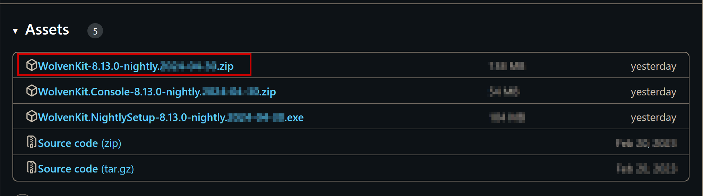

# The Wolvenkit Nightly

## What is the Nightly?

The **Nightly** is [Wolvenkit's Alpha/Beta version](https://github.com/WolvenKit/WolvenKit-nightly-releases/releases). Releases are build every day when the code changes (traditionally during the night, but this is Cyber**PUNK**), so you will always have access to the latest and hottest features.

Naturally, the Nightly will have more bugs than the stable version — but you should use it regardless, because **we need help** catching those bugs.&#x20;

For more information on this, check [#how-do-i-report-bugs](the-wolvenkit-nightly.md#how-do-i-report-bugs "mention")


You should have the [latest stable release](https://github.com/WolvenKit/WolvenKit/releases) installed as well. See [#is-it-a-regression](the-wolvenkit-nightly.md#is-it-a-regression "mention") for more information.


## How do I install it?

Download the portable version:&#x20;

<figure><figcaption></figcaption></figure>

Then, extract the downloaded .zip file into a folder on your hard drive (for example, `C:\Cyberpunk2077Mod\Wolvenkit_Nightly`) and start it. Done!

## How do I report bugs?


Before reporting a bug, make sure that you are on the [**latest Nightly**](https://github.com/WolvenKit/WolvenKit-nightly-releases/releases), and that you have a way to **reliably reproduce** the bug. We need to watch it in action, or we can't fix it.


### Is it a regression?

Double-check the bug in your **stable install**. If if works there, but doesn't work in the Nightly, then it's a **regression** (something that used to work but got broken).&#x20;

If it's broken in both places: congratulations, you've found a new bug!

### Reporting a bug

1. Head to the "Issues" section of [Wolvenkit's github](https://github.com/WolvenKit/WolvenKit/issues) \
   _(you need a github or Google account; they will not send you spam)_
2. Click the "New issue" button
3. Select the **type** of issue you are reporting (probably "bug report")
4. Give a description of the bug, including the following information:
   1. Your Nightly version (date is okay)
   2. Is the bug a regression? (Does it also happen in the latest stable?)
   3. The files necessary to make this happen, or their paths if they are vanilla files
   4. An itemized list on how to make the bug happen

