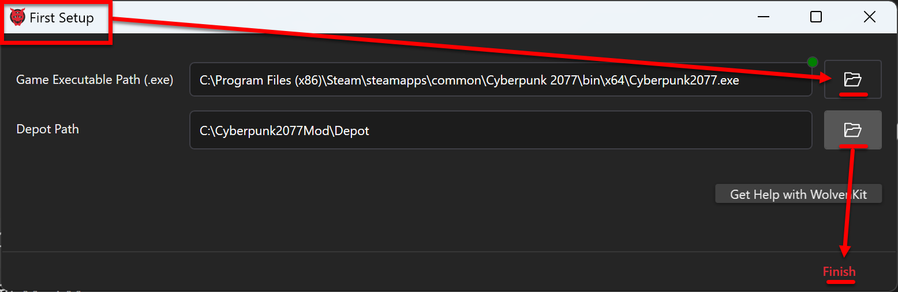

# ELI5: Configure modding tools

## Section Brief

Configure the WolvenKit (wkit) application and MlSetupBuilder (mlsb), and make sure the Asset Browser loads the game's assets.


If you do not use the folder structure I recommended in [Prep your computer](prep-your-computer.md#steps), then use whatever path WolvenKit automatically fills in for you. Also be aware that your experience will not match my screenshots.


## Configuring Wolvenkit

If your Wolvenkit is already configured (because you have followed the installation guide), then you can skip ahead to the next section about installing plugins.

Run the WolvenKit.exe application and the First Setup window will appear. Click on the folder icons to the right of each field:

* _Game Executable Path_ -- Location of the game executable Cyberpunk2077.exe
* _Depot Path_ -- C:\Cyberpunk2077Mod\Depot\\
*   Click the Finish button

    <figure><figcaption></figcaption></figure>

Configuration

1.
2. Close WolvenKit and then restart it because as of 10/12/2022 there is a bug associated with a first time launch of WolvenKit that is fixed by restarting the application.

## Installing Plugins

1. In Wolvenkit, click on HOME
2. Click on Plugins
3. REDMod should already be installed. If it isn't, please follow the instructions [here](http://127.0.0.1:5000/s/4gzcGtLrr90pVjAWVdTc/for-mod-users/users-modding-cyberpunk-2077/redmod#installation).
4. For every other plugin, click Install or Update.

<figure><figcaption></figcaption></figure>

5. Now that all plugins are installed, configure [MLSetupBuilder](http://127.0.0.1:5000/s/4gzcGtLrr90pVjAWVdTc/for-mod-creators/modding-tools/mlsetup-builder) (but read the blue box first).


If you have been following the setup instructions, then the paths you need are:&#x20;

* uncook folder: `C:\Cyberpunk2077Mod\Depot`&#x20;
* WolvenKit-CLI executable: `C:\Cyberpunk2077Mod\WolvenKit.CLI\WolvenKit.CLI.exe`&#x20;


## Testing

Let's make sure that your game path is configured correctly and that Wolvenkit can access the files:

1.  Click on Continue to Editor

    <figure><figcaption></figcaption></figure>
2. Open the Asset Browser

<figure><figcaption></figcaption></figure>

3. After several seconds, a success notification will appear and the asset folder structure will appear on the left. This means WolvenKit was able to access the Cyberpunk archive and extract the game assets.

<figure><figcaption></figcaption></figure>

Congratulations - everything is working! Now it's time to [create a depot](create-depot.md).


Please note that before you can do anything with files, you need to create a Wolvenkit project.


