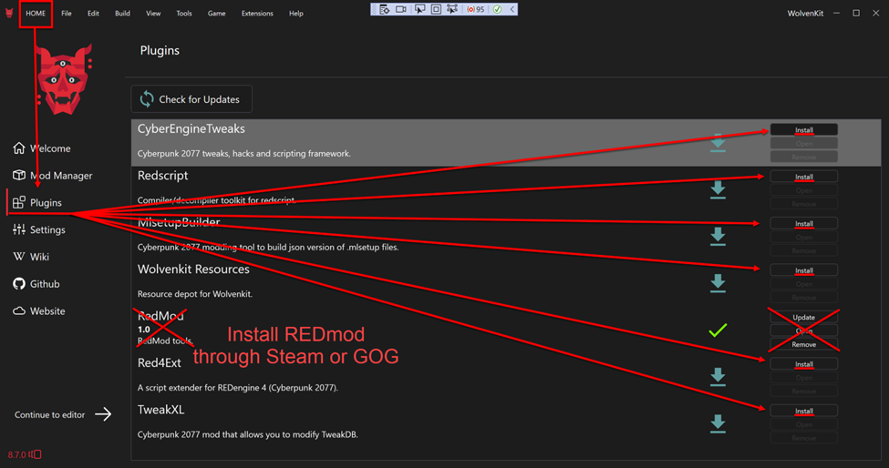
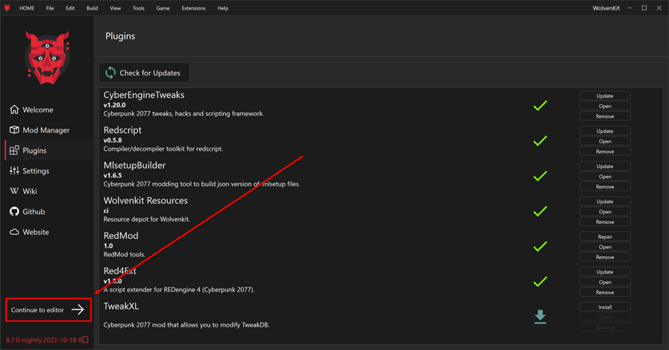
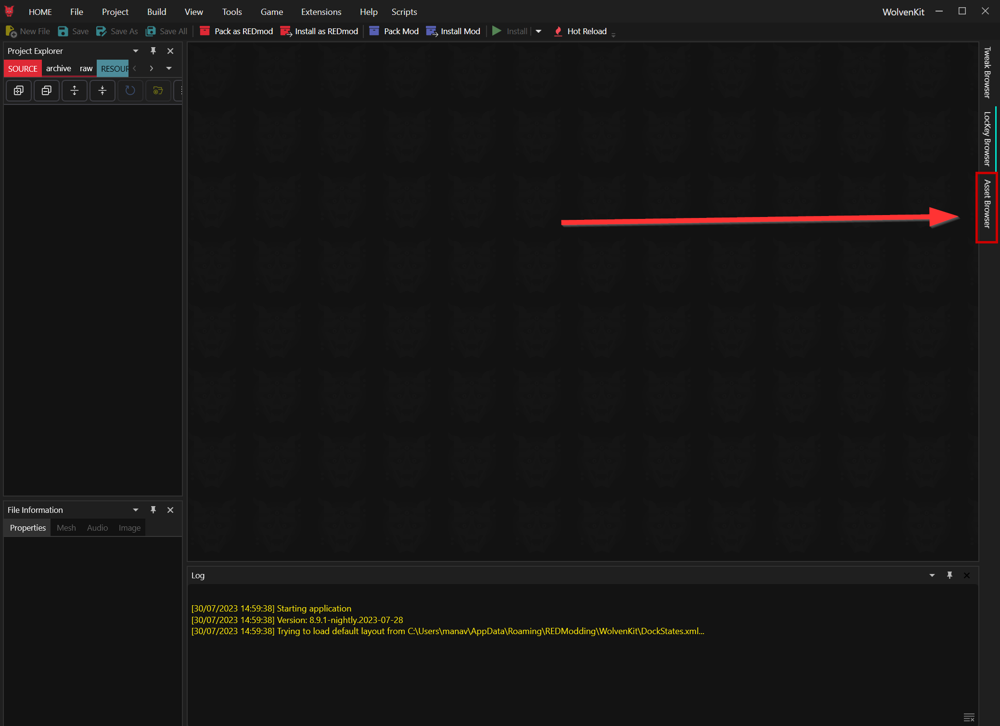

# ELI5: Configure modding tools

## Section Brief

Configure the WolvenKit (wkit) application and MlSetupBuilder (mlsb), and make sure the Asset Browser loads the game's assets.


If you do not use the folder structure I recommended in [Prep your computer](prep-your-computer.md#steps), then use whatever path WolvenKit automatically fills in for you. Also be aware that your experience will not match my screenshots.


## Configuring Wolvenkit

If your Wolvenkit is already configured (because you have followed the [installation guide](../download.md#first-launch-tl-dr)), then you don't need to do anything here.

Otherwise, please do that now or use the [settings page](../../wolvenkit-app/settings.md) to configure `Game Executable Path` and (optionally) `Depot Path`.

## Installing Plugins

1. In Wolvenkit, click on [HOME](../../wolvenkit-app/home/)
2. Click on [Plugins](../../wolvenkit-app/home/#plugins)
3. REDMod should already be installed. If it isn't, please follow the instructions [here](https://app.gitbook.com/s/4gzcGtLrr90pVjAWVdTc/for-mod-users/users-modding-cyberpunk-2077/redmod#installation).
4. For every other plugin, click `Install` or `Update`.

<figure><figcaption></figcaption></figure>

5. Now that all plugins are installed, configure [MLSetupBuilder](https://app.gitbook.com/s/4gzcGtLrr90pVjAWVdTc/for-mod-creators/modding-tools/mlsetup-builder) (but read the blue box first).


If you have been following the setup instructions exactly, then the paths you need to enter here are:&#x20;

* uncook folder: `C:\Cyberpunk2077Mod\Depot`&#x20;
* WolvenKit-CLI executable: `C:\Cyberpunk2077Mod\WolvenKit.CLI\WolvenKit.CLI.exe`&#x20;

If you have not, then your paths will be different and you need to adjust them accordingly.


## Testing

Let's make sure that your game path is configured correctly and that Wolvenkit can access the files:

1.  Click on Continue to Editor

    <figure><figcaption></figcaption></figure>
2. Open the Asset Browser

<figure><figcaption></figcaption></figure>

3. After several seconds, a success notification will appear and the asset folder structure will appear on the left. This means WolvenKit was able to access the Cyberpunk archive and extract the game assets.

<figure><figcaption></figcaption></figure>

Congratulations - everything is working! If you haven't done this during the full prep, now is a good time to [create a depot](../../wolvenkit-app/usage/create-depot/). Otherwise, you can move on to [validate-functionality.md](validate-functionality.md "mention")!


Please note that before you can do anything with files, you need to create a Wolvenkit project.


