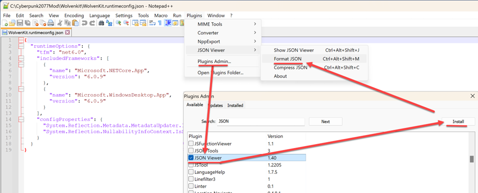

# ELI5: Full Prep for Mod Development

## Summary

**Created by @JJTurtle**\
**Published October 22 2022**

**Updated Jul 30 2023 by** [manavortex](http://127.0.0.1:5000/u/NfZBoxGegfUqB33J9HXuCs6PVaC3 "mention")


This section is optional, as most guides will tell you what programs you need anyway. If you are not computer-savy or feel very insecure about all this, then you want to read this. Otherwise, you can probably skip straight to the [configuration section](configure-modding-tools.md).


Prepare your computer with Windows configuration, basic software requirements, and creates a centralized modding location that will match what you will see in the ELI5 guide screenshots.

## Logistics: Creating the folder structure


This is a **suggestio**n. We're not your real mom, so you can put stuff where you want. However, the paths below will be used through the rest of the ELI5 guide, so you might as well stick to them.


The folder structure below will be the centralized location for modding tools, assets, project folders, guides, shortcuts, and the depot.

* [ ] Asset Depot -- `C:\Cyberpunk2077Mod\Depot\`
* [ ] Guides and misc notes -- `C:\Cyberpunk2077Mod\Guides\`
* [ ] Modding projects -- `C:\Cyberpunk2077Mod\Projects\`
* [ ] WolvenKit application -- `C:\Cyberpunk2077Mod\WolvenKit\`
* [ ] WolvenKit.CLI (console) -- `C:\Cyberpunk2077Mod\WolvenKit.CLI\`

### Recommended: Pin it to Quick Access

I recommend pinning CyberPunk2077Mod folder to File Explorer’s Quick Links. I keep going back to this parent folder to access my guides, shortcuts, to get into the asset depot, etc...

<figure><figcaption>
File Explorer view showing recommended quick link
</figcaption></figure>

## Install Wolvenkit

If you haven't done that, go and [install Wolvenkit](../download.md) now.

### Optional: Create a shortcut

To quickly open the game folder, you can create a shortcut under `C:\Cyberpunk2077Mod\`. This will save time when programs keep asking you for the install location.

By default, Cyberpunk installs to the following locations (disregard this if you've changed them):

<table><thead><tr><th width="154"></th><th></th></tr></thead><tbody><tr><td>Steam</td><td><code>C:\Program Files (x86)\Steam\steamapps\common\Cyberpunk 2077</code></td></tr><tr><td>Epic</td><td><code>C:\Program Files (x86)\Epic Games\Epic Games\Cyberpunk 2077</code></td></tr><tr><td>GOG</td><td><code>C:\Program Files (x86)\GOG Galaxy\Games\Cyberpunk 2077</code></td></tr></tbody></table>

## Optional: enable long path names

This will prevent you from running into problems because your path names are too long. Use this if you really like subfolders and/or have OCD. If you plan to put your mods in, for example, `C:\mods`, this is not necessary, but it won't hurt under any circumstances.

* Enable _Windows long path names_ and then reboot your computer.&#x20;
  1. Here is a quick link if you want to do your own research [Google search](https://www.google.com/search?q=enable+Windows+long+path+names)
  2. Otherwise, expand the [collapsed section](prep-your-computer.md#enable-long-path-names-detailed-guide) below.

Enable long path names: detailed guide

*   **Step 1**: Run PowerShell as an administrator

    <figure><figcaption></figcaption></figure>
*   **Step 2:** Copy and paste the below command into PowerShell and press the enter key

    > New-ItemProperty -Path "HKLM:\SYSTEM\CurrentControlSet\Control\FileSystem" -Name "LongPathsEnabled" -Value 1 -PropertyType DWORD -Force

    <figure><figcaption></figcaption></figure>
* **Step 3**: Install Microsoft Group Policy Editor, it is not deployed with Windows Home edition. If you have Windows Enterprise edition or know that policy editor is already installed then skip ahead to step 5.
  1.  Run CMD.EXE as an administrator,

      <figure><figcaption></figcaption></figure>
  2.  Copy and paste the below command into the command prompt window and press the enter key

      > FOR %F IN ("%SystemRoot%\servicing\Packages\Microsoft-Windows-GroupPolicy-ClientTools-Package\~\*.mum") DO ( DISM /Online /NoRestart /Add-Package:"%F" )

      <figure><figcaption></figcaption></figure>
  3.  Copy and paste the below command into the command prompt window to install Microsoft Group Policy Client Extensions

      > FOR %F IN ("%SystemRoot%\servicing\Packages\Microsoft-Windows-GroupPolicy-ClientExtensions-Package\~\*.mum") DO ( DISM /Online /NoRestart /Add-Package:"%F" )

      <figure><figcaption></figcaption></figure>
  4.  Press Windows + R to open the Run window and open gpedit.msc

      <figure><figcaption></figcaption></figure>
  5.  Navigate into the policy folders: Computer Configuration > Administrative Templates > System > Filesystem

      <figure><figcaption></figcaption></figure>
  6.  Double click into Filesystem, then select Enable Win32 long paths and then click on Edit policy setting

      <figure><figcaption></figcaption></figure>
  7.  Select Enabled and then click on OK

      <figure><figcaption></figcaption></figure>
  8. Close Windows Group Policy Editor
  9.  Reboot your computer

      

      <figure><figcaption>
Meme
</figcaption></figure>

      

## Install Microsoft .NET&#x20;

You should have done that as part of [Wolvenkit's install instructions](../download.md#perquisites). If you haven't, please do it now, because you need it.

## Enable REDMod

Redmod is CDPR's entry point for mods. For full instructions on how to enable it, see [here](http://127.0.0.1:5000/s/4gzcGtLrr90pVjAWVdTc/for-mod-users/users-modding-cyberpunk-2077/redmod#installation).

## Utilities

Other programs you might need, and what you might need them for

| Program                                                                                                             | What you need it for                                                                                                                                                                                                                                                                              |
| ------------------------------------------------------------------------------------------------------------------- | ------------------------------------------------------------------------------------------------------------------------------------------------------------------------------------------------------------------------------------------------------------------------------------------------- |
| [Blender ](https://www.blender.org/download/)([3.6](https://www.blender.org/download/releases/3-6/) as of Aug.2023) | 3d modelling - refitting, printing your V, you name it. The software is free and open source.                                                                                                                                                                                                     |
| The [Blender Plugin](https://github.com/WolvenKit/Cyberpunk-Blender-add-on) for Wolvenkit                           | Importing and exporting meshes with ease from and for Wolvenkit                                                                                                                                                                                                                                   |
| [GIMP](https://www.gimp.org/downloads/)                                                                             | Image editing. You can also use Photoshop or Paint.net.                                                                                                                                                                                                                                           |
| [Notepad++](https://notepad-plus-plus.org/downloads/)                                                               | 
Text editing. Using this rather than whatever Windows wants you to use will save you a lot of pain later-on.  If you don't know how to enable it after installation, check out the <a href="prep-your-computer.md#enabling-the-notepad++-json-viewer-plugin">instructions below</a>.
 |

Enabling the Notepad++ JSON viewer plugin

Notepad++ JSON Viewer is used to correctly format JSON syntax, such as when a file has been collapsed onto a single line.... for job security reasons :tada: Alternatively, you can install Visual Studio for its VCode JSON Viewer extension, but Visual Studio is a full featured coding solution and only needed by application developers.

### Optional: Pin them to the start menu

I recommend that you pin Blender, GIMP, and Notepad++ to your Start Menu because you’ll need to access them as you’re creating mods.

<figure><figcaption>
Windows Start Menu showing recommended pins
</figcaption></figure>


Now that wer're geared up and ready, let's proceed to the [configuration](configure-modding-tools.md).

