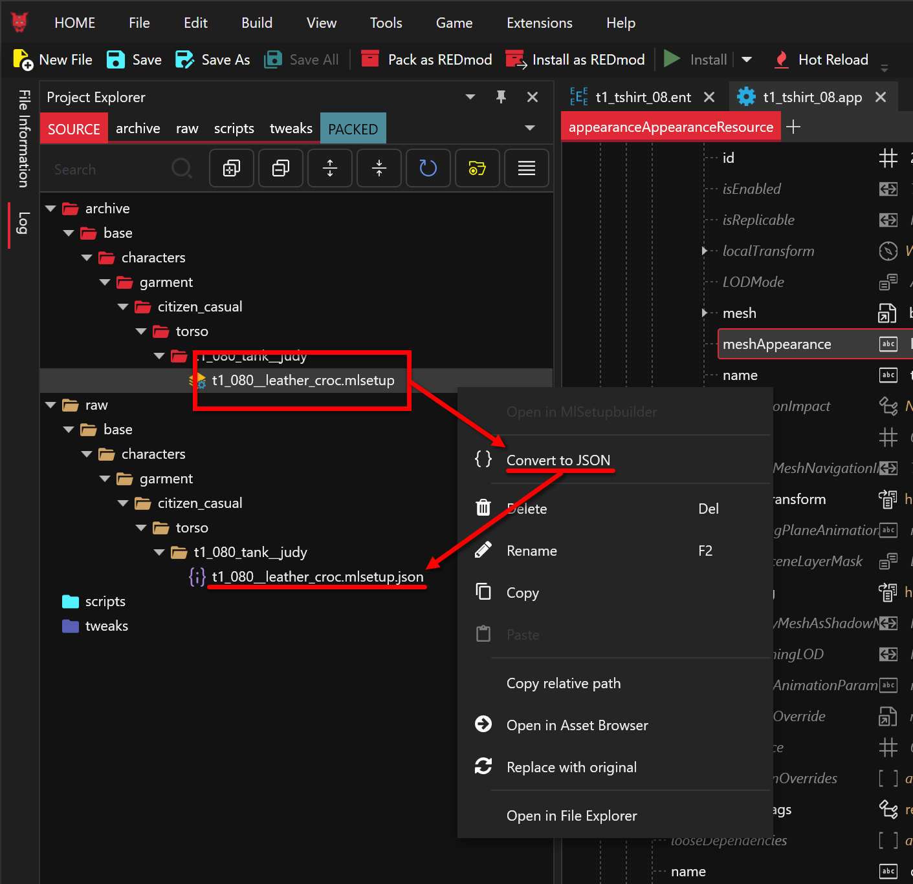
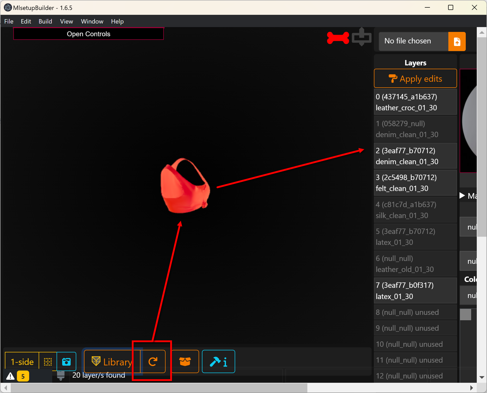
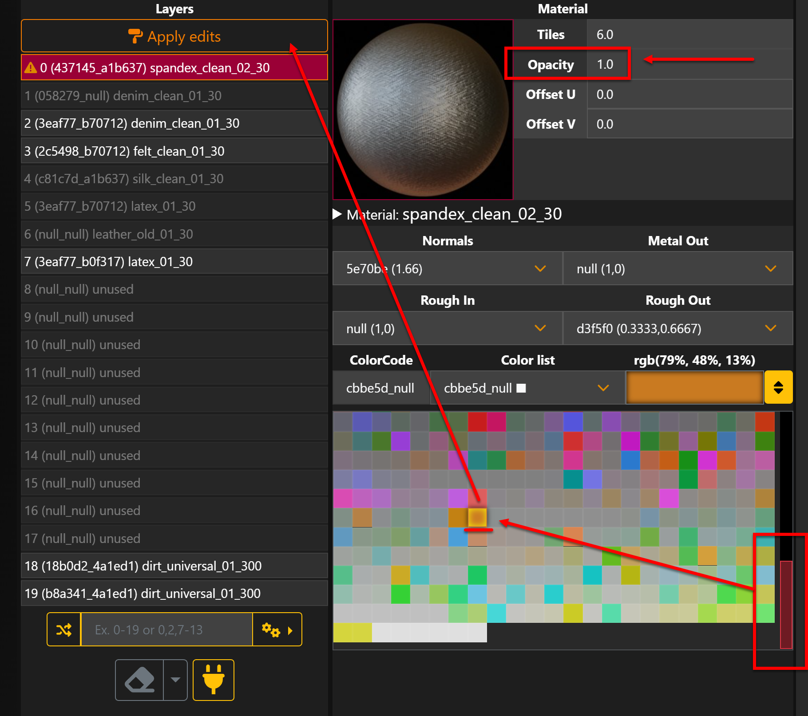
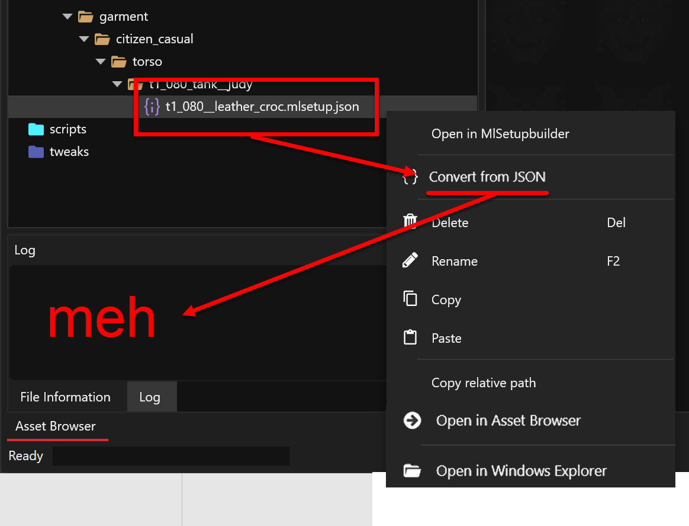

# ELI5: Validate Functionality

## Section Brief

This section is about validating the modding tools and potentially building your first mod.

Learning objectives:

* Understand how file types relate to each other,
* Identify assets with clothes in the game,
* Create and add assets to projects,
* Searching the Asset Browser,
* Understand the Project Explorer,&#x20;
* Review log for activity,&#x20;
* Understand the purpose of the Archive folders versus Raw folders,&#x20;
* Look at assets in File Editor,&#x20;
* Convert to-and-from JSON files,&#x20;
* Opening files from the Asset Browser to plugins,&#x20;
* Use the Import/Export tool,&#x20;
* Install a REDmod type of mod,&#x20;
* Look at installed mods in WolvenKit Mod Manager.

### Overview steps

1. Use the name of the game item to find the asset files in WolvenKit,
2. Find all the asset files for the item,,
3. Create the GLB and DDS file for MlSetupBuilder models,
4. Open an asset in MlSetupBuilder and change its color from green to orange,
5. Import the edited asset back into your project,
6. Install the mod,
7. Party like it’s 2077 in your new orange tank.


Some of the steps below are unnecessary, but it's important to see how:

* An in-game item is used to find the ENT file,
* The ENT file is used to find the APP file,
* The APP file is used to find the MESH file,&#x20;
* The MESH file is used to find the MLMASK and MLSETUP files,
* The MLSETUP file is used to find the MLTEMPLATE file,
* MLMASK file is used to find the DDS files,
* DDS file is used to find the XBM file.

Understanding this topology will help with your future mod development.



These steps get confusing. Just remember that we’re using the entity file **tshirt\_08\_old\_02\_w.ent** to find the material layer file **t1\_080\_\_leather\_croc.mlsetup**


## Steps

1.  To make sure you do not have any mod conflicts, please uninstall all Cyberpunk mods except for Material and Texture Override. This can normally be done by disabling the mods in Vortex or whatever mod managing application you use for your normal gameplay.

    <figure><figcaption></figcaption></figure>
2. Launch Cyberpunk 2077 and either load an existing woman character, or start a new one if you have to. If you start a new game, then you'll have to play up to the scav hunt with Jackie before you can swap your clothes.
3. Once you reach a point in the game when you can change your clothes, run the Cyber Engine Tweaks (CET) command “Game.AddToInventory("Items.TShirt\_08\_old\_02",1)”. This will load Judy’s Tank in your torso inventory.
4.  Wear the shirt, take a screenshot, save the game, and then exit the game. This screenshot will be your reference to compare against when you have made the edit.

    <figure><figcaption></figcaption></figure>
5. The name of the shirt is **Secondhand Knotted Tank** and it’s an **Inner Torso** item
6.  Navigate to Fandom’s Cyberpunk clothing page and find the asset name for Judy’s tank. Since we know the item is an inner torso shirt, please add #Inner\_Torso to the end of the URL. This convention works for all other items as well. If we want to find V’s Pants then you would add #Legs to the end of the URL. If you’re looking for blades, use Fandom’s menu to navigate to the weapons section Gameplay > Items > [Weapons and then add #Blade](https://cyberpunk.fandom.com/wiki/Cyberpunk_2077_Weapons#Blade) to the end of the URL. But in this case, we’re looking for Judy’s shirt.

    [https://cyberpunk.fandom.com/wiki/Cyberpunk\_2077\_Clothing#Inner\_Torso](https://cyberpunk.fandom.com/wiki/Cyberpunk_2077_Clothing#Inner_Torso)

    <figure><figcaption></figcaption></figure>

    <figure><figcaption></figcaption></figure>
7.  Launch WolvenKit and [#create-a-new-wolvenkit-mod-project](../../wolvenkit-app/usage/wolvenkit-projects.md#create-a-new-wolvenkit-mod-project "mention"):\
    Project Name: `judys_orange_tank` \
    Creation Location as `C:\Cyberpunk2077Mod\Projects`\
     

    <figure><figcaption></figcaption></figure>
8.  In the menu bar click on View and click on Reset Layout to make sure your screen matches the screenshots in this guide.

    <figure><figcaption></figcaption></figure>
9.  Click on the Asset Browser and search for the asset name we found on Fandom. \
    Start by searching for the entire name `tshirt_08_old_02`, then start deleting characters from the end of the name until the entity (ENT) file shows up.

    <figure><figcaption></figcaption></figure>
10. Right click the `t1_tshirt_08.ent` file and open the file without adding it to your project. \
    &#xNAN;_&#x4E;otice that the file opens in the File Editor and is not listed in the Project Explorer._

    <figure><figcaption></figcaption></figure>
11. In the File Editor, expand appearance and locate the full asset name we found on the Fandom website. \
    &#xNAN;_&#x4E;otice that in the appearances array, the name ends in “w” which stands for woman (aka “wa” which stands for woman average). Cyberpunk uses postfixes m, ma, mb, mf, w, wa, wb, and wf to describe the gender of the asset and the body type it goes to. A is average, and b and f are synonymous for big/fat. There are other postfixes, but that’s the general concept._

    <figure><figcaption></figcaption></figure>
12. In the File Editor, expand appearance 7 for `tshirt_08_old_02_w`. Click on the blue button for `apperanceResource` to open the APP file without adding it to the project.

    <figure><figcaption></figcaption></figure>
13. Now that the file editor has switched to the .app file, expand the `appearances` array. \
    The asset name we got from the Fandom website is <mark style="color:yellow;">**tshirt\_08**</mark>**\_**<mark style="color:green;">**old\_02**</mark>, which is a mashup of its entity name <mark style="color:yellow;">**tshirt\_08**</mark> and one of its appearance names <mark style="color:green;">**old\_02**</mark>. We want the woman version of that appearance, so we're looking for <mark style="color:green;">**old\_02\_w**</mark>. \
    Expand the old\_02\_w **appearance** and expand its **components**. \
    The component name will say `tank__judy`. The **meshAppearance** has a value of **leather\_croc**, and the mesh file is listed right next to it. That mesh file is used to create the GLB file that MlSetupBuilder uses to generate the tank's 3D model. \
    Click on the **yellow button** for the mesh file to add it to your project, only files added to your project will show up in the Import/Export Tool.

    <figure><figcaption></figcaption></figure>
14. In **Project Explorer**, double-click on the file, or hover your mouse cursor over the mesh file and click on the blue button to open the file in **File Editor**. \
    Expand the arrays `localMaterialBuffer` > `Materials` > `leather_croc` > `values` > `0` and `1`. \
    `[`**`0`**`]` contains the **.mlsetup** file, which you'll import into MlSetupBuilder to change Judy's Tank from green to orange. Click on the yellow button for the **MLSETUP** file to add it to your project. 

    <figure><figcaption></figcaption></figure>
15. Right click the **mlsetup** file.&#x20;



<figure><figcaption></figcaption></figure>

Right-click on the file, and select the first menu entry, Open in MlSetupBuilde



<figure><figcaption></figcaption></figure>

Right-click the json file in your raw folder, and hold down the `SHIFT` key to activate the contextual menu entries, then select "Copy absolute path": 

<figure><figcaption></figcaption></figure>

You can now click into your Windows Explorer's task bar, select or delete everything, (Hotkey: `Ctrl+A`), and paste the copied path (Hotkey: `Ctrl+V`):

<figure><figcaption></figcaption></figure>



16. Over in MlSetuipBuilder (MLSB), close the developer tool, then savagely and with mercy throw more coffee at Neurolinked#4973 (the author of this guide is not Neurolinked), and then click anywhere off the Welcome popup to get into the building tool.

<figure><figcaption></figcaption></figure>

17. On the left side, you will see a panel with the MLSetup preview. Click the "Import" button — important, do not skip this step:\
    .png>)
18. Notice that the material layers loaded but not the model. Click on **Library** to bring up the frame with the available models.\
    &#xNAN;_&#x4F;n newer versions of MLSB, you will find the Models Library button at the top._

<figure><figcaption>
If all of your layers say "(null null) unused", then you haven't imported the mlsetup correctly
</figcaption></figure>

19. Search for the mesh name from step 13 in MLSB's model library and select it. \
    You will see an error `The searched file does not exist`. Close that error by pressing OK - MLSB will now ask you if you want to uncook the file. Click "Yes": 

<figure><figcaption></figcaption></figure>

20. This can take a minute or two. Click on the console icon to keep an eye on the log - it should tell you when you're good to go.
21. Back in MlSetupBuilder, click the refresh button at the bottom of the screen. The model should load without errors and the multilayers display on the right.

    > <mark style="color:red;">**Attention:**</mark> As of MLSetupBuilder 1.6.8, the model will only **highlight the affected region**. A full material preview is planned for 1.6.9.

    <figure><figcaption></figcaption></figure>
22. Let's change material first: \
    select the leather\_croc layer and then click the **Material** dropdown. Type spandex into the search box and select `spandex_clean_02_30` material.

    > <mark style="color:red;">**Attention:**</mark> A MultilayerMask file supports 20 layers; computers start counting at 0 rather than 1. The number in the name describes the corresponding mask layer.

    <figure><figcaption></figcaption></figure>
23. **Normals**, **Metal Out**, **Rough In** and **Rough Out** represent how light interacts with the material surface:

    
<figure><figcaption>
The hex values in the dropdown represent lookup keys - the important value is in the brackets behind it
</figcaption></figure>

    * **Normals**: Intensity of the [normal map](https://app.gitbook.com/s/4gzcGtLrr90pVjAWVdTc/modding-guides/textures-and-luts/self-made-normal-maps)
    * **Metal Out**: Defines the outside of the material as diffuse with a white dielectric coating (0.0) or metallic (1.0)
    * **Rough Inside**/**Rough Outside**: Sets the roughness of the surface, where 0.0 is completely smooth, and 1.0 is completely rough (wholly diffuse).
24. Set the Normals to `1.66`, Metal and Rough Inside to null, and Rough Outside to `0.3333,0.6666`.
25. Scroll down the color grid, select orange, and then click the Apply Edits button. Notice that the wording in the layer changes to match your selections.&#x20;

    > <mark style="color:red;">**Attention:**</mark> Set Opacity to 1.0 (100% visible) — the first layer does not allow transparency.

    <figure><figcaption></figcaption></figure>
26. With the layer updated, click on `Export` (Hotkey: `Ctrl+E`). The dialogue should already show you the exported file; overwrite it.

    When you click on Save, click on **Yes** to replace the existing file. There is no need to save a copy of the original, because you can repeat step 16 to re-create it.

    <figure><figcaption></figcaption></figure>
27. Back in WolvenKit, right click on the JSON file and select the second entry to convert it back:

    <figure><figcaption></figcaption></figure>
28. Our MLSetup is now imported (you can check the log view to sere a success message).&#x20;
29. We will now **install our mod**. For that purpose, we'll use the Install and Launch button: 

    <figure><figcaption></figcaption></figure>

    \
    _You can also pack your mod as_ [_REDmod_](https://wiki.redmodding.org/cyberpunk-2077-modding/for-mod-creators-theory/modding-tools/redmod)_. By default, that button is hidden from the toolbar — you can re-enable it in settings. As pretty much everyone defaults to the vanilla format, we're going to do the same._
30. This will do the following things:
    1. pack your mod to the packed folder in your project directory
    2. install the created .archive to [`Cyberpunk 2077`](https://app.gitbook.com/s/4gzcGtLrr90pVjAWVdTc/for-mod-users/users-modding-cyberpunk-2077/the-cyberpunk-2077-game-directory)`\archive\pc\mod`
    3. launch the game for you.
31. Load your saved game from step 4. How you launch the game doesn’t matter because the mod is deployed directly to the game’s install directory. Enter your inventory and you’ll notice that the tank you created in step 3 changed from green leather to orange spandex.

    <figure><figcaption></figcaption></figure>
32. Congratulations! You have now validated that WolvenKit is deployed and setup correctly on your computer. Happy modding!
