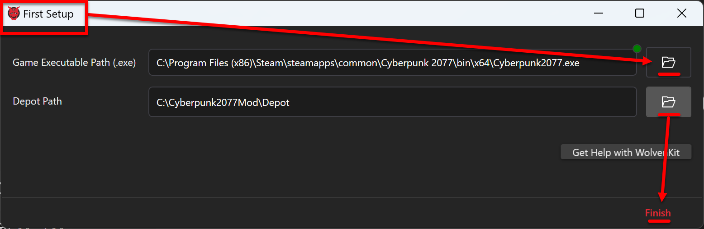

# Configure modding tools

### Section Brief

Configure the WolvenKit (wkit) application and MlSetupBuilder (mlsb), and make sure the Asset Browser loads the game's assets.


If you do not use the folder structure I recommended in [Prep your computer](prep-your-computer.md#steps), then use whatever path WolvenKit automatically fills in for you. Also be aware that your experience will not match my screenshots.


### Steps

1. Run the WolvenKit.exe application and the First Setup window will appear. Click on the folder icons to the right of each field:
   * _Game Executable Path_ -- Location of the game executable Cyberpunk2077.exe
   * _Depot Path_ -- C:\Cyberpunk2077Mod\Depot\\
   *   Click the Finish button

       <figure><figcaption></figcaption></figure>
2. Close WolvenKit and then restart it because as of 10/12/2022 there is a bug associated with a first time launch of WolvenKit that is fixed by restarting the application.
3.  In WolvenKit, click on HOME then Plugins and click on Install/Update for every Plugin on the list, except for REDmod because it is installed through Steam or GOG. If you have not installed REDmod then please do step 6 - 7 on [Prep your computer](prep-your-computer.md#steps).

    <figure><figcaption></figcaption></figure>
4.  For MlSetupBuilder click on Open to configure it for your Depot and WolvenKit.CLI

    <figure><figcaption></figcaption></figure>
5.  Close the developer tools, throw some coffee at Neurolinked#4973, and then click off the Welcome popup to get into the building tool.

    <figure><figcaption></figcaption></figure>
6.  Click on File and then Preferences. Set the uncook folder to C:\Cyberpunk2077Mod\Depot and set the WolvenKit-CLI executable to C:\Cyberpunk2077Mod\WolvenKit.CLI\WolvenKit.CLI.exe. Click on Save Preferences and then Exit.

    <figure><figcaption></figcaption></figure>
7.  Back in WolvenKit, on the bottom left click on Continue to Editor

    <figure><figcaption></figcaption></figure>
8.  On the bottom left click on Asset Browser and then click Load Asset Browser.

    <figure><figcaption></figcaption></figure>
9.  After several seconds a success notification will appear and the asset folder structure will appear on the left. This means WolvenKit was able to access the Cyberpunk archive and extract the game assets.

    <figure><figcaption></figcaption></figure>
