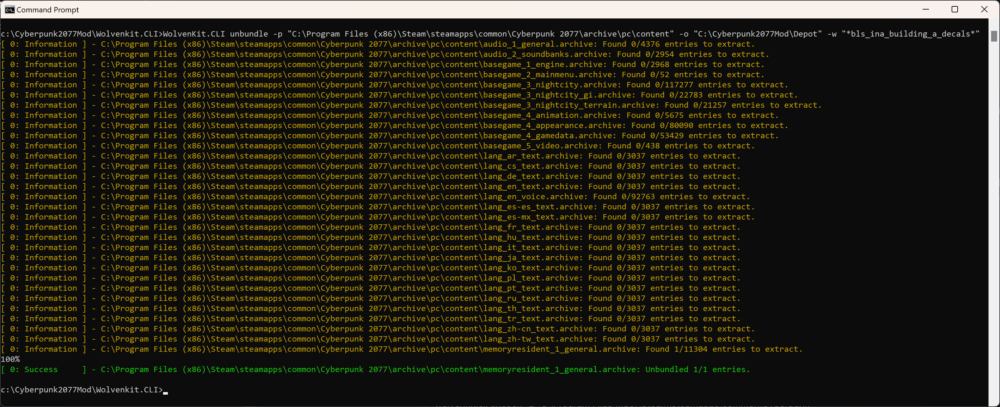
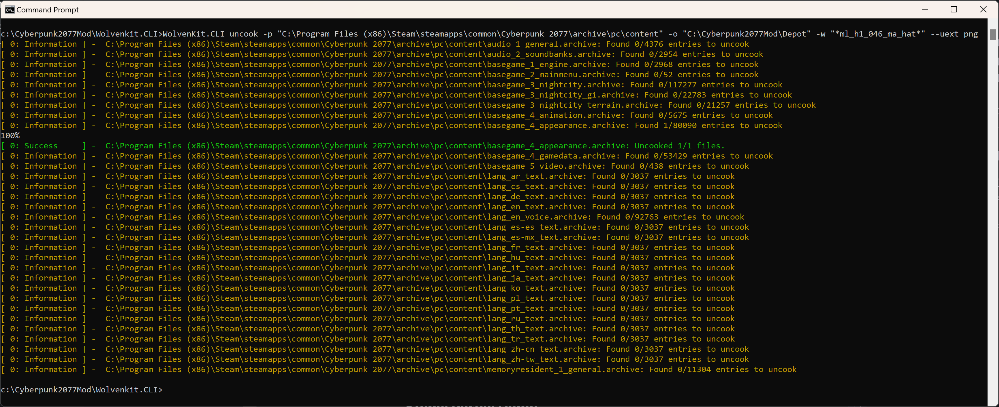

# Create Depot

## Section Brief

There are three methods of creating and maintaining a depot.

1. ****[**Adhoc Depot**](create-depot.md#steps-adhoc-depot) is the manual process of creating the asset files as you need them. The general idea is that almost all the files you need are already accessible to WolvenKit. The biggest benefit is the minimal disk space usage. The biggest detractor is that it places breaks in your development while you locate, uncook, and unbundle the assets you need.
2. ****[**Partial Depot**](create-depot.md#steps-partial-depot) is mostly uncooked and unbundled, and it's only missing the GLB files. Unless you are needing that specific file type, this depot has everything you will need. The biggest benefit is that nearly everything is ready to use and that means very likely little to no pauses in your development. The biggest detractor is that it requires 120GiB of disk space.
3. ****[**Full Depot**](create-depot.md#steps-full-depot) is every asset available to us. The biggest benefit is that everything is ready to use and that means no pauses in your development. The biggest detractor is that it requires 160GiB of disk space.

## Steps: Adhoc Depot


Uncooking can be done in the Import/Export tool, but you will need to use WolvenKit.CLI for the unbundling anyway, so you might as well get used to the console commands.


1.  Run CMD.EXE

    <figure><figcaption></figcaption></figure>
2.  Change directory to WolvenKit.CLI

    <figure><figcaption></figcaption></figure>
3.  Identify if the file you need falls under the category of uncook or unbundle.

    <figure><figcaption></figcaption></figure>
4.  If you need to unbundle then use the following command. In the parameter -w “_xxx_”, replace xxx with the filename you’re looking. For example, in the below image I need the file bls\_ina\_building\_a\_decals.mi

    > WolvenKit.CLI unbundle -p "C:\Program Files (x86)\Steam\steamapps\common\Cyberpunk 2077\archive\pc\content" -o "C:\Cyberpunk2077Mod\Depot" -w "\*_bls\_ina\_building\_a\_decals\*_"

    <figure><figcaption></figcaption></figure>
5.  If you need to uncook masks then use the following command. The parameter -w searches for a file in the game's archive with the name "_xxx_”. You can use asterisks for wildcards such as "\*hat\*farmer\*". In this example, when I tried viewing the model for  farmer hat in MlSetupBuilder, it warned that it was missing the file ml\_h1\_046\_ma\_hat\_\_farmer\_masksset\_19.dds. You can put the entire filename in -w and slowly start removing the last character in the filename until you get the asset, or there are strategies to find the name in WolvenKit. For an Adhoc Depot, hunting down the name is most of the fun.

    > wolvenkit.cli uncook -p "C:\Program Files (x86)\Steam\steamapps\common\Cyberpunk 2077\archive\pc\content" -o "C:\Cyberpunk2077Mod\Depot" -w "\*_ml\_h1\_046\_ma\_hat\*.mlmask_" --uext dds

    <figure><figcaption></figcaption></figure>
6.  If you need to uncook normal maps then use the following command. The parameter -w searches for a file in the game's archive with the name "_xxx_” and the image encoding set to PNG for lossless compression. You can use asterisks for wildcards such as "\*hat\*farmer\*". In this example, when I tried viewing the model for farmer hat in MlSetupBuilder, it warned that it was missing the file h1\_046\_ma\_hat\_\_farmer.glb. You can put the entire filename in -w and slowly start removing the last character in the filename until you get the asset, or there are strategies to find the name in WolvenKit. For an Adhoc Depot, hunting down the name is most of the fun..

    > WolvenKit.CLI uncook -p "C:\Program Files (x86)\Steam\steamapps\common\Cyberpunk 2077\archive\pc\content" -o "C:\Cyberpunk2077Mod\Depot" -w "\*_ml\_h1\_046\_ma\_hat\*_" --uext png

    <figure><figcaption></figcaption></figure>

## Steps: Partial Depot


Some of the unbundle files are already accessible in the WolvenKit Asset Browser. You may want to search for the files you want in Asset Browser before unbundling the game.


1.  Launch WolvenKit application and click on Tools then Depot Generator.

    <figure><figcaption></figcaption></figure>
2.  Click into the field next to Depot Path and select the folder C:\Cyberpunk2077Mod\Depot

    <figure><figcaption></figcaption></figure>
3.  For masks, select DDS and then click the Generate Materials button. While the program is running, the button will deactivate and once the program is complete File Explorer will automatically open at the location of your Depot.

    <figure><figcaption></figcaption></figure>
4.  For normal maps, select PNG and then click the Generate Materials button. While the program is running, the button will deactivate and once the program is complete File Explorer will automatically open at the location of your Depot.

    <figure><figcaption></figcaption></figure>
5.  For the following list of files, click on the Unbundle Game button: radient, w2mi, matlib, remt, sp, hp, fp, mi, mt, mlsetup, mltemplate, and texarray.

    <figure><figcaption></figcaption></figure>

## Steps: Full Depot


When the unbundling and uncooking reaches 99% complete, press CTRL+C to cancel the program because without limiters it wll get stuck and never reach 100%&#x20;


1.  Run CMD.EXE

    <figure><figcaption></figcaption></figure>
2.  Change directory to WolvenKit.CLI

    <figure><figcaption></figcaption></figure>
3.  Run the following command to unbundle all assets. You can ignore any red failures and purple warning message. Just wait for 99% and press Ctrl+C

    <figure><figcaption></figcaption></figure>
4.  Run the following command to uncook all normal map assets. You can ignore any red failures and purple warning message. Just wait for 99% and press Ctrl+C

    <figure><figcaption></figcaption></figure>
5.  Run the following command to uncook all mask assets. You can ignore any red failures and purple warning message. Just wait for 99% and press Ctrl+C

    <figure><figcaption></figcaption></figure>
