# Create Depot

## Section Brief

There are three methods of creating and maintaining a depot:


I recommend that you skip this section for now and do the Validate Functionality steps first. Based on what you learn there, make the decision which kind of Depot you want.


1. ****[**Adhoc Depot**](create-depot.md#steps-adhoc-depot) is the manual process of creating the asset files as you need them. The general idea is that almost all the files you need are already accessible to WolvenKit. The biggest benefit is the minimal disk space usage. The biggest detractor is that it places breaks in your development while you locate, uncook, and unbundle the assets you need.
2. ****[**Partial Depot**](create-depot.md#steps-partial-depot) is mostly uncooked and unbundled, and it's only missing the GLB files. Unless you are needing that specific file type, this depot has everything you will need. The biggest benefit is that nearly everything is ready to use and that means very likely little to no pauses in your development. The biggest detractor is that it requires 120GiB of disk space.
3. ****[**Full Depot**](create-depot.md#steps-full-depot) is every asset available to us. The biggest benefit is that everything is ready to use and that means no pauses in your development. The biggest detractor is that it requires 160GiB of disk space.

## Steps: Adhoc Depot


If you understand how the asset files relate to each other, then an Adhoc Depot works perfectly fine. Be aware that experience and knowledge are required if this is the type of depot you want to maintain.

* An in-game item is used to find the ENT file,
* The ENT file is used to find the APP file,
* The APP file is used to find the MESH file,&#x20;
* The MESH file is used to find the MLMASK, MLSETUP, and XBM files, and it can be exported to create the GLB file,
* The MLSETUP file is used to find the material layers and the MLTEMPLATE file,
* MLMASK file can be exported to create the DDS files,
* DDS file can be imported to create the XBM file, but the XBM file can also be accessed directly from the MESH.


1.  Add the asset to your project which also adds the asset to the Import/Export Tool.

    <figure>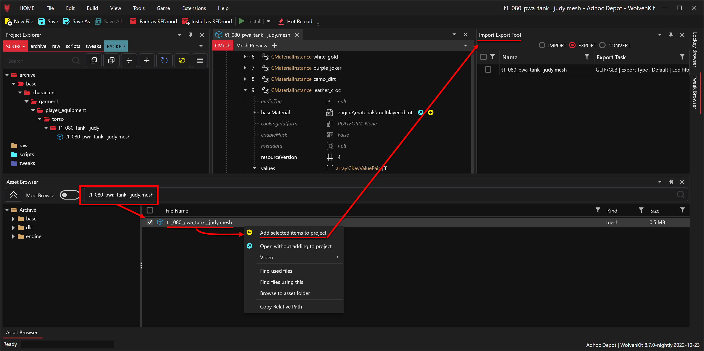<figcaption></figcaption></figure>
2.  Open the Import/Export Tool, right click on asset, and click on Show Settings. Most of the time the default settings will provide you the output you're needing, but for DDS files from MLMASK and if you need the rig files, then you'll need to get into the settings to make those alterations.

    <figure>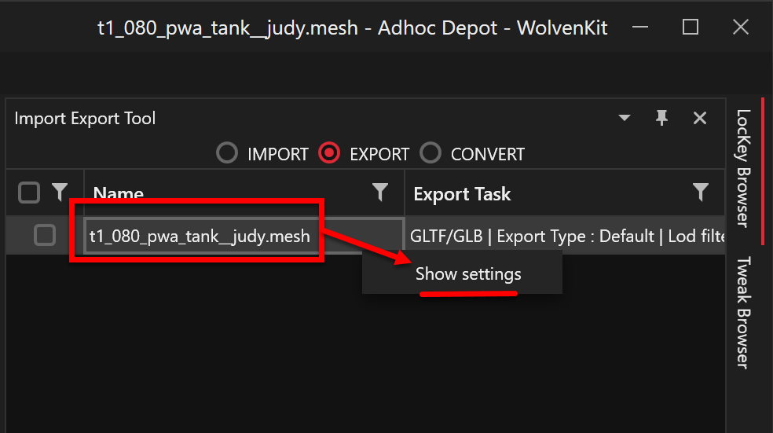<figcaption></figcaption></figure>
3.  Once you have the settings to what you need, either select the files you want to export and click the Process Selected button, or click the Process All for everything on the list.

    <figure>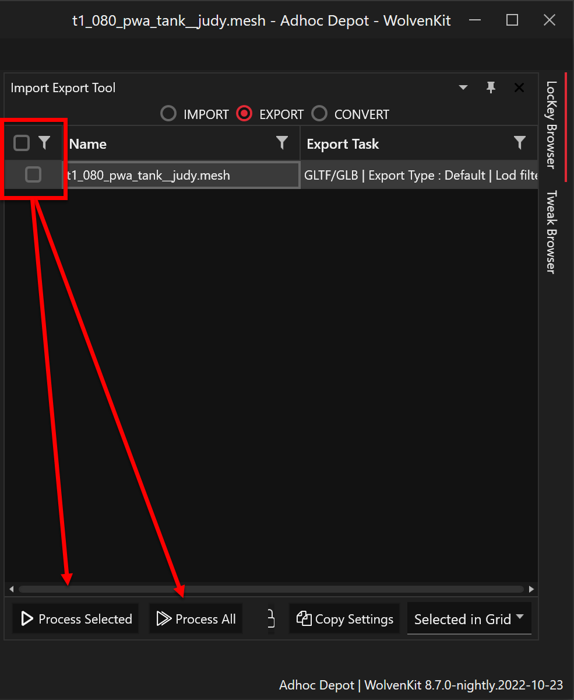<figcaption></figcaption></figure>

## Steps: Partial Depot


Some of the unbundle files are already accessible in the WolvenKit Asset Browser. You may want to search for the files you want in Asset Browser before unbundling the game. For the ones that aren't, the source files can be accessed through the mesh file and the Import/Export tool will generate them.


1.  Launch WolvenKit application and click on Tools then Depot Generator.

    <figure>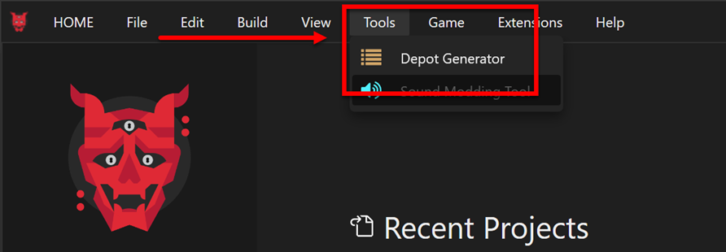<figcaption></figcaption></figure>
2.  Click into the field next to Depot Path and select the folder C:\Cyberpunk2077Mod\Depot

    <figure>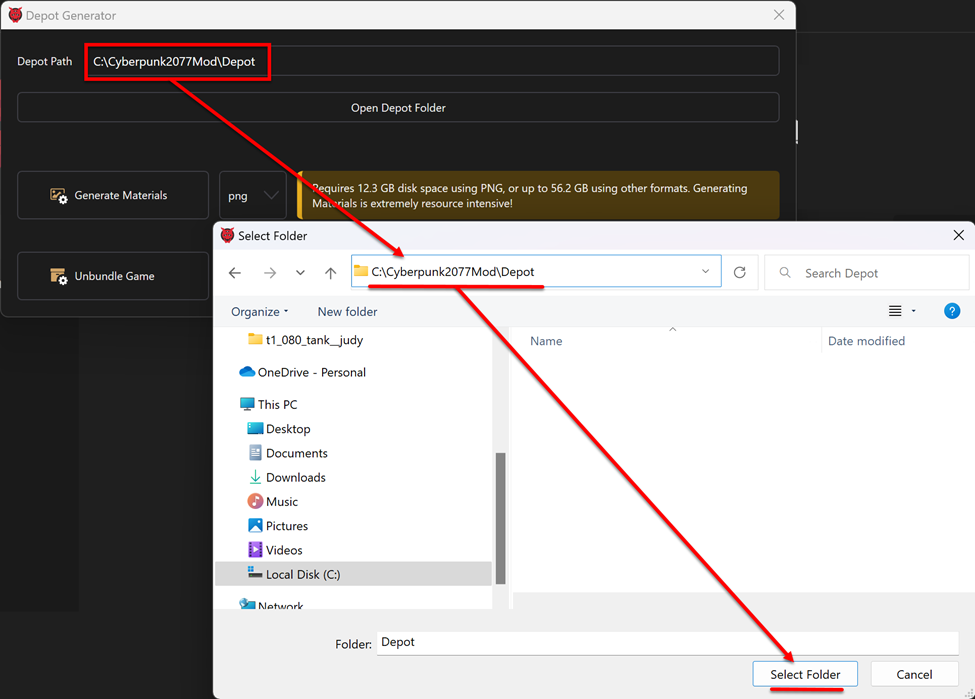<figcaption></figcaption></figure>
3.  For masks, select DDS and then click the Generate Materials button. While the program is running, the button will deactivate and once the program is complete File Explorer will automatically open at the location of your Depot.

    <figure>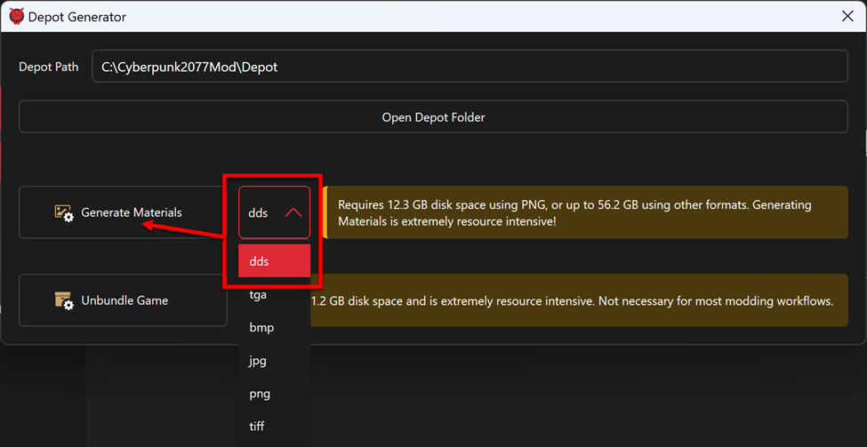<figcaption></figcaption></figure>
4.  For normal maps, select PNG and then click the Generate Materials button. While the program is running, the button will deactivate and once the program is complete File Explorer will automatically open at the location of your Depot.

    <figure>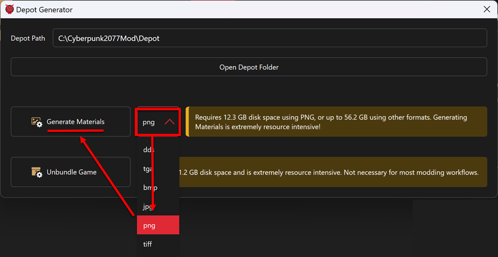<figcaption></figcaption></figure>
5.  For the following list of files, click on the Unbundle Game button: radient, w2mi, matlib, remt, sp, hp, fp, mi, mt, mlsetup, mltemplate, and texarray.

    <figure>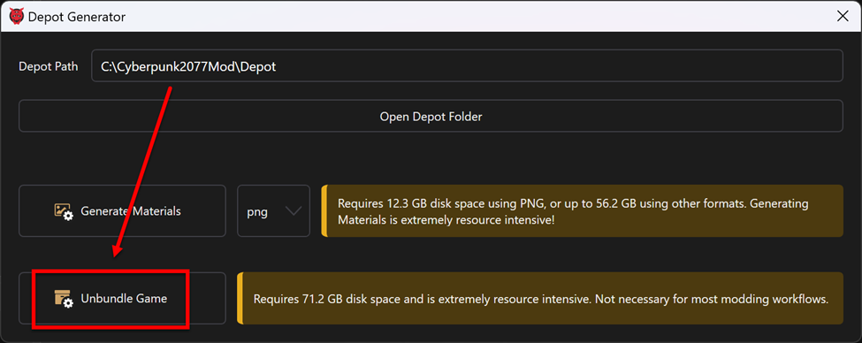<figcaption></figcaption></figure>

## Steps: Full Depot


When the unbundling and uncooking reaches 99% complete, press CTRL+C to cancel the program because without limiters it wll get stuck and never reach 100%&#x20;


1.  Run CMD.EXE

    <figure>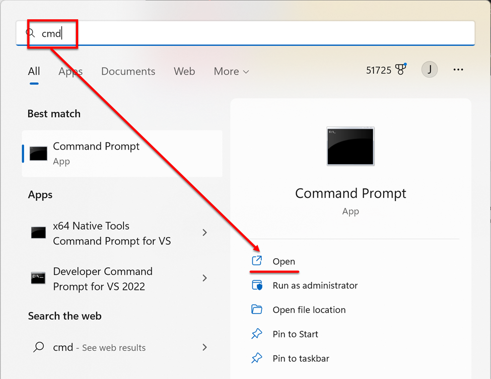<figcaption></figcaption></figure>
2.  Change directory to WolvenKit.CLI

    <figure>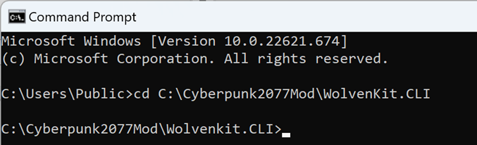<figcaption></figcaption></figure>
3.  Run the following command to unbundle all assets. You can ignore any red failures and purple warning message. Just wait for 99% and press Ctrl+C

    `WolvenKit.CLI unbundle -p "C:\Program Files (x86)\Steam\steamapps\common\Cyberpunk 2077\archive\pc\content" -o "C:\Cyberpunk2077Mod\Depot"`

    <figure><figcaption></figcaption></figure>
4.  Run the following command to uncook all normal map assets. You can ignore any red failures and purple warning message. Just wait for 99% and press Ctrl+C

    `WolvenKit.CLI uncook -p "C:\Program Files (x86)\Steam\steamapps\common\Cyberpunk 2077\archive\pc\content" -o "C:\Cyberpunk2077Mod\Depot" --uext png`

    <figure><figcaption></figcaption></figure>
5.  Run the following command to uncook all mask assets. You can ignore any red failures and purple warning message. Just wait for 99% and press Ctrl+C

    `WolvenKit.CLI uncook -p "C:\Program Files (x86)\Steam\steamapps\common\Cyberpunk 2077\archive\pc\content" -o "C:\Cyberpunk2077Mod\Depot" --uext dds`

    <figure>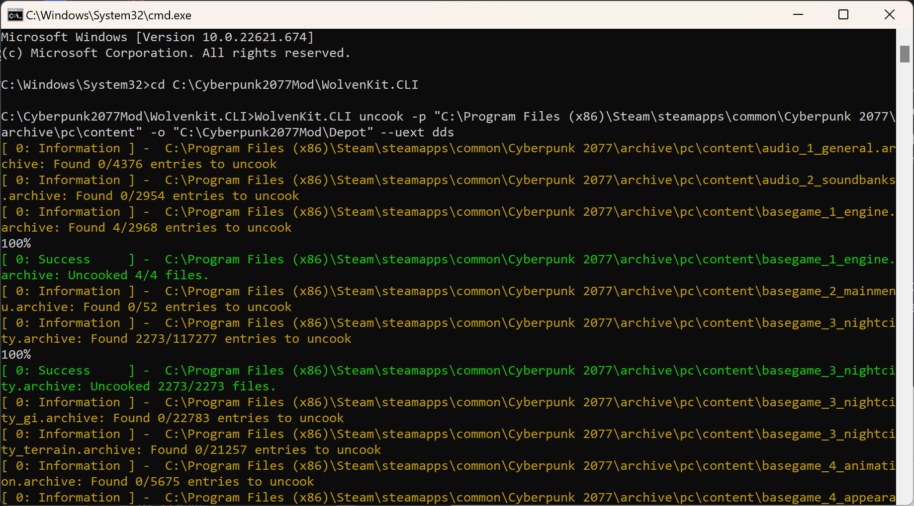<figcaption></figcaption></figure>
