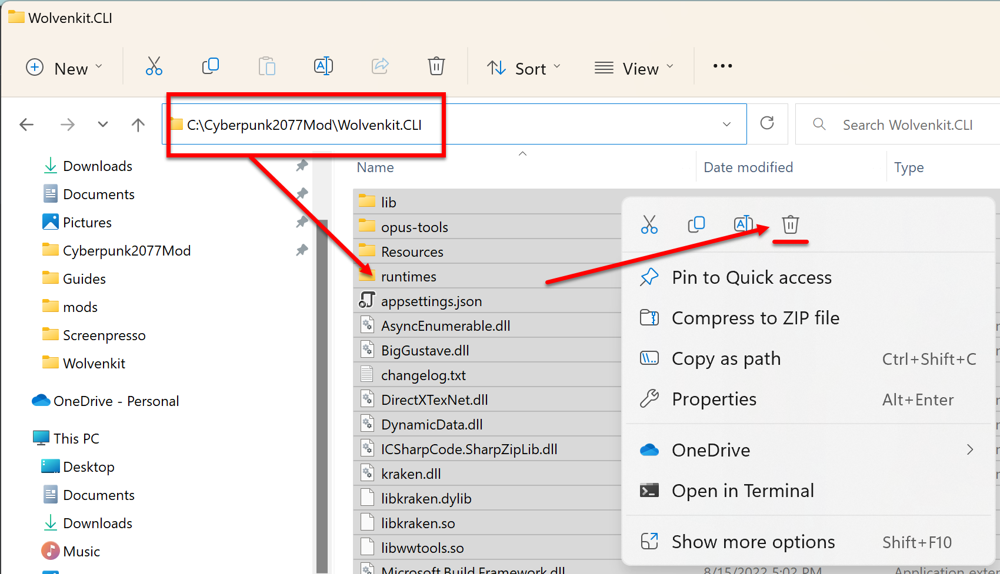
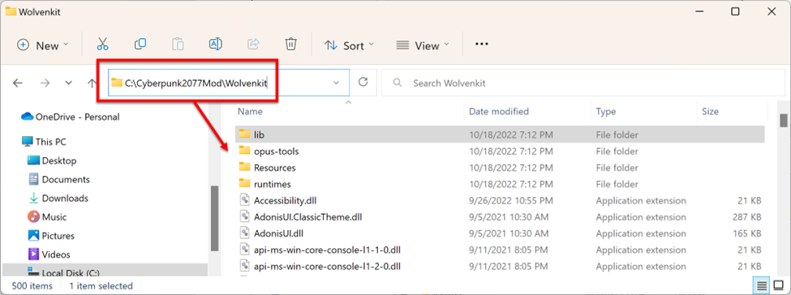
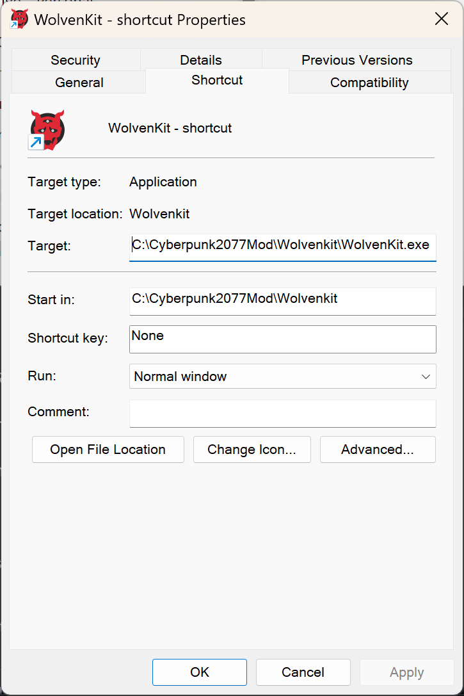

# Download WolvenKit

## Section Brief

There are two releases of WolvenKit with different release schedules and change management policies. You only need one of the releases, stable or nightly, don't bother downloading both.

1. **Stable Release** has an as-needed release schedule based on Cyberpunk 2077 patch changes, WolvenKit bug fixes, updated WolvenKit functionality, and the realities of being a fan-made application by unpaid developers. Change management policies are an as-is rollup from the latest Nightly release.
2. **Nightly Release** has a release schedule of every night at 12:00 AM UTC and contains the last 24-hours of GitHub pull requests submitted by the WolvenKit developer community. Change management policies are a review and approval by the maintainer of the GitHub repository to merge the branch coding changes into the project.


The nightly version is updated almost every day and that introduces: 1) the risk of instability, 2) name changes to features, and 3) features getting moved around in the application. I promise that it isn’t as bad as it sounds, but you need to be aware that it could happen.


## Download and Use

### TLDR;

Delete previous release, download the new release, then extract and run it.

### Brief

WolvenKit is not technically installed, you extract the downloaded file into a folder and it runs as a [portable application](https://en.wikipedia.org/wiki/Portable\_application). When you update the application, you will want to delete all the files from the previous version and extract the new version in the previous version's place.

## Steps:

1.  Delete all the files in C:\Cyberpunk2077\WolvenKit.CLI from the previous release so that any cached and orphaned files do not corrupt the updated release.

    <figure><figcaption></figcaption></figure>
2.  Delete all the files in C:\Cyberpunk2077\WolvenKit.CLI from the previous release so that any cached and orphaned files do not corrupt the updated release.

    <figure><figcaption></figcaption></figure>
3. You do not need both releases, download the ZIP files for either Stable or Nightly release.
   *   [Stable Release](https://github.com/WolvenKit/WolvenKit/releases/latest)

       <figure><figcaption></figcaption></figure>
   *   [Nightly Release](https://github.com/WolvenKit/WolvenKit-nightly-releases/releases/latest)

       <figure><figcaption></figcaption></figure>
4.  Extract the WolvenKit ZIP to C:\Cyberpunk2077Mod\WolvenKit\\

    <figure><figcaption></figcaption></figure>
5.  Extract the WolvenKit.CLI (console) ZIP to C:\Cyberpunk2077Mod\WolvenKit.CLI\\

    <figure><figcaption></figcaption></figure>
6.  Create a shortcut in the folder C:\Cyberpunk2077Mod\ to the WolvenKit executable C:\Cyberpunk2077Mod\WolvenKit\WolvenKit.exe, and then pin the shortcut to Windows Start. The reason you want to do this is because every time you update WolvenKit, any pins directly to the application will break, so pinning a shortcut is a workaround to that problem.

    <figure><figcaption></figcaption></figure>
