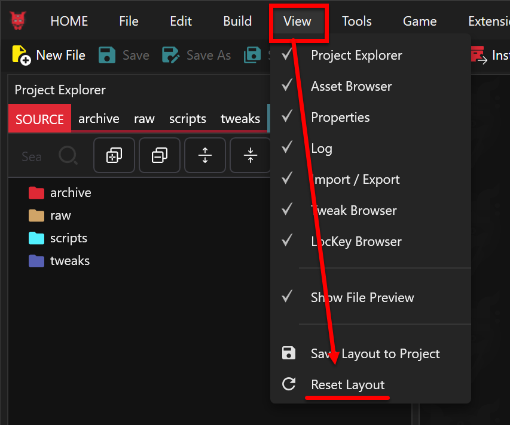
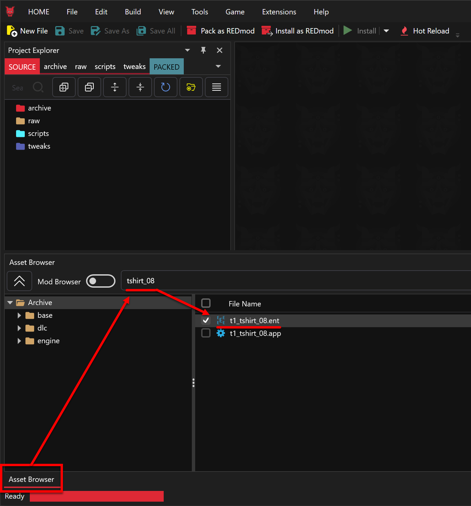
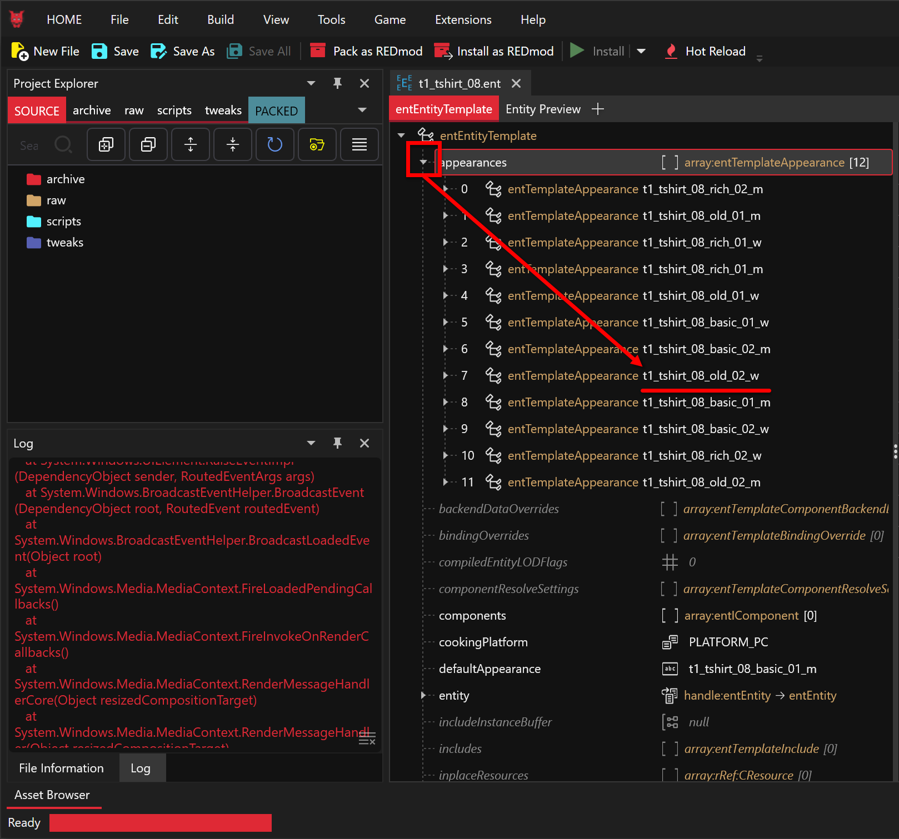
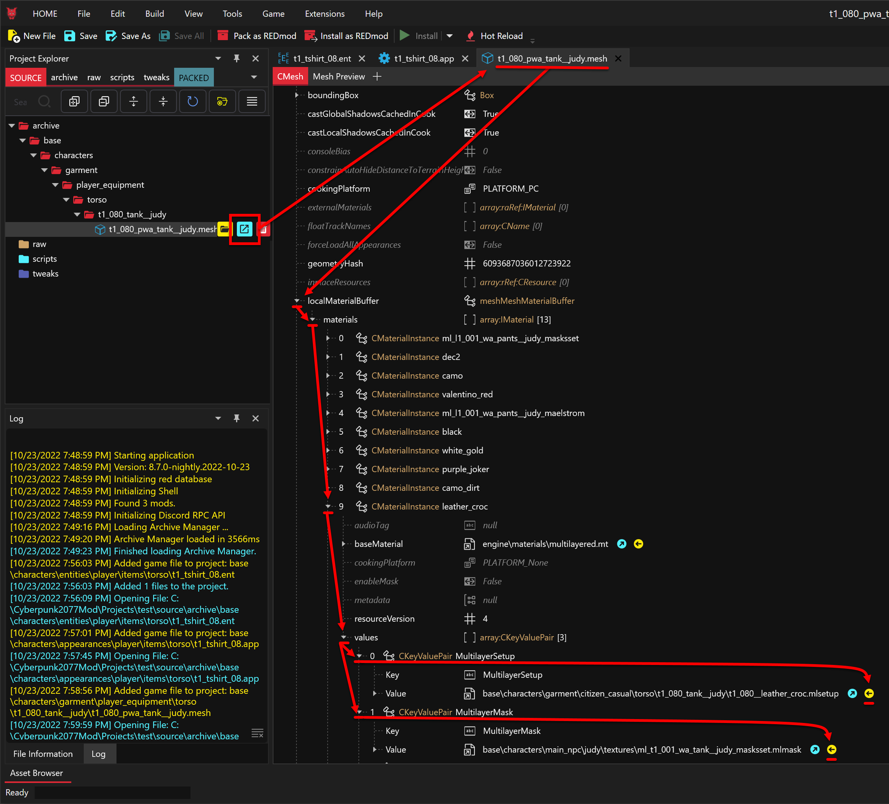
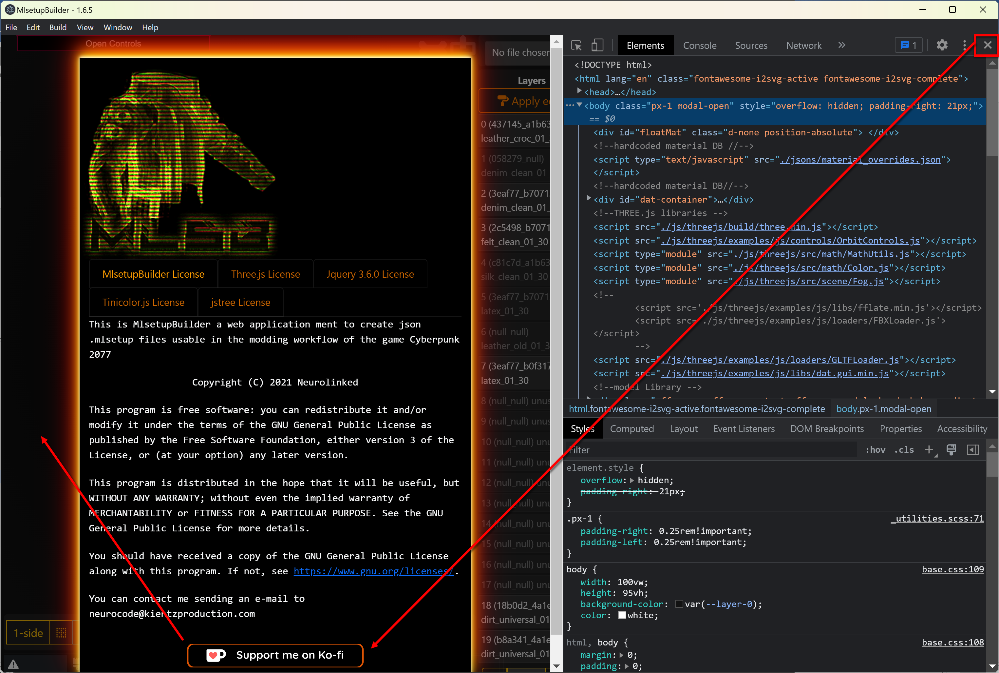
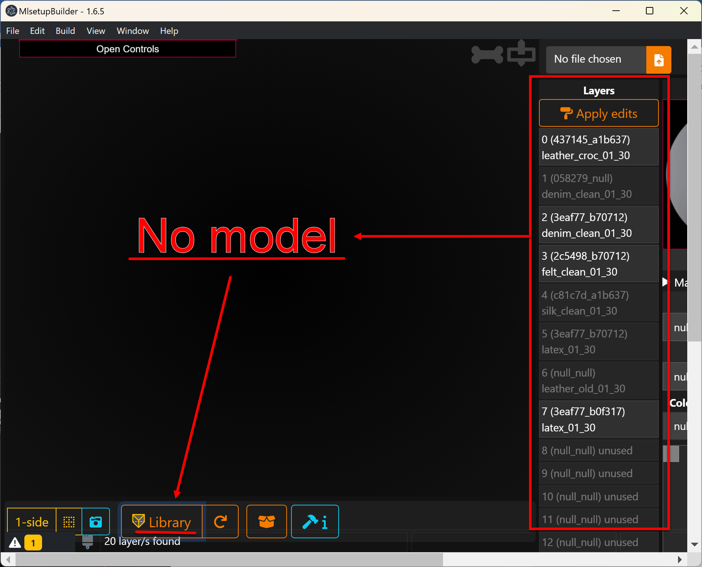
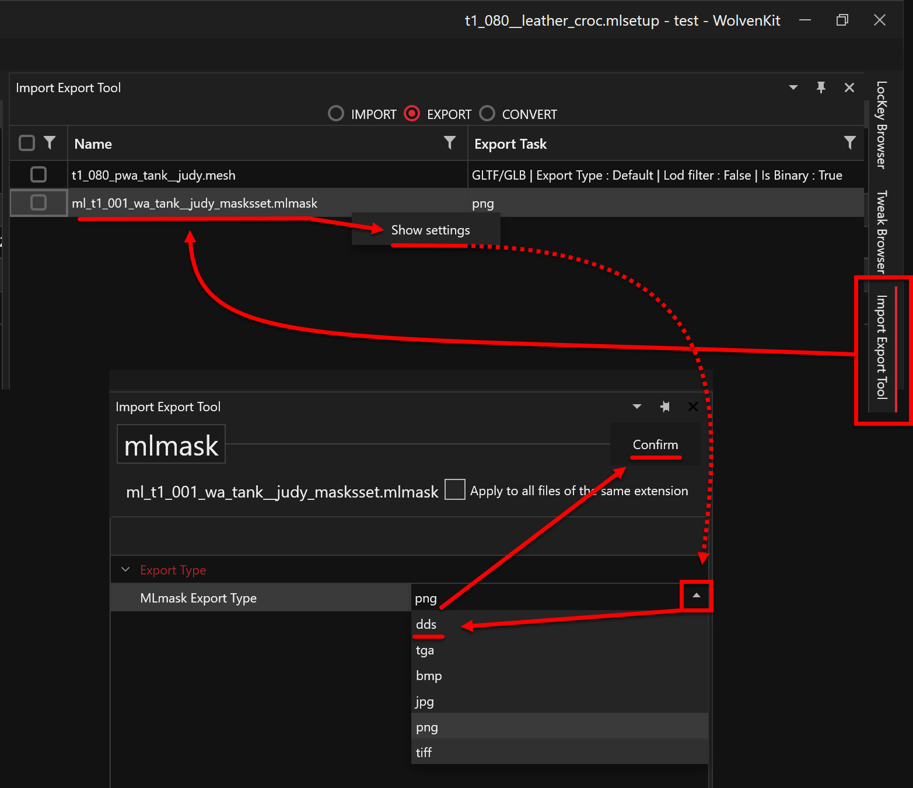
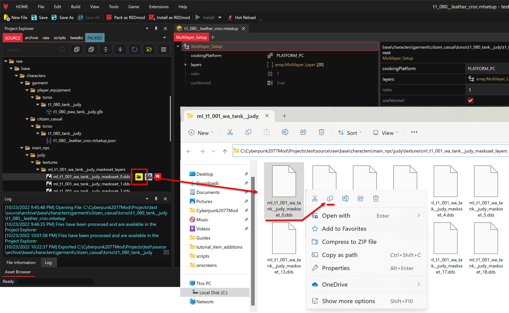
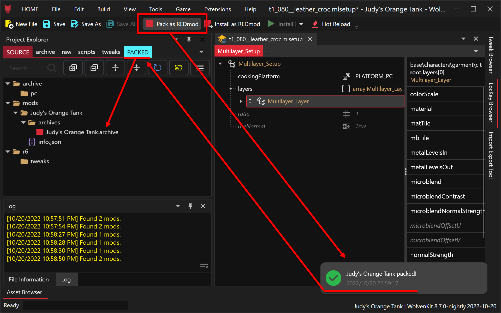

# Validate Functionality

## Section Brief

This section is about validating the modding tools and potentially building your first mod.

Learning objectives:

* Identify assets with clothes in the game,
* How to reduce mod conflicts with a highly specific change to a single material layer,
* Create and add assets to projects,
* Searching the Asset Browser,
* Using the Project Explorer,&#x20;
* Review log for activity,&#x20;
* Seeing the Archive folders versus Raw folders,&#x20;
* Looking at assets in File Viewer,&#x20;
* Convert to-and-from JSON files,&#x20;
* Opening files from Asset Browser to plugins,&#x20;
* Using the Import/Export tool,&#x20;
* Packing and Installing REDmod,&#x20;
* Looking at installed mods in WolvenKit Mod Manager.

### Overview steps

1. Using the name of the game item, find the asset files in WolvenKit,
2. Find the mlsetup file and mesh file for the item,
3. Convert the mlsetup file to JSON and export the mesh file as a glb,
4. Uncook the mask asset to get a dds image,
5. Open the assets in MlSetupBuilder and change its color from green to orange,
6. Import the changes into your project,
7. Pack and build the mod,
8. Party like it’s 2077 in your new orange tank.


Some of the steps below are unnecessary, but you need to learn how the ENT and APP files relate to each other, and how those files tie into the MESH and MLSETUP files. Understanding this topology will help with your future mod development.



These steps get confusing. Remember that we’re using the entity file **tshirt\_08\_old\_02\_w.ent** to find the material layer file **t1\_080\_\_leather\_croc.mlsetup**


## Steps

1.  To make sure you do not have any mod conflicts, please uninstall all Cyberpunk mods except for Material and Texture Override. This can normally be done by disabling the mods in Vortex or whatever mod managing application you use for your normal gameplay.

    <figure><figcaption></figcaption></figure>
2. Launch Cyberpunk 2077 and either load an existing woman character, or start a new one if you have to. If you start a new game, then you'll have to play up to the scav hunt with Jackie before you can swap your clothes.
3. Once you reach a point in the game when you can change your clothes, run the Cyber Engine Tweaks (CET) command “Game.AddToInventory("Items.TShirt\_08\_old\_02",1)”. This will load Judy’s Tank in your torso inventory.
4.  Wear the shirt, take a screenshot, save the game, and then exit the game. This screenshot will be your reference to compare against when you have made the edit.

    <figure><figcaption></figcaption></figure>
5. The name of the shirt is **Secondhand Knotted Tank** and it’s an **Inner Torso** item
6.  Navigate to Fandom’s Cyberpunk clothing page and find the asset name for Judy’s tank. Since we know the item is an inner torso shirt, please add #Inner\_Torso to the end of the URL. This convention works for all other items as well. If we want to find V’s Pants then you would add #Legs to the end of the URL. If you’re looking for blades, use Fandom’s menu to navigate to the weapons section Gameplay > Items > [Weapons and then add #Blade](https://cyberpunk.fandom.com/wiki/Cyberpunk\_2077\_Weapons#Blade) to the end of the URL. But in this case, we’re looking for Judy’s shirt.

    [https://cyberpunk.fandom.com/wiki/Cyberpunk\_2077\_Clothing#Inner\_Torso](https://cyberpunk.fandom.com/wiki/Cyberpunk\_2077\_Clothing#Inner\_Torso)

    <figure><figcaption></figcaption></figure>
7.  Launch WolvenKit and create a new project called Judy’s Orange Tank with the Creation Location as C:\Cyberpunk2077Mod\Projects

    <figure><figcaption></figcaption></figure>
8.  In the menu bar click on View and click on Reset Layout to make sure your screen matches the screenshots in this guide.

    <figure><figcaption></figcaption></figure>
9.  Click on the Asset Browser and search for the asset name we found on Fandom. Start by searching for the entire name “tshirt\_08\_old\_02” and then slowly start deleting characters from the right side until the entity (ENT) file shows up.

    <figure><figcaption></figcaption></figure>
10. Right click the t1\_tshirt\_08.ent file and open the file without adding it to your project. Notice that the file opens in the File Viewer and is not listed in the Project Explorer.

    <figure><figcaption></figcaption></figure>
11. In the File Viewer, expand appearance and locate the full asset name we found on the Fandom website. Notice that in the appearances array, the name ends in “w” which stands for woman (aka “wa” which stands for woman average). Cyberpunk uses postfixes m, ma, mb, mf, w, wa, wb, and wf to describe the gender of the asset and the body type it goes to. A is average, and b and f are synonymous for big/fat. There are other postfixes, but that’s the general concept.

    <figure><figcaption></figcaption></figure>
12. In the File Viewer, expand appearance 7 for “tshirt\_08\_old\_02\_w”. Click on the apperanceResource blue button to open the APP file without adding it to the project.

    <figure><figcaption></figcaption></figure>
13. In the File Viewer, select the APP file, and expand the appearances array. The asset name from Fandom is **tshirt\_08\_old\_02**, which is a mashup of its entity **tshirt\_08** and one of the entity's appearances named **old\_02**. We want the woman version of that appearance, so we're looking for **old\_02\_w**. Expand the old\_02\_w appearance and expand its components to find the mesh key-value pairs. This is where you will start seeing the name of the asset which is Judy’s Tank. The meshappearance key has a value of **leather\_croc**, and the mesh file is listed right next to it (remember where this mesh is because you’ll return here at a later step).

    <figure><figcaption></figcaption></figure>
14. Now you know you’re looking for the mesh **leather\_croc** for the entity **t1\_080**. In this part of the APP file, you can also see the "name" key which is **t1\_080\_pwa\_tank\_\_judy**. This is the name you will use at a later date to create the GLB file. Return to the Asset Browser and search for **t1\_080\_leather\_croc** to find the material layer that the mesh uses for its visual appearance (e.g. color and texture properties).

    <figure><figcaption></figcaption></figure>
15. Right click on the mlsetup file and add it to your project

    <figure><figcaption></figcaption></figure>
16. Right click the mlsetup file and convert it to JSON

    <figure><figcaption></figcaption></figure>
17. Right click the JSON file and open it in MlSetupBuilder (aka mlsb). MLSB should automatically open for you. If it doesn't, then first check the Windows task bar to make sure it's not open but hidden, and then check click on HOME > Plugins to make sure it is installed.

    <figure><figcaption></figcaption></figure>
18. Over in MlSetuipBuilder (MLSB), close the developer tool, then savagely and with mercy throw more coffee at Neurolinked#4973 (the author of this guide is not Neurolinked), and then click anywhere off the Welcome popup to get into the building tool.

    <figure><figcaption></figcaption></figure>
19. Notice that the material layers loaded but not the model. Click on Library to bring up the frame with the available models.

    <figure><figcaption></figcaption></figure>
20. Search for the mesh name from step 14 and then double-click on the model. Depending on how you created your Depot, you may see up to two errors. The errors are saying that the model requires two files, and those files are not in the locations that MLSB expects. One is the GLB 3D binary and the other the DDS flat image.

    <figure><figcaption></figcaption></figure>
21. Since this is a good excuse to do some troubleshooting and get familiar with the tools, let's create the DDS file using WolvenKit.CLI and the GLB file using the WolvenKit Import/Export Tool. First thing is to find out where MLSB is expecting these files. Close the Library by clicking the X icon in the orange bar on the top-right of the library. Then click on the warning icon on the bottom-left to open the error log.

    <figure><figcaption></figcaption></figure>
22. The error log says MLSB wants the DDS file in C:\Cyberpunk2077Mod\Depot\base\characters\main\_npc\judy\textures and the GLB file in C:\Cyberpunk2077Mod\Depot\base\characters\garment\player\_equipment\torso.

    <figure><figcaption></figcaption></figure>
23. For the DDS file, we know the file you're looking for is named _ml\_t1\_001\_wa\_tank\_\_judy\_masksset0.dds_. Since the file ends in \_0.dds, the odds are it comes in a compressed file with similar assets ending in \_1.dds, \_2.dds, \_3.dds, etc... This means you want WolvenKit.CLI to uncook that packed file, so you'll replace the \_0.dds with an asterisk (\*), and then to make sure we get the file, you'll add another asterisk (\*) to the front of the file. If this still doesn't result any uncooked files, then slowly start removing letters from the filename until something does uncook. These steps are from the [Create Adhoc Depot](create-depot.md#steps-adhoc-depot), run CMD.EXE and change directory to C:\Cyberpunk2077Mod\WolvenKit.CLI. Run the below command to generate the DDS file:
    * The -w "\*xxx\*" parameter is a search function that looks in the archive for a specific asset name,&#x20;
    * The asterisks (\*) are wildcards that account for any oddities in CDProject's naming conventions.
    *   The --uext dds parameter will encode the DDS as a DDS because the DDS is a DDS; savy?

        > wolvenkit.cli uncook -p "C:\Program Files (x86)\Steam\steamapps\common\Cyberpunk 2077\archive\pc\content" -o "C:\Cyberpunk2077Mod\Depot" -w "\*_ml\_t1\_001\_wa\_tank\_\_judy\_masksset\*.mlmask_" --uext dds

        <figure><figcaption></figcaption></figure>
24. Open a File Explorer and drill into your Depot to C:\Cyberpunk2077Mod\Depot\base\characters\main\_npc\judy\textures\ml\_t1\_001\_wa\_tank\_\_judy\_masksset\_layers. Copy the ml\_t1\_001\_wa\_tank\_\_judy\_masksset\_0.dds file and paste it one level up in the location that MLSB asked for.

    <figure><figcaption></figcaption></figure>
25. Back in WolvenKit, in the Asset Manager search for the GLB filename t1\_080\_pwa\_tank\_\_judy that MLSB was asking for to get the mesh version of the file.

    <figure><figcaption></figcaption></figure>
26. Right click on the mesh file and add the file to your project.

    <figure><figcaption></figcaption></figure>
27. With the mesh file in your project, hover your mouse over the Import/Export Tool to expand it.

    <figure><figcaption></figcaption></figure>
28. Make sure EXPORT function is selected, and then right click on the mesh and click on Show Settings

    <figure><figcaption></figcaption></figure>
29. Verify your settings look like this screenshot and then click on the Confirm button.

    <figure><figcaption></figcaption></figure>
30. Check the mesh file’s selection box to select it, click on Process Selected and verify a successful confirmation message. Within a few seconds a GLB file should get added to your project.

    <figure><figcaption></figcaption></figure>
31. Hover your mouse cursor over the GLB file and click the yellow folder button to open File Explorer at the file’s location. Right click the file in File Explorer and copy it.

    <figure><figcaption></figcaption></figure>
32. To get to the location that MLSB wats the GLB file, just click into the File Explorer path field and replace "Project\Judy's Orange Tank\source\raw" with "Depot" and press enter. Paste the copied GLB file in that location and you're done.

    <figure><figcaption></figcaption></figure>
33. Back in MlSetupBuilder, click the refresh button at the bottom of the screen. The model should load without errors and the multilayers display on the right.

    > <mark style="color:red;">**Attention:**</mark> As of MlSetupBuilder version 1.6.5, the model does not change with the material selections (e.g. color Normals, Metal Outside, etc.). The model only shows the relationship of the layers with each other. You can see this by clicking through the layers, and the colored region on the model is the currently selected layer.

    <figure><figcaption></figcaption></figure>
34. You can leave the leather\_croc material and only change the color to orange (in the case of this guide’s example), but I feel that the orange color looks better in spandex. Select the leather\_croc layer and then click the Material dropdown. Type spandex into the search box and select the spandex\_clean\_02\_30 material, and then click the Material dropdown again to close the dropdown.

    > <mark style="color:red;">**Attention:**</mark> Please take a mental note that each layers’ name starts with a number that is in sequence from 0 through however many layers the asset has. The layer we’re editing starts with a 0, which means we’re editing layer 0.

    <figure><figcaption></figcaption></figure>
35. These four settings alter how the material is rendered to physically represent how light interacts with its surface. The dropdown values are not color HEX, but instead reference numbers. The important numbers are inside the brackets (#).
    * **Normals**: A texture mapping technique used for faking the lighting of bumps and dents.
    * **Metal Outside**: Defines the outside of the material as diffuse with a white dielectric coating (0.0) or metallic (1.0)
    * **Rough Inside**/**Rough Outside**: Sets the roughness of the surface, where 0.0 is completely smooth, and 1.0 is completely rough (wholly diffuse).
36. Set the Normals to 1.66, Metal and Rough Inside to null, and Rough Outside to 0.3333,0.6666.

    <figure><figcaption></figcaption></figure>
37. Scroll down the color grid, select orange, and then click the Apply Edits button. Notice that the wording in the layer changes to match your selections.&#x20;

    > <mark style="color:red;">**Attention:**</mark> While you’re here, make sure the Opacity is 1.0 which means this layer is 100% visible.

    <figure><figcaption></figcaption></figure>
38. With the layer updated, click on Export and selected the Wkit version that matches what you have installed, and as of 10/20/2022 that is WolvenKit 8.7. The Save Dialog Window should open to your Project folder and have the same name as the JSON you converted in WolvenKit. When you click on Save, also click on Yes to replace the existing file. There is no need to save a copy of the original because you can repeat step 16 to re-create it.

    <figure><figcaption></figcaption></figure>
39. Back in WolvenKit, right click on the JSON file and click on Import from JSON. Normally a log would be created to show you the import occurred, but currently that isn’t happening so I cannot show you that. Regardless, if you look at the modified date of the mlsetup file in File Explorer, you will see an updated datetime.

    <figure><figcaption></figcaption></figure>
40. The final step is to mitigate the risk of conflicts with other mods. When Cyberpunk is launched and the mods are loaded, the first mod to effect an asset will win. All we want to do is change the color of Secondhand Knotted Tank, and not affect any of the other versions of this same asset.

    <figure><figcaption></figcaption></figure>
41. Hover your mouse cursor over mlsetup and click on Open File. If you recall your mental note from step 25, we edited layer 0 in MlSetupBuilder. So expand the layers and then expand layer 0. You will see that the colorScale changed to match the orange selection and also the material name changed from leather\_croc to spandex\_clean\_02.

    <figure><figcaption></figcaption></figure>
42. Collapse the layer 0, and select all of the other layers. This is done by clicking on Layer 1, hold down your shift key and then click layer 19. Right click the selected layers and click on Delete Selection in Array/Buffer.

    <figure><figcaption></figcaption></figure>
43. An asterisk will appear at the end of the File Viewer’s filename to show that unsaved changes were made to that file. Click on Save button to commit the changes. Now that this mlsetup only contains the layer you edited, there is a lower risk of it accidently affecting other mods that may alter different layers on this same asset.

    <figure><figcaption></figcaption></figure>
44. Notice the button Pack as REDmod. This button packs your asset files into an archive file, generates the required info.json, puts them into the necessary folder structure to install the mod into your game. This package can be viewed on the PACKED tab. Feel free to click the button Pack as REDmod to see what it does, it will not harm the mod, or else you can skip this step and just look at the screenshot below to see what it does.

    <figure><figcaption></figcaption></figure>
45. Click the button **Install as REDmod**. This button will pack your mod just like **Pack as REDmod** did, and then it will also install the mod into your game folder. Let me repeat myself but with different words,
    * Pack as REDmod generates the archive file,
    *   Install as REDmod also generates the archive file and then install it to your gaming folder.

        <figure><figcaption></figcaption></figure>
46. Your new mod will be listed in the Cyberpunk 2077 REDmod folder

    <figure><figcaption></figcaption></figure>
47. Launch the Cyberpunk 2077 game and load your saved game from step 4. How you launch the game doesn’t matter because the mod is deployed directly to the game’s install directory. Enter your inventory and you’ll notice that the tank you created in step 3 changed from green leather to orange spandex.

    <figure><figcaption></figcaption></figure>
48. Congratulations! You have now validated that WolvenKit is deployed and setup correctly on your computer. Happy modding!
