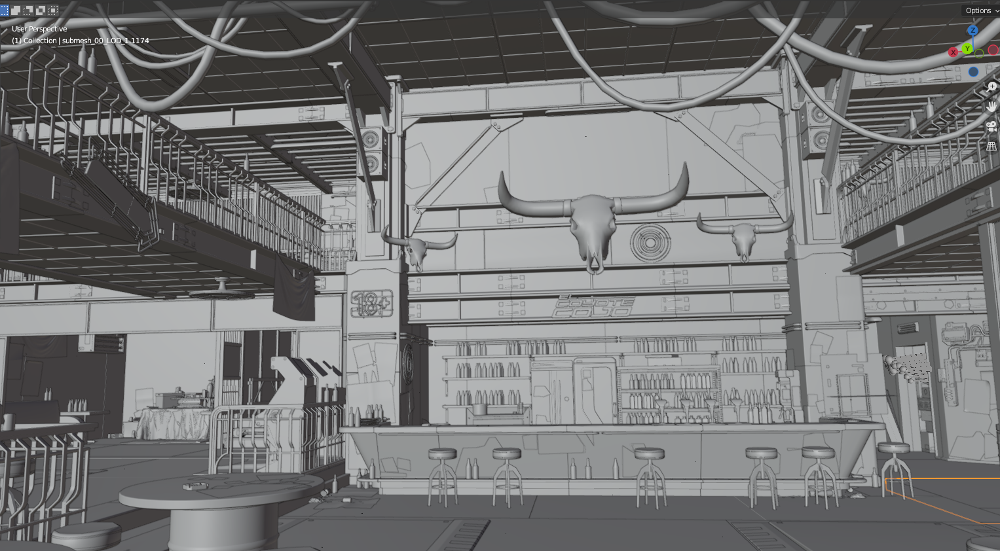
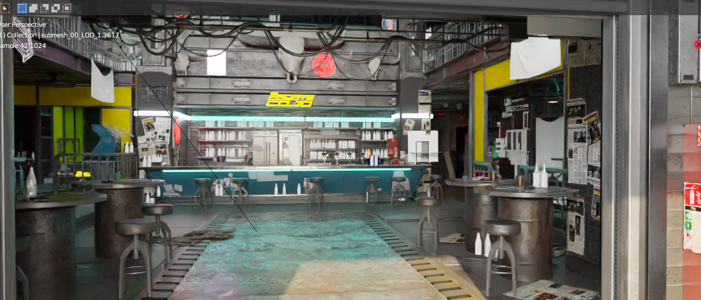

# Exporting Streaming Sectors to Blender

## Summary

**Created by @Simarilius** \
**Updated 19 March 2023**

So the Export script has got good enough/fast enough that its been incorporated into the latest Blender addon the following guide has been updated to reflect this.

&#x20;Original exporter was based on some posts by @123321 in the Discord _#mapeditor_ channel back in May, so all credit to him for working it out in the first place.

#### This guide uses the following versions:

* Cyberpunk 2077 game version 1.6
* WolvenKit-8.8.1 or newer
* Blender 3.3 stable
* Cyberpunk add-on for Blender 1.2.0

### Requirements

* [**WolvenKit release version 8.8.1**](https://github.com/WolvenKit/WolvenKit) **(or the latest nightly)**
* [**Blender 3.3**](https://www.blender.org/) **or newer**
* [**Cyberpunk add-on for Blender 1.2.0**](https://github.com/WolvenKit/Cyberpunk-Blender-add-on/releases)


## Background on Streaming Sectors

So Streaming Sectors are the files that define the world to the Cyberpunk Engine, and contain the data to point to all the models and entities that populate it. There are several types of Streaming Sector, including ones to define navigation, sound collision bodies and illumination, but the ones we're dealing with here are primarily the interior and exterior ones.

The world is broken up into a grid, with several sizes of squares available (bit like graph paper with major and minor grid lines). The size of the grid in use is dependent on the Level of Detail (LOD) of the sector file your looking at, which is the last digit of the filename. Chunk sizes are as below.

| LOD | Interior | Exterior |
| --- | -------- | -------- |
| 0   | 32       | 64       |
| 1   | 64       | 128      |
| 2   | 128      | 256?     |

For every location there can be multiple levels of LOD sectors overlapping, with progressively more detail defined as you go down the levels, so for instance Lizzies bar, is located at approximately -1200, 1562, 22 as you can see from the screenshot below of interrogating the bouncers position with AMM.&#x20;

<figure><figcaption></figcaption></figure>

Filenames are   `sectortype_X_Y_Z.streamingsector`  in the AMM co-ords. If you preview a sector in wkit the axes are shown rotated so Z=-Y and Y=Z.

I've left the detail of the process below for record, but if you just want a list of sectors I've created a python script to find the ones that a set of co-ordinates are in. You can find it [HERE](https://mybinder.org/v2/gh/Simarilius-uk/sectorStuff/5b8a8f5536002ec2d33c16103f79c53b6b93bd8e?urlpath=lab%2Ftree%2FAllBlocks.ipynb). Simply enter the co-ordinates in the player\_loc dict in block 3 then run all blocks. You'll be given 2 lists containing of all the interior and exterior sectors which contain the co-ords within their bounding boxes. The list also shows the distance from the centre of the sectors to the co-ords given.

From those co-ordinates we can calculate the sector files for interior/exterior sectors by dividing by the grid size for the LOD and rounding. (ie 1200/32=38 etc)

| LOD | Interior   | Exterior   |
| --- | ---------- | ---------- |
| 0   | -38\_49\_0 | -19\_24\_0 |
| 1   | -19\_24\_0 | -9\_12\_0  |
| 2   | -9\_12\_0  | -5\_6\_0   |

At the level 0 files the whole building isn't covered by 1 sector, so you end up needing 4, conversely the exterior level 2 is several city blocks. In the end to totally define the bar you need the following as far as I can tell

.png>)

In some locations bit are defined inside quest sectors that have bunch of bits to do with triggering the story bits that occur there, half vs apartment seems to be tucked away inside several of those. Their something todo with the nodeRefs inside the main sector files, but I'm still trying to work out how to work out one from the other.

An easy way to locate sectors from inside wkit is if theres anything unique in the location, if you find the mesh then use 'Find files using this' to track back to the streaming sector. So for instance to find El Coyote has the sign which is findable with a search for coyote as el\_coyote\_cojo\_bar\_signage\_a.mesh _._ From that you can do used by to find interior\_-20\_-16\_0\_1.streamingsector. Thats the Level 1 LOD sector though, which just has the big stuff, you also need the LOD 0 ones, which are done on a chunk size half the size, so the numbers in the filename double. For El Coyote these are interior\_-39\_-31\_0\_0.streamingsector, interior\_-39\_-32\_0\_0.streamingsector, interior\_-40\_-31\_0\_0.streamingsector & interior\_-40\_-32\_0\_0.streamingsector.

The other approach is to go in game and use CET and AMM to interrogate an entity at the location and use the director tools to get its world co-ords. So el coyote is at approx x,y,z of -1260,-996,12. Dividing those by 64 and rounding (not sure how they decide that) gets us -20 -16 0 for the filename above.&#x20;

You can preview the sectors in wolvenkit to confirm their what you're after.

## Exporting Streaming Sectors to Blender

Once you've found the location you want to export, we can use a script to add all the files we need. Open the script manager by going Tools>Script Manager and add a script. Paste the script below into it. Replace the sectors in the sectors list with your sector names, then run it.&#x20;

```javascript
// Exports file and all referenced files (recursively)
import * as Logger from 'Logger.wscript';

//list of sector files (paths need double slashes) - REPLACE WITH YOUR SECTORS 
var sectors=['base\\worlds\\03_night_city\\_compiled\\default\\interior_-20_-16_0_1.streamingsector',
'base\\worlds\\03_night_city\\_compiled\\default\\interior_-39_-31_0_0.streamingsector',
'base\\worlds\\03_night_city\\_compiled\\default\\interior_-39_-32_0_0.streamingsector',
'base\\worlds\\03_night_city\\_compiled\\default\\interior_-40_-31_0_0.streamingsector',
'base\\worlds\\03_night_city\\_compiled\\default\\interior_-40_-32_0_0.streamingsector'
]

// sets of files that are parsed for processing
const parsedFiles = new Set()
const projectSet = new Set()
const exportSet = new Set()
const jsonSet = new Set()

// loop over every sector in `sectors`
for (var sect in sectors) {
    Logger.Info(sectors[sect])
    ParseFile(sectors[sect])
}

// save all our files to the project and export JSONs
for (const fileName of projectSet) {
    var file = wkit.GetFileFromBase(fileName)
    wkit.SaveToProject(fileName, file)

    if (jsonSet.has(fileName)) {
        var path = ""
        if (file.Extension === ".ent") {
            path = wkit.ChangeExtension(file.Name, ".ent.json")
        }
        if (file.Extension === ".streamingsector") {
            path = wkit.ChangeExtension(file.Name, ".streamingsector.json")
        }
        if (file.Extension === ".app") {
            path = wkit.ChangeExtension(file.Name, ".app.json")
        }
        if (path.length > 0) {
            var json = wkit.GameFileToJson(file)
            wkit.SaveToRaw(path, json)
        }
    }
}

// export all of our files with the default export settings
wkit.ExportFiles([...exportSet])


// begin helper functions
function* GetPaths(jsonData) {
    for (let [key, value] of Object.entries(jsonData || {})) {
        if (key === "DepotPath" && value != null && value != 0) {
            yield value;
        }

        if (typeof value === "object") {
            yield* GetPaths(value)
        }
    }
}

// Parse a CR2W file
function ParseFile(fileName) {
    // check if we've already worked with this file and that it's actually a string
    if (parsedFiles.has(fileName) || typeof fileName !== "string") {
        return
    }
    parsedFiles.add(fileName)

    // try to get the file
    var file = wkit.GetFileFromBase(fileName)
    if (file === null) {
        Logger.Error(fileName + " could not be found")
        return
    }
    
    // handle the file types we want
    if (file.Extension === ".mesh") {
        projectSet.add(fileName)
        exportSet.add(fileName)
    }
    if (file.Extension === ".ent") {
        projectSet.add(fileName)
        jsonSet.add(fileName)
    }
    if (file.Extension === ".app") {
        projectSet.add(fileName)
        jsonSet.add(fileName)
    }
    if (file.Extension === ".streamingsector") {
        projectSet.add(fileName)
        jsonSet.add(fileName)
    }
    // now check if there are referenced files and parse them
    var json = JSON.parse(wkit.GameFileToJson(file))
    for (let path of GetPaths(json["Data"]["RootChunk"])) {
        ParseFile(path)
    }
}
```

This will add all the sector files and the files needed to export them to your project, and exported the files to json/glb as appropriate with the default export settings. May take a few minutes to run, just wait for the Stop to grey out and Run to become available again.

## Importing to Blender

Open Blender, (3.3 or higher should work) then do File>Import>Cyberpunk Streaming Sector.

<figure><figcaption></figcaption></figure>

Select the cpmodproj file in the root of your project directory, it will use this to get the file path and find all the sector jsons in the project. Import may take a few minutes.

The meshes are scaled and positioned based on the map co-ords, so come in kinda small and off in a weird place. The meshes should be selected after import so if you hit . on the keypad to frame selected you should see it.

There are still some node types in the sector file not being processed currently, or not fully instanced. These include decals (which just get an empty with details of what the decal is) and lights which I havent got round to. The import code is a constant work in progress so hopefully I'll get to them soon.&#x20;

Export code is underway, and early version can be found in my github [here](https://github.com/Simarilius-uk/CP2077\_BlenderScripts/blob/main/export\_to\_JSONs.py). It has some instructions at the top of the script but feel free to come chat in the Discord for more info.

<figure><figcaption></figcaption></figure>

##

<figure><figcaption></figcaption></figure>

####

