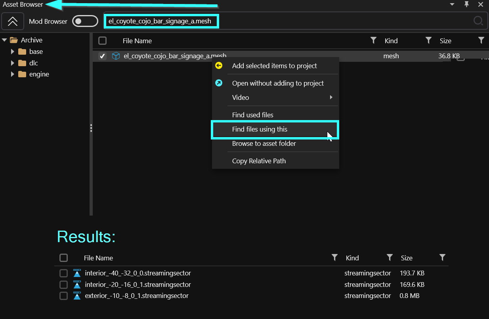

# Finding a specific sector

## Finding a specific sector

### Method 1: the Wolvenkit preview

1. Start Cyberpunk and go to the location you're interested in
2. In the CET console, type `print(GetPlayer():GetWorldPosition())` and copy the coordinates
3. In Wolvenkit, open the file `base\worlds\03_night_city\_compiled\default\blocks\all.streamingblock`
4. Switch to the second tab "All Sector Preview"
5. In the panel to the right, enter the coordinates that you copied from the game in step 2
6. Click "Search for Coordinate"
7. Optional: Zoom in


You can double-click on the red text to load the corresponding streamingsector file into the streamingblock's preview!


<figure><figcaption>
veri nise
</figcaption></figure>


For details on how to find other LOD levels, check [here](https://wiki.redmodding.org/cyberpunk-2077-modding/modding-know-how/files-and-what-they-do/the-whole-world-.streamingsector#calculating-the-files).&#x20;


### Method 2: Following the meshes

If you know a mesh that's used inside the location, you can right-click the mesh file inside Wolvenkit's asset browser and use "**Find files using this**".&#x20;


You might want to consider using a unique mesh rather than a standard cup or bottle.


<figure><figcaption></figcaption></figure>
