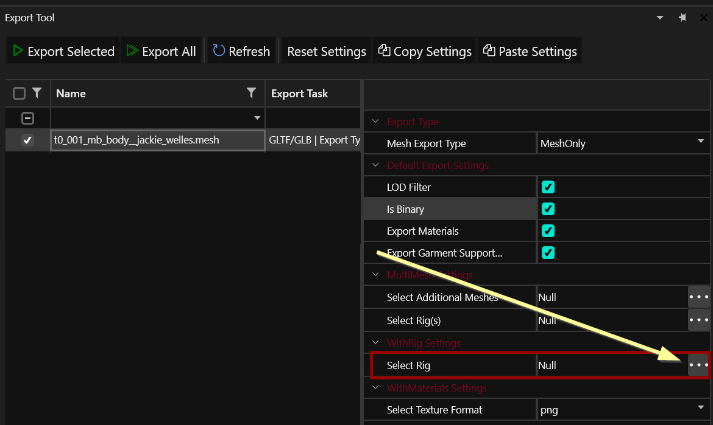
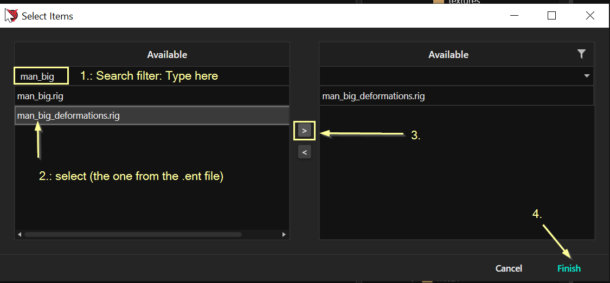
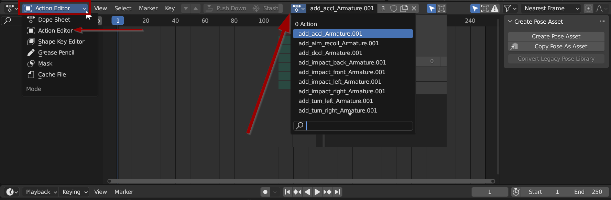

# Exporting Rigs & Anims

## Summary

**Created by @Simarilius** \
**Published October 15 2022**\
**Last documented update: December 29 2023**

This guide will show you how to add animations to a previously exported character. It assumes that you successfully completed [exporting-to-blender.md](../exporting-to-blender.md "mention").

#### It uses the following versions:

* Cyberpunk 2077 game version 2.1&#x20;
* Blender >= [3.6 (stable)](https://www.blender.org/download/lts/3-6/) or [4.0](https://www.blender.org/download/releases/4-0/)
* Wolvenkit >= 8.11.1 ([stable](https://github.com/WolvenKit/Wolvenkit/releases) | [Nightly](https://github.com/WolvenKit/WolvenKit-nightly-releases))
* [Wolvenkit IO suite for Blender >= 1.5.1](https://github.com/WolvenKit/Cyberpunk-Blender-add-on)


Optional: If you want to get your hands dirty, check [this github repository](https://github.com/Simarilius-uk/CP2077\_BlenderScripts/) for a selection of Python scripts for Blender. Most users won't need this.


## Exporting to Blender

So exported characters are cool, but how do we get them out of that annoying A-pose?&#x20;

**We need the rig, and maybe some animations:**

* the main body rig
* the head/face rig

We're going to export them, bind everything, and attach the head to the body. (recapitate?!?)

### Finding the body rig

You can look it up in the body's entity file. Find it by file name, or right-click on Jackie's body mesh and select "find files using this", then doing the same again on the `.app` file.&#x20;

Open up the .ent file and check the `components` array for an `entAnimatedComponent` (usually named`deformations`), which lists the rig:

<figure><figcaption>
look for the property "rig"
</figcaption></figure>


You will need this for the body mesh export. Additionally, you need to find the head rig — read the next section for how.


Copy the path under `rig` and put it somewhere where you can find it later.

### Finding the head rig

The head rig is in the same folder as the head mesh.&#x20;

Naming conventions:

<pre><code><strong>generic:             &#x3C;name_of_head_mesh>_skeleton.rig
</strong><strong>Jackie:              h0_001_mb_c__jackie_welles_skeleton.rig
</strong></code></pre>


You will need this for the head mesh export.


Right-click on the `.rig` file and select `Copy relative path`. Put this with the body rig path.

### Re-exporting the meshes

We now need to re-export the meshes we want to use.


In the first step of the guide, you should have exported them the default setting `withMaterials`. That should have created material.json files and images, as the export we will use now won't do that.


#### The body mesh

In the Export Tool, select the body mesh and adjust its export options. (In Wolvenkit < 8.8, double-click it).

<figure><figcaption>
Wolvenkit > 8.8
</figcaption></figure>

1. Filter by name: paste the file names (or paths) that you saved in the previous step into the empty row at the top of `Available` on the left&#x20;
2. Select the rig by name (the same one as in the .ent file)
3. Move it into the `Available` list
4. Click on `Finish` to apply your changes

<figure><figcaption>
As of WKit 8.8.1, the filter will only search from the start
</figcaption></figure>

#### The head mesh

1. Repeat the process above, but use the name of the head mesh rather than the body.

## Importing into Blender

Delete the head and body component that you've imported the first time around: we're going to do a reimport. With the [Cyberpunk GLTF plugin](https://github.com/WolvenKit/Cyberpunk-Blender-add-on) (File > Import > Cyberpunk GLTF), import both of your files into Blender — the process works exactly like it did [the first time](../exporting-to-blender.md#importing-into-blender), just that there's extra data now.

If the `WithRig` has worked, you should notice that rather than the mass of unorganised huge bones, you now have a skeleton structure that kinda makes sense.&#x20;

I normally change the bone display settings of that armature from `Octahedral` to `Stick`, as that prevents bones from completely hiding the mesh:


Most characters bring in full bodies; however, Jackie is not one of them. CDPR modelled only his chest and hands, since the rest of his body was never planned to be visible.


## Merging the skeletons

Now, we hook up everything by merging all rigs into one.


You can do this either by script or by hand. This guide assumes you will select Option B, using the most recent script from [this github repository](https://github.com/Simarilius-uk/CP2077\_BlenderScripts/blob/main/Merge\_rigs.py).


1. Rename the head's armature to `HeadArmature`
2. Rename the body's armature to `BodyArmature`
3. Switch to the "Scripting" perspective and create a new empty script
4. Copy the script from [github](https://raw.githubusercontent.com/Simarilius-uk/CP2077\_BlenderScripts/main/Merge\_rigs.py) and paste it into the document
   1. _Optional, if you skipped step 1 and 2 because you like making things complicated:_ \
      At the top of the script, find \~line 5 `head = bpy.data.objects['HeadArmature']`, and put the names of your armatures from the `SceneCollection` tab
5. Click on the`BodyArmature` in the 3d viewport
6. Run the script

&#x20;

The rigs should merge; the head meshes should be without an armature parent now.&#x20;

Hopefully it looks something like below, with all the bones selected and just the one green dude in the outliner:

<figure><figcaption></figcaption></figure>

### Parenting the other meshes to the armature


If you have a lot of meshes, you might want to skip this step.


For each submesh item, repeat the following steps:

1. Select it in object mode
2. Set the `Armature Modifier` in the Modifiers tab to `BodyArmature`

This should snap the item to the body and it will follow with correct weights when animated.

## Animations

To find animations compatible with the character you just exported, open up their `.ent` file and expand the `resolvedDependencies`:

<figure><figcaption></figcaption></figure>

Alternatively, [search](../../../wolvenkit-app/usage/wolvenkit-search-finding-files.md) for `.anim` in the asset browser.


As of December 2023, facial animations and lipsync (folders `lipsync` and `animations\facial`) are not supported yet.  (We're working on it, though!)


Add the animation you've chosen to your WKit project and export it . If you want to use this animation for editing, you need to check `Include Root Motion` in the export settings.

You will end up with a new .glb file, which you can import into Blender.

Now let's apply it:

1. Select the `BodyArmature`
2. Switch to the `Animation` perspective
3. In the panel at the bottom, change the dropdown on the left from `Dope Sheet` to `Action Editor`
4. In the dropdown in the middle, select one of the animations you just imported.
5. Click the "play" button
6.

    <figure><figcaption></figcaption></figure>

<figure><figcaption></figcaption></figure>

You can keep importing more anim files and the list just grows.&#x20;

Anyway, cheers Chooms, hope this has been helpful, have fun!

## Troubleshooting/reporting:


As of December 2023, facial animations and lipsync (folders `lipsync` and `animations\facial`) are not supported yet. We're working on it, but if one of these exploded on you, you'll just have to wait.


Most of the animations seem to work flawlessly. Occasionally the process gos screwy somewhere and the model freaks out when you attach the anims. In that case, please open [an issue](https://github.com/WolvenKit/Cyberpunk-Blender-add-on/issues) on github or tell us about it on [**Discord**](https://discord.gg/redmodding) in `#blender-add-on`.

Please include your .blend file and the **full relative path** to the animation that was giving you trouble in your report.
