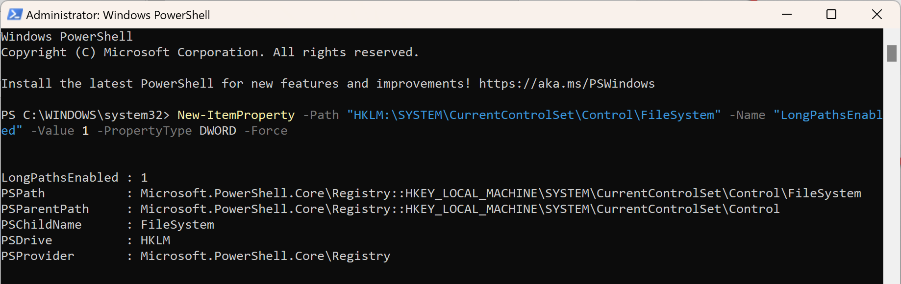
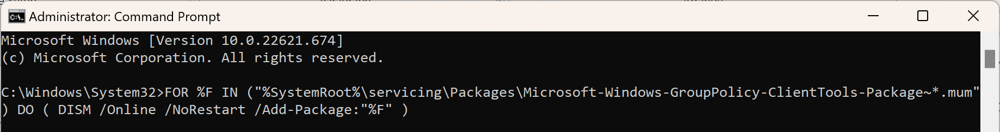
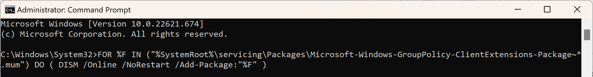
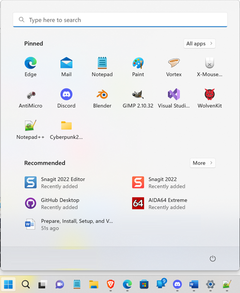
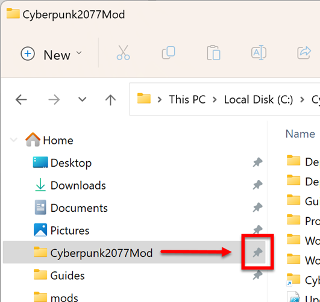

# Prep your computer

## Section Brief

Prepare your computer with Windows configuration, basic software requirements, and creates a centralized modding location that will match what you will see in the ELI5 guide screenshots.

## Steps

1. Enable _Windows long path names_ and then reboot your computer. Here is a quick link if you want to do your own research [Google search](https://www.google.com/search?q=enable+Windows+long+path+names). For everyone else:
   *   **Step 1**: Run PowerShell as an administrator

       <figure><figcaption></figcaption></figure>
   *   **Step 2:** Copy and paste the below command into PowerShell and press the enter key

       > New-ItemProperty -Path "HKLM:\SYSTEM\CurrentControlSet\Control\FileSystem" -Name "LongPathsEnabled" -Value 1 -PropertyType DWORD -Force

       <figure><figcaption></figcaption></figure>
   * **Step 3**: Install Microsoft Group Policy Editor, it is not deployed with Windows Home edition. If you have Windows Enterprise edition or know that policy editor is already installed then skip ahead to step 5.
     1.  Run CMD.EXE as an administrator,

         <figure><figcaption></figcaption></figure>
     2.  Copy and paste the below command into the command prompt window and press the enter key

         > FOR %F IN ("%SystemRoot%\servicing\Packages\Microsoft-Windows-GroupPolicy-ClientTools-Package\~\*.mum") DO ( DISM /Online /NoRestart /Add-Package:"%F" )

         <figure><figcaption></figcaption></figure>
     3.  Copy and paste the below command into the command prompt window to install Microsoft Group Policy Client Extensions

         > FOR %F IN ("%SystemRoot%\servicing\Packages\Microsoft-Windows-GroupPolicy-ClientExtensions-Package\~\*.mum") DO ( DISM /Online /NoRestart /Add-Package:"%F" )

         <figure><figcaption></figcaption></figure>
     4.  Press Windows + R to open the Run window and open gpedit.msc

         <figure><figcaption></figcaption></figure>
     5.  Navigate into the policy folders: Computer Configuration > Administrative Templates > System > Filesystem

         <figure><figcaption></figcaption></figure>
     6.  Double click into Filesystem, then select Enable Win32 long paths and then click on Edit policy setting

         <figure><figcaption></figcaption></figure>
     7.  Select Enabled and then click on OK

         <figure><figcaption></figcaption></figure>
     8. Close Windows Group Policy Editor
     9.  Reboot your computer

         

         <figure><figcaption>
Meme
</figcaption></figure>

         

2.  [Install Microsoft .NET 6](https://dotnet.microsoft.com/en-us/download), download and install the runtime only. The SDK is for .NET developers…. unless you are a NET developer, and in which case do whatever you want :smile:

    

    <figure><figcaption>
NET download page
</figcaption></figure>

    

3. Install [Blender](https://www.blender.org/download/) for 3D modeling of assets.
4. Install [GIMP](https://www.gimp.org/downloads/) or your preferred image editor for PNG and DDS images.
5.  Install [Notepad++](https://notepad-plus-plus.org/downloads/) and then enable its JSON Viewer plugin. Notepad++ JSON Viewer is used to correctly format JSON syntax, such as when a file has been collapsed onto a single line.... for job security reasons :tada: Alternatively, you can install Visual Studio for its VCode JSON Viewer extension, but Visual Studio is a full featured coding solution and only needed by application developers.

    

    <figure><figcaption>
Notepad++ Plugin Admin
</figcaption></figure>

    

6. Install the free REDmod DLC from [Steam](https://store.steampowered.com/app/2060310/Cyberpunk\_2077\_REDmod/) or [GOG](https://www.gog.com/game/cyberpunk\_2077\_redmod) to your Cyberpunk 2077 game.
7. [Enable REDmod in your Cyberpunk game](https://www.youtube.com/watch?v=Rcf65OvEJTo\&t=121s):&#x20;
   *   For Steam users, launch Cyberpunk from Steam and on the RedLauncher toggle the Enable mods switch

       

       <figure><figcaption>
Steam REDLauncher
</figcaption></figure>

       

   *   For GOG users, on the Cyberpunk game click into Manage Installation and on Configure > Features you need to check the box for Enable mods.

       

       <figure><figcaption>
GOG Game Configuration
</figcaption></figure>

       

8. Install the asset override mod
   *   Navigate to Nexus and download [Material and Texture Override](https://www.nexusmods.com/cyberpunk2077/mods/5266)

       

       <figure><figcaption>
Nexus download page
</figcaption></figure>

       

   *   Extract the file into Cyberpunk's REDmod folder located at ".\Cyberpunk 2077\mods\Material and Texture Override". Below are screenshots for the default locations for Steam versus GOG

       

       <figure><figcaption>
Steam install
</figcaption></figure>

       

       

       <figure><figcaption>
GOG Install
</figcaption></figure>

       

9. Create the below folder structure, it will be the centralized location for modding tools, assets, project folders, guides, shortcuts, and the depot.
   * [ ] Asset Depot -- C:\Cyberpunk2077Mod\Depot\\
   * [ ] Guides and misc notes -- C:\Cyberpunk2077Mod\Guides\\
   * [ ] Modding projects -- C:\Cyberpunk2077Mod\Projects\\
   * [ ] WolvenKit application -- C:\Cyberpunk2077Mod\WolvenKit\\
   *   [ ] WolvenKit.CLI (console) -- C:\Cyberpunk2077Mod\WolvenKit.CLI\\

       <figure><figcaption>
File Explorer view of central repository for everything modding related
</figcaption></figure>
10. Create a shortcut in the folder C:\Cyberpunk2077Mod\ to the Cyberpunk game folder. This will give you a quick navigation to the cooked game files, for example when the modding tools periodically ask you for that location. For Steam the folder location is “C:\Program Files (x86)\Steam\steamapps\common\Cyberpunk 2077”, and for GOG it is "C:\Program Files (x86)\GOG Galaxy\Games\Cyberpunk 2077".
11. I recommend that you pin Blender, GIMP, and Notepad++ to your Start Menu because you’ll need to access them as you’re creating mods.

    

    <figure><figcaption>
Windows Start Menu showing recommended pins
</figcaption></figure>

    

12. I also recommend pinning the CyberPunk2077Mod folder to File Explorer’s Quick Links. I am always having to go back to this parent folder to access my guides, shortcuts, to get into the asset depot, etc...

    

    <figure><figcaption>
File Explorer view showing recommended quick link
</figcaption></figure>

    

13. Reboot your computer again

    

    <figure><figcaption>
Meme
</figcaption></figure>

    

