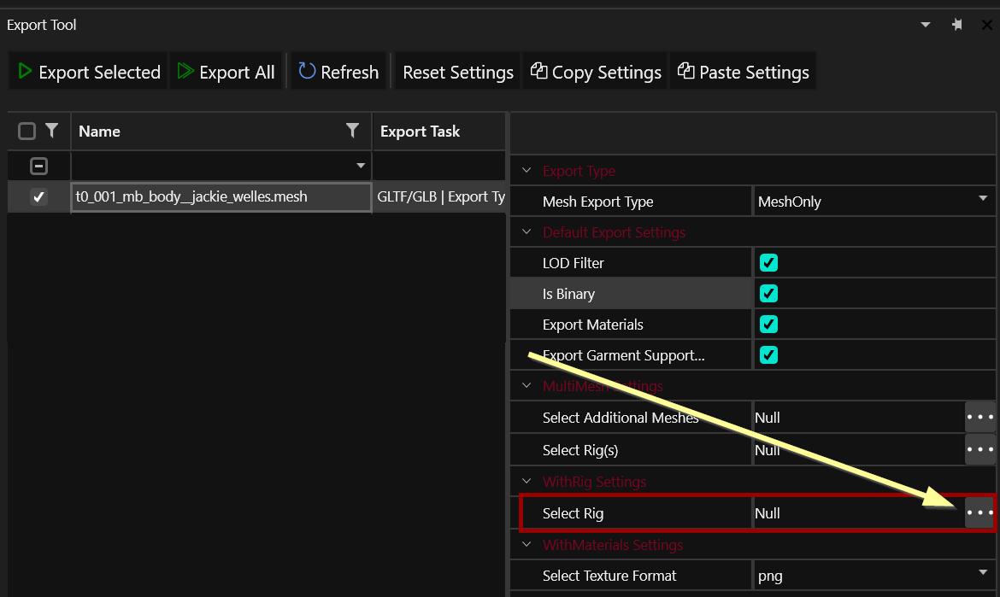
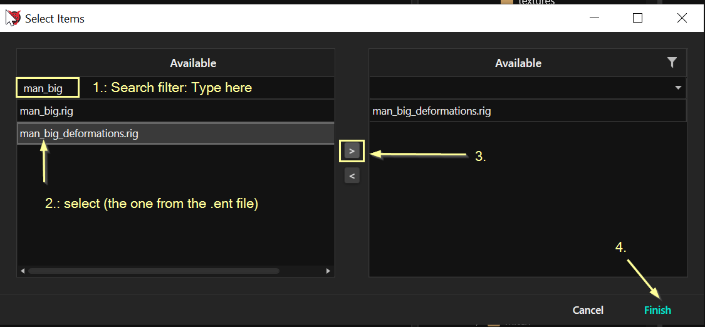
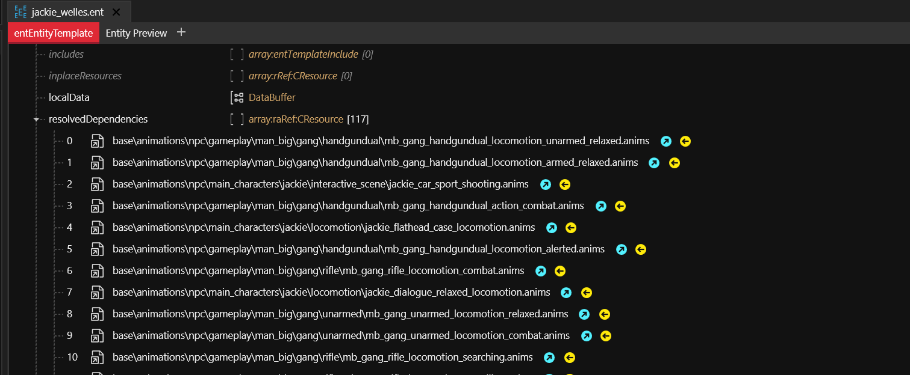
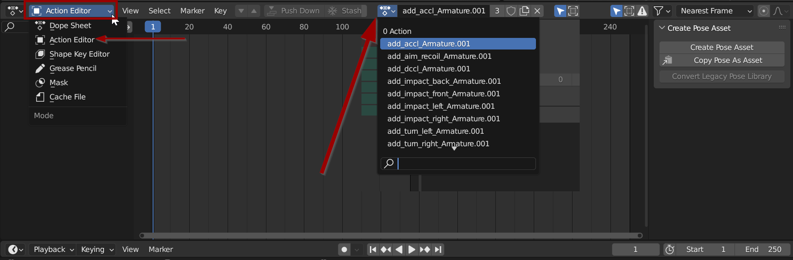

# Exporting Rigs & Anims

## Summary

**Created by @Simarilius** \
**Published October 15 2022**

This guide aims to walk you through adding the rig and some anims to the  character to blender previously exported. Guide is using nightly WolvenKit, Cyberpunk add-on for Blender 1.0.9, and Blender 3.3.

#### This guide uses the following versions:

* Cyberpunk 2077 game version 1.6
* Blender 3.3 stable
* Cyberpunk add-on for Blender 1.0.9rc1 (release has a bug)
* WolvenKit 8.7 nightly&#x20;

### Requirements

* [**WolvenKit nightly release version 8.7**](https://github.com/WolvenKit/WolvenKit) **or higher**&#x20;
* [**Blender 3.3**](https://www.blender.org/) **or higher**
* Optional, required for material import: [**Cyberpunk add-on for Blender 1.0.9**](https://github.com/dragonzkiller/cp77research) **or newer**


If you want to get your hands dirty, check [this github repository](https://github.com/Simarilius-uk/CP2077\_BlenderScripts/) for a selection of Python scripts for Blender.


## Exporting to Blender

So exported characters are cool, but how do we get them out of that annoying pose?&#x20;

**We need the rig, and maybe some animations:**

* the main body rig
* the head/face rig

We're going to export them, bind everything, and attach the head to the body. (recapitate?!?)

### Finding the body rig

You can look it up in the body's entity file. Find it by file name, or right-click on Jackie's body mesh and select "find files using this", then doing the same again on the `.app` file.&#x20;

Open up the .ent file and check the `components` array for an `entAnimatedComponent` (usually named`deformations`), which lists the rig:

<figure><figcaption>
look for the property "rig"
</figcaption></figure>


You will need this for both the head mesh and the body mesh export.


### Finding the head rig

The head rig is in the same folder as the head mesh.&#x20;

Naming conventions:

<pre><code><strong>generic:             &#x3C;name_of_head_mesh>_skeleton.rig
</strong><strong>Jackie:              h0_001_mb_c__jackie_welles_skeleton.rig
</strong></code></pre>


You will need this for the head mesh export.


### Re-exporting the meshes

We now need to re-export the meshes we want to use.


In the first step of the guide, you should have exported them as withMaterials. That should have created material.json files and images, as the export we will use now won't do that.


#### The body mesh

In the Export Tool, select the body mesh and adjust its export options. (In Wolvenkit < 8.8, double-click it).

<figure><figcaption>
Wolvenkit > 8.8
</figcaption></figure>

1. Filter by name: type into the empty row at the top of "Available". (<= Wolvenkit 8.8.1: It will only search from the start of the name)
2. Select the rig by name (the same one as in the .ent file)
3. Move it into the "Available" list
4. Apply

<figure><figcaption>
As of WKit 8.8.1, the filter will only search from the start
</figcaption></figure>

#### The head mesh

1. Repeat the process above, but use the name of the head mesh rather than the body.

## Importing into Blender

Use the [Cyberpunk GLTF plugin](https://github.com/WolvenKit/Cyberpunk-Blender-add-on) (File > Import > Cyberpunk GLTF) to import both of your files into Blender.


For a detailed import/export guide, see [here](https://wiki.redmodding.org/cyberpunk-2077-modding/modding-know-how/3d-modelling/exporting-and-importing-meshes).&#x20;


If the WithRig has worked you should notice that rather than the mass of unorganised huge bones, you've got a skeleton structure that kinda makes sense. I normally change the bone display settings of that armature from `Octahedral` to `Stick`, as that prevents bones from completely hiding the mesh:


Most characters bring in full bodies; however, Jackie is not one of them. CDPR modelled only his chest and hands, since the rest of his body was never planned to be visible.


## Merging the skeletons

Now, we hook up everything&#x20;

You can do this either by script or by hand. This guide assumes you will select Option B, using the most recent script from [this github repository](https://github.com/Simarilius-uk/CP2077\_BlenderScripts/blob/main/Merge\_rigs.py).

1. Switch to the "Scripting" perspective and create a new empty script
2. Copy the script from [github](https://raw.githubusercontent.com/Simarilius-uk/CP2077\_BlenderScripts/main/Merge\_rigs.py) and paste it into the document
3. At the top of the script, find \~line 5, where it says `= bpy.data.objects`, and rename your armatures accordingly.
4. Select the `BodyArmature` in the 3d viewport
5. Run the script

&#x20;

The rigs should merge; the head meshes should be without an armature parent now.&#x20;

Hopefully it looks something like below, with all the bones selecting at once, and just the one green dude in the outliner named BodyArmature.

<figure><figcaption></figcaption></figure>

### Parenting the other meshes to the armature


If you have a lot of meshes, you might want to skip this step.


For each submesh item, repeat the following steps:

1. Select it in edit mode
2. Set the `Armature Modifier` in the Modifiers tab to `BodyArmature`

This should snap the item to the body and it will follow with correct weights when animated.

## Animations

To find animations compatible with the character you just exported, open up their `.ent` file and expand the `resolvedDependencies`:

<figure><figcaption></figcaption></figure>

Alternatively, search for `.anim` in the asset browser


You might want to avoid animations from the lip sync and facial tracking folders, as we haven't worked out how to make them usable yet. (If you have figured it out, please let us know on [Discord](https://discord.gg/redmodding)!)&#x20;


Add the animation you've chosen to your WKit project and export it.&#x20;


If you want to use this animation for editing, you need to check `Include Root Motion` in the export settings. Otherwise, you don't have to change anything.


You will end up with a new .glb file, which you can import into Blender.

Now let's apply it:

1. Select the `BodyArmature`
2. Switch to the `Animation` workspace
3. In the panel at the bottom, change the dropdown on the left from `Dope Sheet` to `Action Editor`
4. In the dropdown in the middle, select one of the animations you just imported.
5. Click the "play" button
6.

    <figure><figcaption></figcaption></figure>

You can keep importing more anim files and the list just grows.&#x20;

Anyway, cheers Chooms, hope this has been helpful, have fun!

<figure><figcaption></figcaption></figure>

Note:

Most of the animations seem to work flawlessly, some don't and I don't know enough about blender animation to know why, if anyone has a better idea whats going on please enlighten me! Occasionally the process gos screwy somewhere and the model freaks out when you attach the anims, I've mostly just repeated the process and its come out fine so I haven't worked out exactly whats causing that. As always happy to try and help on the Discord, normally in #textures-and-models.
