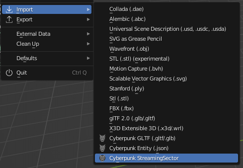
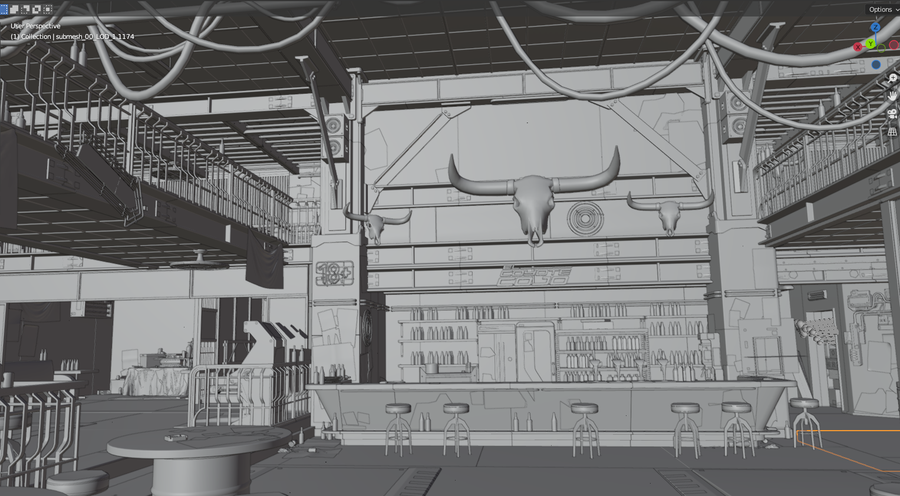
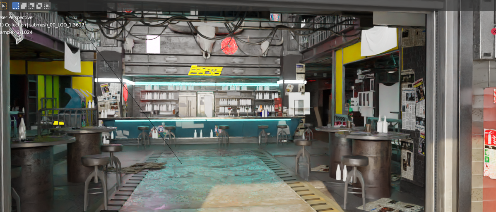

# Editing locations in Blender

## Summary

**Created by @Simarilius** \
**Updated 19 March 2023 \~** [Simarilius](http://localhost:5000/u/G2MqNkfgTlQ1R3G4B5s6WefLjdy2 "mention")\
**Updated 7 May 2023 \~** [manavortex](http://localhost:5000/u/NfZBoxGegfUqB33J9HXuCs6PVaC3 "mention")

The original exporter was based on some posts by **@123321** in the Discord _#mapeditor_ channel back in May, so all credit to him for working it out in the first place.

### Versions and requirements

This guide was initially written with game version 1.6 of Cyberpunk 2077.

* [**Wolvenkit**](https://github.com/WolvenKit/WolvenKit) **>= 8.8.1 or the latest** [**Nightly**](https://github.com/WolvenKit/WolvenKit-nightly-releases/releases)
* [**Blender 3.3**](https://www.blender.org/) **or newer**
* [**Cyberpunk add-on for Blender 1.2.0**](https://github.com/WolvenKit/Cyberpunk-Blender-add-on/releases)

## Exporting Streaming Sectors to Blender

To export a location, you need to know its files — you can either [pick them from our list](interesting-sectors.md) or [go and find them](finding-a-specific-sector.md) (and add them to the list, please).

Open the script manager by going Tools>Script Manager and add a script. Paste the script below into it. Replace the sectors in the sectors list with your sector names, then run it.&#x20;

```javascript
// Exports file and all referenced files (recursively)
import * as Logger from 'Logger.wscript';

//list of sector files (paths need double slashes) - REPLACE WITH YOUR SECTORS 
var sectors=['base\\worlds\\03_night_city\\_compiled\\default\\interior_-20_-16_0_1.streamingsector',
'base\\worlds\\03_night_city\\_compiled\\default\\interior_-39_-31_0_0.streamingsector',
'base\\worlds\\03_night_city\\_compiled\\default\\interior_-39_-32_0_0.streamingsector',
'base\\worlds\\03_night_city\\_compiled\\default\\interior_-40_-31_0_0.streamingsector',
'base\\worlds\\03_night_city\\_compiled\\default\\interior_-40_-32_0_0.streamingsector'
]

// sets of files that are parsed for processing
const parsedFiles = new Set()
const projectSet = new Set()
const exportSet = new Set()
const jsonSet = new Set()

// loop over every sector in `sectors`
for (var sect in sectors) {
    Logger.Info(sectors[sect])
    ParseFile(sectors[sect])
}

// save all our files to the project and export JSONs
for (const fileName of projectSet) {
    var file = wkit.GetFileFromBase(fileName)
    wkit.SaveToProject(fileName, file)

    if (jsonSet.has(fileName)) {
        var path = ""
        if (file.Extension === ".ent") {
            path = wkit.ChangeExtension(file.Name, ".ent.json")
        }
        if (file.Extension === ".streamingsector") {
            path = wkit.ChangeExtension(file.Name, ".streamingsector.json")
        }
        if (file.Extension === ".app") {
            path = wkit.ChangeExtension(file.Name, ".app.json")
        }
        if (path.length > 0) {
            var json = wkit.GameFileToJson(file)
            wkit.SaveToRaw(path, json)
        }
    }
}

// export all of our files with the default export settings
wkit.ExportFiles([...exportSet])


// begin helper functions
function* GetPaths(jsonData) {
    for (let [key, value] of Object.entries(jsonData || {})) {
        if (key === "DepotPath" && value != null && value != 0) {
            yield value;
        }

        if (typeof value === "object") {
            yield* GetPaths(value)
        }
    }
}

// Parse a CR2W file
function ParseFile(fileName) {
    // check if we've already worked with this file and that it's actually a string
    if (parsedFiles.has(fileName) || typeof fileName !== "string") {
        return
    }
    parsedFiles.add(fileName)

    // try to get the file
    var file = wkit.GetFileFromBase(fileName)
    if (file === null) {
        Logger.Error(fileName + " could not be found")
        return
    }
    
    // handle the file types we want
    if (file.Extension === ".mesh") {
        projectSet.add(fileName)
        exportSet.add(fileName)
    }
    if (file.Extension === ".ent") {
        projectSet.add(fileName)
        jsonSet.add(fileName)
    }
    if (file.Extension === ".app") {
        projectSet.add(fileName)
        jsonSet.add(fileName)
    }
    if (file.Extension === ".streamingsector") {
        projectSet.add(fileName)
        jsonSet.add(fileName)
    }
    // now check if there are referenced files and parse them
    var json = JSON.parse(wkit.GameFileToJson(file))
    for (let path of GetPaths(json["Data"]["RootChunk"])) {
        ParseFile(path)
    }
}
```

This will add all the sector files and the files needed to export them to your project, and exported the files to json/glb as appropriate with the default export settings. May take a few minutes to run, just wait for the Stop to grey out and Run to become available again.

## Importing to Blender

1. Open Blender, then select `File` -> `Import` -> `Cyberpunk Streaming Sector`.

<figure><figcaption></figcaption></figure>

2. Select the `.cdmodproj` file in the root of your Wolvenkit project directory.
3. Wait - import may take a few minutes.
4. As the meshes will be scaled and positioned according to the map coordinates, they're probably off-screen. Since they are selected, you can hit `.` on the numpad (`/` on German keyboard), moving the camera to selection.


The script will find all streamingsector .json files under the `raw` directory and import them. If you are editing multiple streaming sectors but want to import only one at a time, remove or rename the json files under `raw`.


(TODO May 07: Is this working by now?) \
There are still some node types in the sector file not being processed currently, or not fully instanced. These include **decals** (which just get an empty with details of what the decal is) and lights which I haven't gotten round to.&#x20;

<figure><figcaption><p>Export of <em>El Coyote Cojo</em></p></figcaption></figure>

<figure><figcaption><p>Export of <em>El Coyote Cojo, generated materials!</em></p></figcaption></figure>

## Importing back into Cyberpunk

1. Download this script ([raw link](https://raw.githubusercontent.com/Simarilius-uk/CP2077\_BlenderScripts/main/export\_to\_JSONs.py)) from [Sim's github](https://github.com/Simarilius-uk/CP2077\_BlenderScripts/blob/main/export\_to\_JSONs.py)&#x20;
2. Switch to Blender's scripting perspective and paste the code there
3. Adjust line 30 and change the path assigned to 'project' to the path of your cyberpunk project. Make sure to double the backslashes.\
   Example: \
   before:  `project = 'F:\\CPmod\\meshdecal_parralax'`\
   after:     `project = 'D:\\Cyberpunk_Modding\\world_editing\\myproject'`
4. In your Wolvenkit project's root folder, create the folder `output`
5. Run the script by clicking the ▷ button\
   _If the script throws errors and you can't resolve them on your own or with the help of ChatGPT, find us on_ [_Discord_](https://discord.gg/redmodding)_!_
6. Via Windows Explorer, copy the json file from the `output` directory in your Wolvenkit project over the file with the same name in the `raw` directory.
7. In Wolvenkit, right-click on the file you just copied and select "Import from json"
8. You're done!


