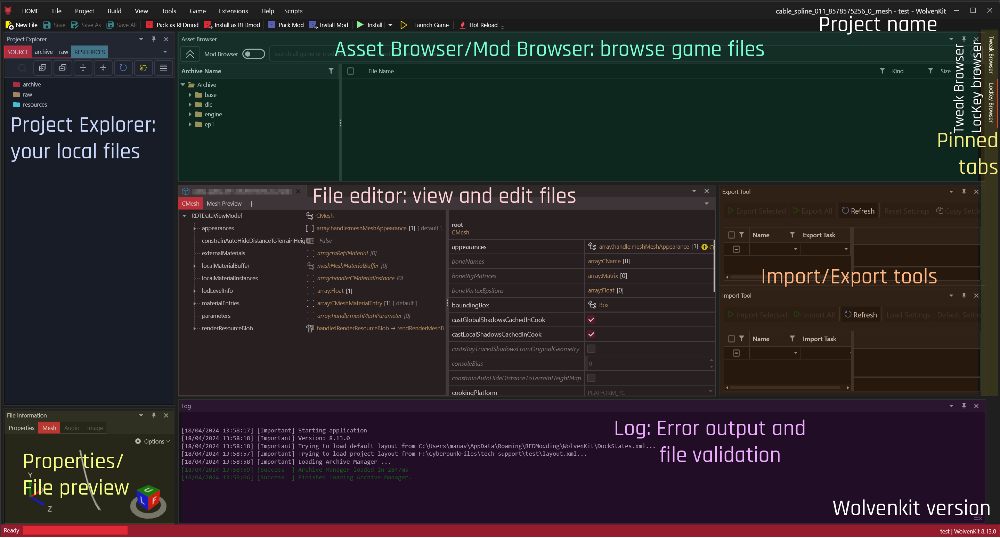

# Editor

## What is the Editor?

The Editor is the main mod-editing workspace within WolvenKit, holding the docking window for the individual [#editor-panels](./#editor-panels "mention").

<figure><figcaption>
The Wolvenkit UI as of 8.13
</figcaption></figure>

## Editor panels

For an explanation to the editor panels, please see the corresponding sub-pages:&#x20;

* [project-explorer.md](project-explorer.md "mention"): Your local game files go here
* [asset-browser.md](asset-browser.md "mention"): Browse game files or mod files
* [properties.md](properties.md "mention") / File Preview: Information about the current file
* [file-editor](file-editor/ "mention"): Edit or view game files
* [log.md](log.md "mention"): Shows you error messages or [file-validation.md](../file-validation.md "mention") output
* [tweak-browser.md](tweak-browser.md "mention"): Lets you browse existing tweaks
* [lockey-browser.md](lockey-browser.md "mention"): Lets you browse translation entries

## Docking

The docking in WolvenKit is similar to other IDE's such as Visual Studio. All panels can be rearranged by docking to specific areas, or used as a standalone floating window.


Try double-clicking an Editor title bar to create a floating window!&#x20;


## Status Bar

The Status Bar along the bottom of the application window contains useful information such as your **WolvenKit version number** and the current mod project, and provide the ability to install new updates if available.
