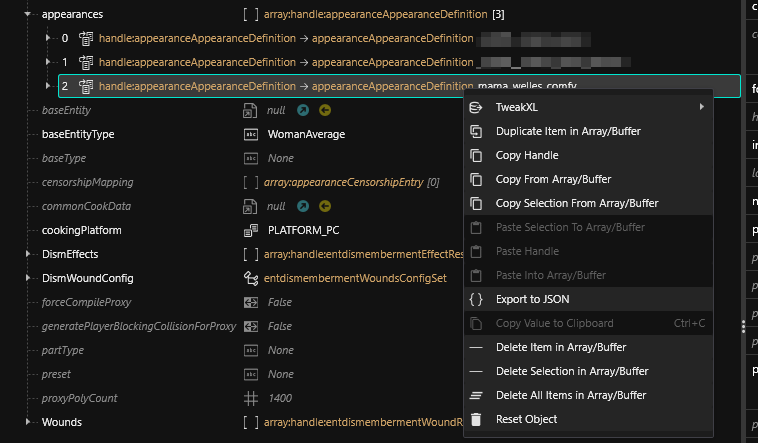

# File Editor

## What is the File Editor?

The File Editor is a document viewer and manipulator for modifying any REDengine file. WolvenKit is the only RTTI-based editor for RED4.

## Using the File Editor

REDengine files can be viewed by double-clicking them within the [**Project Explorer**](project-explorer.md). The File Editor expects unbundled files with compressed internal buffers, so we recommend using files added to the project using the [**Asset Browser**](asset-browser.md) to ensure compatibility.\
\
After making changes to a RED4 file, use the **Save File** or **Save All** button within the General section of the Ribbon to save changes. The document can then be closed, and packed with the mod project.

### Context Menu

The right-click menu offers different options depending on what you currently have selected. Maybe they will one day be comprehensively documented, but it will not be this day.

### Array items

<figure><figcaption></figcaption></figure>

#### TweakXL: Override Value

Does not make sense under all circumstances, but will attempt to create a TweakXL override for the current selection (as if you had selected it in the [tweak-browser.md](tweak-browser.md "mention")).

#### TweakXL: Copy to clipboard

Attempts to copy the [Tweak](http://127.0.0.1:5000/s/4gzcGtLrr90pVjAWVdTc/for-mod-creators/files-and-what-they-do/tweaks) identifier to clipboard. If something without a tweak identifier is selected, you'll get the RedType instead.

#### Duplicate item in Array/Buffer

Creates an exact copy of the currently selected item, which will be inserted directly after it (this is important for e.g. [material instances](http://127.0.0.1:5000/s/4gzcGtLrr90pVjAWVdTc/for-mod-creators/files-and-what-they-do/3d-objects-.mesh-files#step-3-material-definition) in mesh files.

#### Copy Handle

Will copy a reference to your object for pasting inside of Wolvenkit

#### Copy From Array/Buffer

Copies the currently selected item for pasting inside of Wolvenkit. If you have selected multiple items, the most recent selection will be used.

You can only paste items to a compatible array.


The clipboard will be cleared once you paste an item to **prevent reference cloning**.


#### Copy Selection From Array/Buffer

Copies the currently selected items for pasting inside of Wolvenkit. You can only paste items to a compatible array.


The clipboard will not be cleared once you paste. However, if you paste multiple times, all those pasted items **will be identical** - so if you change the file path in one of them, it will change all across your file.&#x20;

You can [#duplicate-item-in-array-buffer](file-editor.md#duplicate-item-in-array-buffer "mention") to fix this, or you can abuse it to save copy-pasting. Word of warning: if you choose the latter, you will ruin somebody's day, and it's probably going to be future you.


#### Export to JSON

See [#export-as-json](../usage/import-export/import-export-as-json.md#export-as-json "mention")

#### Delete Item in Array/Buffer

Deletes the currently selected item. If you have selected multiple items, the most recent selection will be used.

#### Delete Selection From Array/Buffer

Deletes the currently selected items.

#### Delete All Items in Array/Buffer

Empties the entire list

#### Reset Object

Will reset the selected object to its default state, as if you had just created it via the parent array's "Add new element" function.
