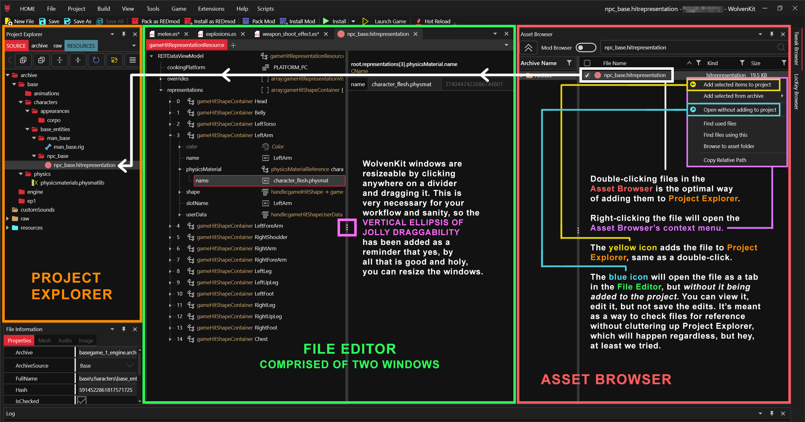
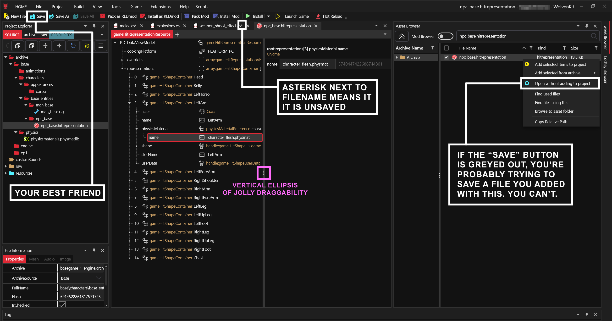
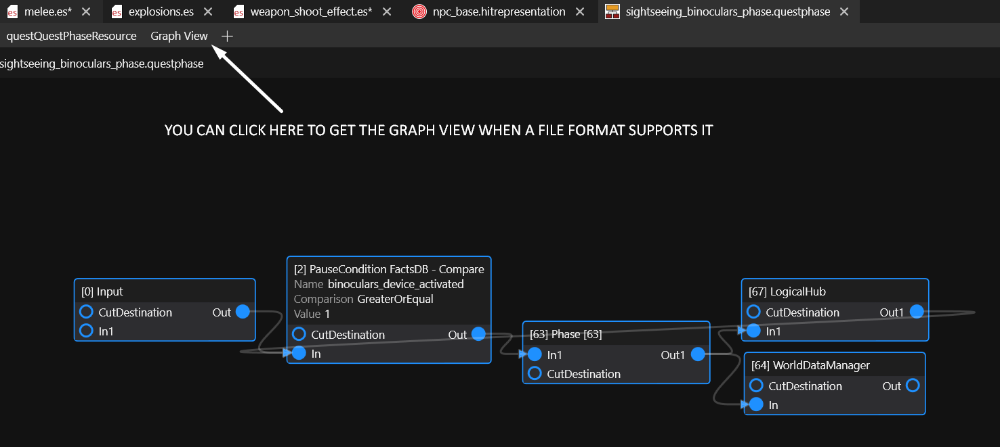
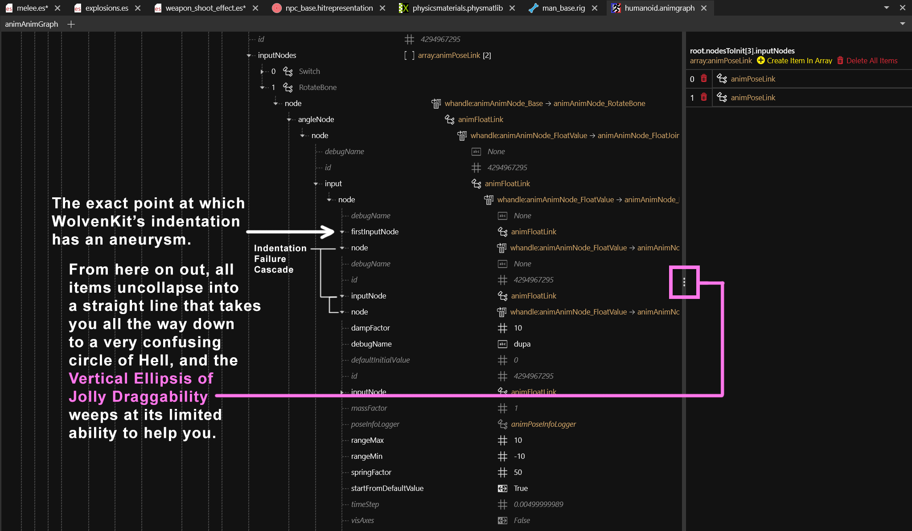
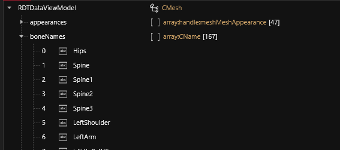
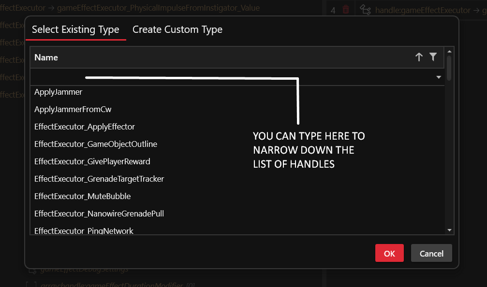

# File Editor

What is the **File Editor**?

The **File Editor** is a document viewer and manipulator for modifying any REDengine file. \
WolvenKit is the only RTTI-based editor for RED4.

## Adding files via File Editor

To edit a REDEngine file, you have to add it to your [your project's archive folder](project-explorer.md#archive) first. There are two ways to do this from the [**Asset Browser**](asset-browser.md):

* double-click on a file in the Asset Browser's navigation window
* select several at once, then use the [**Add Selected Items to Project**](asset-browser.md#add-selected-items-to-project) option from the context menu

You can also open files without adding them to your project:

* Right-click a file in the Asset Browser and use [**Open Without Adding to Project**](asset-browser.md#open-without-adding-to-project)


This version of the file is _read-only_; you can edit it, but you can't save it.


<figure><figcaption>
An annotated screenshot demonstrating how to add a file from the Asset Browser to Project Explorer
</figcaption></figure>


Files in your Wolvenkit Project are accessible via Windows Explorer. It also works the other way around; however, not everything has to be compatible.


## Saving Edited Files

See the next section about [#editing-files](file-editor.md#editing-files "mention")


TL;DR: Wolvenkit does not auto-save for you. Do it yourself, you lazy gonk!


Unless you have opened a file as read-only, you can save your changes in the following ways:

* Hotkey: `Ctrl+S`
* Save/Save All button


Unsaved files will have an asterisk next to their name in the editor tab.


<figure><figcaption>
Bear in mind that files added with the <strong>Open Without Adding to Project</strong> option behave identically even though they can't be saved; this is so you know that a file you may be using for reference has been edited by you - possibly seven or eight hours ago, when you foolishly thought "I can figure out how to make this mod in five minutes" - and is no longer the same as the original file.
</figcaption></figure>

## Opening files

## Editing files

Once a project is part of your Wolvenkit Project and shows up in the Project Explorer, you can open and edit it. Again you have two ways of doing that:&#x20;

* Double-click the file
* Click on the blue icon that appears next to the file when you mouse over it


You can clear up some extra space for the **File Editor** by un-pinning other parts of the view with pin icon at the top right, reducing them to easily-accessible tabs.


The file editor features two resizable panels, the [tree view](file-editor.md#navigating-files-the-tree-view) and the [editor panel](file-editor.md#editing-files-the-editor-panel).

<figure><figcaption>
An annotated screenshot explaining the File Editor's interface
</figcaption></figure>

## Navigating files: The tree view

The **tree view** on the left lets you browse the file's structure. All entries are indented per level and can be collapsed by category to preserve the user's sanity as much as possible.&#x20;

Many entries will have descriptor entries in white or grey that give you a preview on their contents.

### The File Editor Context Menu

The **File Editor Context Menu** appears when you right-click on something in the **File Editor.** It offers different options depending on what you currently have selected. Maybe they will one day be comprehensively documented, but it will not be this day. Also, bear in mind that this is specifically about the **File Editor** context menu, which is not the same as the context menus in **Asset Browser** and **Project Explorer**.

### Array items (Handles)

<figure><figcaption>
The context menu options available for items/handles
</figcaption></figure>

#### TweakXL: Override Value

Does not make sense under all circumstances, but will valiantly attempt to create a **TweakXL** override for the current selection (as if you had selected it in the [tweak-browser.md](tweak-browser.md "mention")). This override will be saved as a **.yaml** file and, depending on the handle you tried to use it on, its contents may be useless. You must have **TweakXL** installed via the **Plugins** menu to get this option to appear in the context menu.

#### TweakXL: Copy to clipboard

Attempts to copy the [Tweak](https://app.gitbook.com/s/4gzcGtLrr90pVjAWVdTc/for-mod-creators/files-and-what-they-do/tweaks) identifier to clipboard. If something without a tweak identifier is selected, you'll get the RedType instead. This option, like the previous one, will not appear without the installation of **TweakXL** via the **Plugins** menu.

#### Duplicate item in Array/Buffer

Creates an exact copy of the currently selected item/handle, which will be inserted directly after it (this is important for e.g. [material instances](https://app.gitbook.com/s/4gzcGtLrr90pVjAWVdTc/for-mod-creators/files-and-what-they-do/3d-objects-.mesh-files#step-3-material-definition) in mesh files). This copy can be edited without affecting the original, unlike the next option in the context menu:

#### Copy Handle

Creates a _**reference**_ to the handle. Unlike the previous entry, this _does not_ create an independent copy; it's a reference to the _same instance_ of the handle, not unlike a desktop shortcut. Whatever changes you make to the reference will also transfer to the original, and this will not be immediately apparent because WolvenKit does not update this in real-time. You must save the file and reopen it to see the original and the reference showing identical values after only one of them was edited.

#### Paste Handle

Exactly as it seems: it's the paste function of **Copy Handle**. As explained above, it pastes a _reference_, not a copy. Do _not_ use this if you want a copy that you can edit independently of the original. "Why the hell wouldn't I _always_ want that?", you might be asking. Because in some files, it can be helpful to have the same instance of a handle referenced in various places and only having to edit one of them. Do not question us, for we know the Old Ways (and if you do, the ideal avenue is to open a ticket in [the Issues tab of GitHub](https://github.com/WolvenKit/WolvenKit/issues)).

#### Copy From Array/Buffer

Copies the currently selected item/handle for pasting inside of Wolvenkit. You can only paste items to a compatible array. If you have selected multiple items, the most recent selection will be used.


The clipboard will be cleared once you paste an item to **prevent reference cloning**.


#### Copy Selection From Array/Buffer

Copies the currently selected items/handles for pasting inside of Wolvenkit. You can only paste items to a compatible array.


The clipboard will not be cleared once you paste. However, if you paste multiple times, all those pasted items **will be identical** - so if you change the file path in one of them, it will change all across your file.&#x20;

You can [#duplicate-item-in-array-buffer](file-editor.md#duplicate-item-in-array-buffer "mention") to fix this, or you can abuse it to save copy-pasting. Word of warning: if you choose the latter, you will ruin somebody's day, and it's probably going to be future you.


#### Export to JSON

See [#export-as-json](../usage/import-export/import-export-as-json.md#export-as-json "mention") Particularly useful for searching large files with CTRL+F in your word editor of choice. However, JSON conversion can get confused by some complex graph files. For instance, **humanoid.animgraph** is converted into a 300-megabyte JSON (300 times the original file's size) with over half a million lines. But hey, you can still CTRL+F it, so there's that.

#### Delete Item in Array/Buffer

Deletes the currently selected item/handle. If you have selected multiple items, the most recent selection will be used. This can also be done via the right-side window of the file editor by clicking on the red trashcan icons, as shown earlier in this article.

#### Delete Selection From Array/Buffer

Deletes the currently selected items/handles.

#### Delete All Items in Array/Buffer

Empties the entire list of items/handles. This is tipically accompanied by a distant, echoing voice that seems to say "That's a bold strategy, Cotton, let's see if it pays off for 'em."

#### Reset Object

Will reset the selected handle and all its values to their default greyed-out state, as if you had just created it by using **Create Item in Array** or **Create Handle**. It undoes all edits, including those by Cyberpunk's developers.

## Editing files: The editor panel

The **Editor View** on the right side lets you edit the selected properties ([arrays, handles and variables](file-editor.md#array-items-handles)). &#x20;

[Each editable property has a small icon next to it that displays at a glance what awaits you when you select it. ](#user-content-fn-1)[^1]

You will observe different kinds of values (dropdowns, numbers, booleans, texts, enums...). Many of those appear in grey:

<figure><figcaption>
Source file: base\physics\physicsmaterials.physmatlib
</figcaption></figure>

Those properties have not been changed by the person who touched this file, still holding their [default value](#user-content-fn-2)[^2].


You can deduce quite a few things about a property's functionality by examining which parameters are untouched and which have been tweaked by Cyberpunk's developers.


### Editing properties

The editor panel will show you the following kinds of controls:

#### Text fields

The icon that says "abc" on it is the one you shall learn to fear, for it heralds the coming of a string variable. Whenever you see it next to a property you need to edit and you don't know what strings you can type in it, get ready to spend the next several hours of your life getting very well-acquainted with WolvenKit's [search feature](../usage/wolvenkit-search-finding-files.md).

<figure><figcaption>
The "abc" icon, rendered in lowercase presumably in an attempt to minimize the dread it inspires deep in one's soul
</figcaption></figure>

#### Curve fields

Some file formats offer more specific editing tools. For instance, curve properties often give you a **Curve Editor**, especially useful in **.curveset** files:

<figure><figcaption>
The curve editor in all its chaotic artistic glory
</figcaption></figure>

#### Node view

And some node-based files, such as **.questphase** files, offer a **Graph View** for viewing nodes and their connections:

<figure><figcaption>
The Graph View. Obviously. We have to write something under these images otherwise the spacing between the image and the next paragraph becomes weirdly unnerving.
</figcaption></figure>

Some node-based file formats, such as **.animgraph** and **.behavior** files, are not yet blessed with the **Graph View**, which as of February 13th 2024 is still under development. These files can be extremely complex and their properties un-collapse into so many sub-properties that it literally breaks WolvenKit's indentation:

<figure><figcaption>
This is the humanoid.animgraph file, which has over 4000 nodes currently browsable only in list form. You can think of it as what would happen if M. C. Escher took some ketamine and decided to design a maze. Converting this file to .json format results in a 300-megabyte file with over half a million lines. It holds naught but pain and suffering.
</figcaption></figure>

Until the **Graph View** is made available for these file formats, they are to be feared.

## Adding, Removing or Replacing Properties

Other than browsing and editing properties, you can also delete them, replace them, or add completely new ones.&#x20;


The possibilities are endless, but most of them make the game crash. Wolvenkit will already prevent you from doing a lot of dumb things, but you can still get creative.


To edit the property structure, you'll mostly use the project tree and its [context menu](file-editor.md#the-file-editor-context-menu), whereas you edit the property's contents in the [editor panel](file-editor.md#editing-files-the-editor-panel).

This section will give you an overview about the existing types of properties and what they are commonly used for.

#### Arrays

Arrays are lists of items. They look like this:

<figure><figcaption>
The "boneNames" array in a mesh
</figcaption></figure>

You can duplicate, add and remove array items and change their order via drag\&drop.&#x20;

Arrays can contain any of the other types of data. They do not contain other arrays directly; but [#handles](file-editor.md#handles "mention") often include other arrays.


The "Paste" operations will be disabled if the items you copied aren't compatible with your currently-selected array.


#### Variables

The "data" in "data structure", the lowest level of nesting. You can edit them in the editor panel to the right, and they will never hold other variables.

#### Data Structures

As the name implies, a data structure is anything that structures data. These elements can hold any collections of other data structures, variables, or handles.

<figure><figcaption></figcaption></figure>

#### Handles

Handles are a special kind of data structure, which hold pieces of executable code.


Since you can't customize editable handles, you might as well delete them.


Handles: An example

Handles do specific things within the scope of the **array** they belong to. For instance, the **weapon\_shoot\_effect.es** file is the foundation for how gunshots behave the way they do in Cyberpunk. It has several entries dealing with different aspects of gunshots, and each entry has an array called **effectExecutors**. It can hold dozens of other entries, such as **PhysicalImpulseFromInstigator** or **HitReaction**. Now let's say you open **weapon\_shoot\_effect.es**, uncollapse the **player\_ray** entry, then uncollapse the **effectExecutors** array, and remove the **HitReaction** element from it. \
Congratulations, you have just eliminated gun violence in Night City. Bullets no longer cause damage or even reaction animations. You absolute hero, you.

In case you don't know, **player\_ray** refers to the concept of a gun's raycast, which detects objects along the path of a bullet and applies appropriate behaviors. So if a lack of familiarity with that term was causing you to wonder who the hell Ray is, well, I hope it's now clear.

You can also replace existing handles or add new ones from a list of handles compatible with the array:

<figure><figcaption>
A demonstration of handle creation/replacement functionality in the weapon_shoot_effect.es file
</figcaption></figure>

When you select an array on the left-side window of the **File Editor**, you will find two types of yellow buttons on the right-side window: **Create Item in Array**, which sits alone at the top, and **Create Handle**, which appears next to every handle in the array. Clicking either of them will bring up the **Type Selector**: a search menu that lets you pick from a list of handles compatible with the array. The difference is that **Create Item in Array** _adds_ the selected handle to the array whereas **Create Handle** _replaces_ the handle it was next to, deleting it in favor of the one you picked.

In either case, the **Type Selector** will give you the full list of handles you can choose for the array in question, and you can narrow down the list by typing search terms such as, say, "Grenade", or "Effector", or "ofwifagbaygfaergergqhqjqtjfy" if you fall asleep on your keyboard:

<figure><figcaption>
The new and extremely improved Type Selector, which as of February 13th 2024 is available only on the nightly branch of WolvenKit
</figcaption></figure>


As of February 13th 2024, the main branch of WolvenKit is still using the old Type Selector, which is slow and limited in its search capabilities. It works like autocomplete, so you can't just type "Effector" and get every item that has "Effector" in the name. The new Type Selector can do that and is much faster. If you don't want to wait for it to be released on the main branch (probably in 8.13.0), you can already use it in WolvenKit's [nightly branch](https://github.com/WolvenKit/WolvenKit-nightly-releases).


If you select a handle instead of an array on the left-side window, you will still get the **Create Handle** button on the right-side window, allowing you to replace the handle you have selected.

The red trashcan icons can also delete handles, as you've surely guessed, but there's a way to do it directly on the left-side window using the **File Editor context menu**. So for our next section, we proudly present... _\*insert drumroll here\*_

[^1]: _Sometimes, you will be blessed with all compatible entries in a dropdown menu, but often you will be met with nothing but text fields that requires Arcane Knowledge to be correctly filled._ \

    _For instance, in the image above, the selected property is given as **character\_flesh.physmat** by default. There are \~80 other materials that you can only learn about in the file that contains them (in this case, **physicsmaterials.physmatlib**). This will make you very thankful for the existence of the **Open Without Adding to Project** option._&#x20;

    \
    _Well, except when you do a bunch of edits on a file that you forgot is read-only._&#x20;

[^2]: For instance, the image above has **dynamicFriction** set to 5. The default **dynamicFriction** value of a physics material is 0.300000012. \
    \
    If you set it to that, the **dynamicFriction** property will turn grey to signal that it's no longer special, and you will feel strangely guilty.
