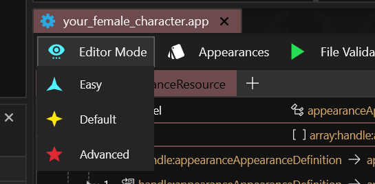

# Editor Difficulty Mode

## Summary

**Created:** Dec 03 2024 by [manavortex](https://app.gitbook.com/u/NfZBoxGegfUqB33J9HXuCs6PVaC3 "mention")\
**Last documented update:** Dec 03 2024 by [manavortex](https://app.gitbook.com/u/NfZBoxGegfUqB33J9HXuCs6PVaC3 "mention")

This page describes Wolvenkit's Editor Difficulty Mode.

## Where to change it

To change the **default**, head to Wolvenkit's [settings page](../../settings.md)

To switch it in-editor, use the dropdown in the upper left corner of the .app

<figure><figcaption></figcaption></figure>


The person who wrote most of the wiki and implemented the feature uses easy mode as default!


### Easy

Recommended for beginners. Many properties that you won't want to edit are hidden, other properties that you shouldn't edit are write-protected.

### Default

Should show all properties that you realistically want to edit for regular use cases. Autogenerated properties are write-protected, irrelevant properties (e.g. `platform`) is hidden.

### Advanced

The authentic editing experience from <=  8.14. Rawdogging CR2W without protection. Use at own risk.
