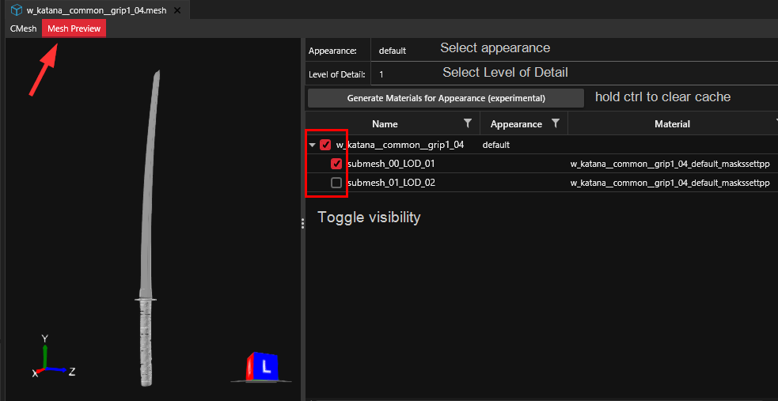

# Preview


Please note that the material preview is a **rough draft implementation**. Until somebody invests a bunch of time to fix it up, the preview will be **neither accurate nor pretty**, and many materials may not be created at all.


## Entity Preview

To be done

## Mesh Preview

You can find the mesh preview inside the file editor for .mesh files in its own tab. \
For further explanation of the UI, see [#ui-documentation](preview.md#ui-documentation "mention")

<figure><figcaption></figcaption></figure>

## UI documentation

### Appearance dropdown

Lets you select an appearance from the list of defined appearances

### Level of Detail

Lets you select the [Level of Detail](https://wiki.redmodding.org/cyberpunk-2077-modding/for-mod-creators/files-and-what-they-do/3d-objects-.mesh-files/level-of-detail-lod), which will load higher or lower fidelity meshes to optimize performance.

### Generate Materials for Appearance


When you hold the `Ctrl` key, Wolvenkit will regenerate the materials from disk.



Please note that the material preview is a **rough draft implementation**. Until somebody invests a bunch of time to fix it up, the preview will be **neither accurate nor pretty**, and many materials may not be created at all.


Will create a rough approximation of the surface material. As of March 2024, this feature needs a lot of work.

