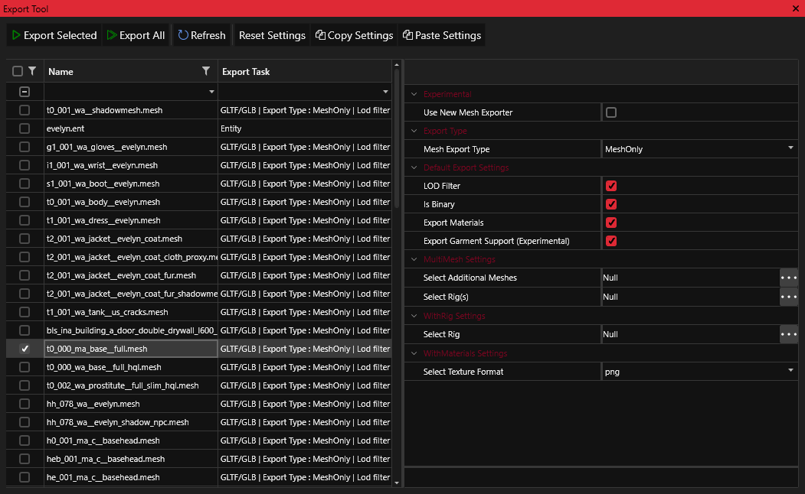

# Import/Export

## What are the Import Export tools?

The Import/Export tools are all-purpose methods for exporting and importing REDengine files. Game files such as models and textures can be exported from REDengine formats such as XBM and MESH into generic assets such as PNG and glTF. As the name of the tools suggest, these files can be edited externally and imported back into REDengine format and packed as a mod.

<figure><figcaption></figcaption></figure>

## Supported I/O Formats

The following formats are supported by WolvenKit for imports and exports

* [x] **mesh  ↔  glb/glTF**\
  Rigged and static 3d models can be converted to and from REDengine. Our I/O supports simple non-targeted skinned meshes for extreme efficiency. Advanced methods support multi-mesh, multi-rig, and material embedded meshes. Meshes with embedded morph targets are automatically included as shapekeys. WolvenKit can also export to virtually any 3d format (non-natively) through the built-in renderer Ab3d. You can read more [about Ab3d here.](https://www.ab4d.com/DXEngine.aspx)\

* [x] **xbm  ↔  png, tga, dds, jpg, bmp, tiff**\
  Textures can be converted to and from REDengine.\

* [x] **mlmask** ↔ **png, tga, dds, jpg, bmp, tiff**\
  REDengine mlmask files can be exported as an array of textures. These texture arrays can be encoded as a new mlmask with a bespoke masklist helper file.\

* [x] **wem ↔ wav, mp3**\
  Audio files can be converted to and from REDengine. Use the Sound Modding Tool to import new audio.\

* [x] **bk2 ↔ avi**\
  Video files can be converted to and from REDengine. (Currently implemented with Project Explorer instead of the Import/Export tool)\

* [x] **morphtarget ↔ glb/glTF (experimental)**\
  REDengine morphtargets can be exported to glTF format. The morphs can be viewed as shapekeys/blendshapes with a 3d package. glTF files can be used to recreate morphtarget files, however only one morph is preserved.\

* [x] **anims** → **glb/glTF (experimental)**\
  Animation files can be exported to glTF format. However this feature is highly experimental. New anims files cannot be imported at this time.\

## Using the Import/Export tools

The **Import/Export** tools can be accessed from the [**Tools**](../../tools.md) category with the Menu.&#x20;


Most imports require an existing REDengine file! For successful imports, ensure that the _archive directory_ contains a "mirrored" file.\
\
_For example, **both** files below must be present for a successful mesh import:_\
**Mod\base\characters\main\_npc\judy\g1\_001\_wa\_glove\_\_judy.mesh**\
**Raw\base\characters\main\_npc\judy\g1\_001\_wa\_glove\_\_judy.glb**


### Simple Import/Export

* Open the Import tool from the Tools menu.\

* Select the files you want to import or export by checking the box icon in the left column, then click **Process Selected** to perform the export operation\

* **Process All** will process all files regardless of selection or visibility filters.\

* Processed files will be available inside the _raw directory_ of the Project Explorer

### Advanced Import/Export

* Choose the import or export view by selecting the circular icon\

* Click any file within the Import/Export grid to view advanced options in the panel on the right\

* (Optional) Check the subpages for Import/Export to learn more about these options by reading the respective wiki pages for each file\

* Click **Confirm** to save advanced options\

* Select the files you want to import or export by checking the box icon in the left column, then click **Process Selected** to perform the operation\

* **Process All** will process all files regardless of selection and visibility filters\

* Processed files will be available inside the _raw directory_ of the Project Explorer

Import/Export Templates

Within the Import/Export grids files can be used as a template. For example, advanced options can be used to set XBM export type to PNG.

1. Select a file and press the **Copy Settings**
2. Select other files of the same extension within the grid
3. Press Paste **Settings** to to apply the advanced options
