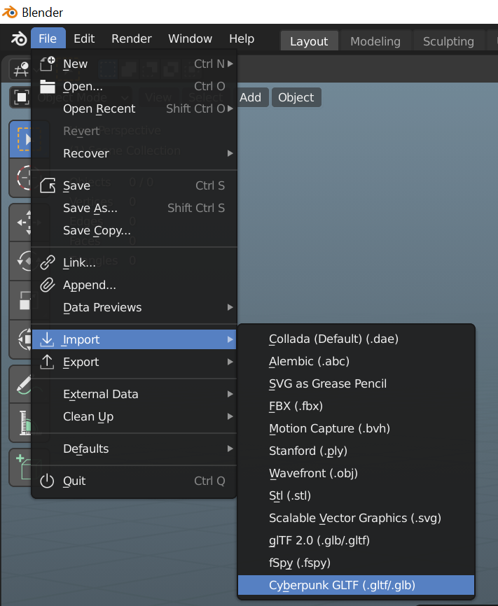

# Blender Integration

## How does it work?

WolvenKit is able to generate a bespoke **material json** file when exporting mesh files using the **WithMaterials** argument. The material json file writes the REDengine shader values and paths to a plaintext json file which can be used in conjunction with HitmanHimself's Blender add-on. The add-on has been tested with Blender version 2.92, 2.93, and 3.0 successfully.

_For the latest information about the HitmanHimself's add-on please visit the GitHub page directly._



### How do I use the Blender integration features?

Preparing a material json with WolvenKit is quite simple, export a mesh using the following setting:

Use the drop down panel for Mesh Export Type, and select the **WithMaterials** option. You will see a material json file created within the Raw directory with the exported glb mesh file.

### Importing Cyberpunk meshes with Blender

After installing and enabling HitmanHimself's Blender add-on, simply navigate to **File** tab, navigate to **Import** then select **Cyberpunk GLTF**.


Not all Cyberpunk shaders are supported! Programming shaders can be very tedious. If you're interested in contributing a new shader please consider reaching out on Discord!



Be sure to select the same Image Extension used during the WithMaterials export! The default extension is PNG.


### Viewing material meshes with Blender

We recommend using Blender Cycles to view meshes with Cyberpunk materials. While some materials can be previewed with Eevee, the multilayered supershader often exceeds the hard-coded limit of 24 image resources.


Cycles viewport performance can be dramatically improved by upgrading to Blender 3.0, using Optix rendering with RTX, and using the Optix viewport denoiser.

