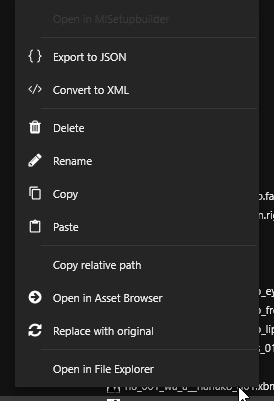

# LocKey Browser

## What is the LocKey Browser?

<mark style="color:blue;">Based on Wkit v. 8.11.0</mark>

LocKey is a localization key designed to identify localized text strings. These keys, such as `'vehicle_enter'` (_which is not only user-friendly but also has a unique ID used typically_), are employed throughout the game. Prior to display, these keys undergo localization to match the language setting of your game.&#x20;

The LocKey browser allows to search for a specific localized text and reveals the corresponding LocKey (numbers) that, when localized, contains the desired text (string).

<figure><figcaption>
a capture of the LocKey Browser 
</figcaption></figure>


The location of the browser in Wolvenkit depends on your design view. In most cases, you can find it within the right-side navigation. However, if you're unable to locate it, you can easily enable it by navigating to 'View' and selecting 'LocKey Browser'


<figure><figcaption></figcaption></figure>
