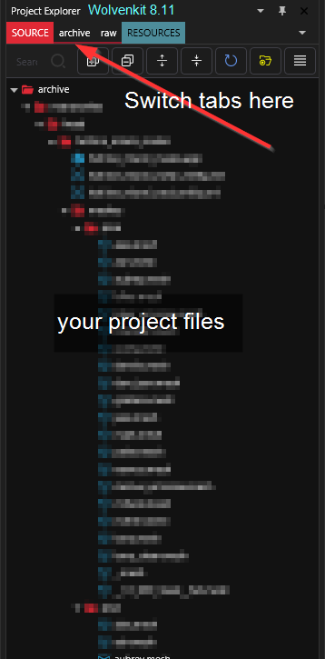
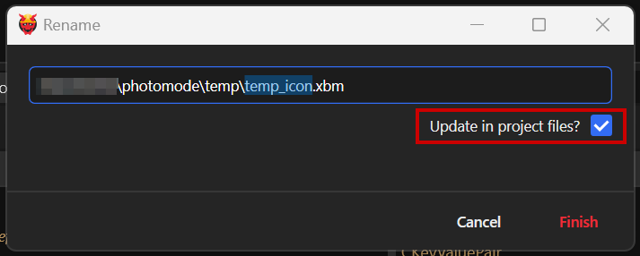

# Project Explorer

## What is the Project Explorer?

The Project Explorer is primarily a tool for organizing and navigating mod project files. The Project Explorer gives a constant tree view of all mod project files which streamlines the modding workflow significantly. There are four main **WolvenKit directories** inside the Project Explorer.&#x20;

### Project Explorer Tabs

You can switch between different tabs at the top of the project explorer (see the red arrow on the screenshot below). Their function (and content) will be explained in the next sections.

<figure><figcaption>
As of 8.11
</figcaption></figure>

###

### Archive

Only shows you files under `your_wolvenkit_project/source/archive`.&#x20;

Contains files that will be bundled into your mod's .archive file. For more information, check the documentation under [wolvenkit-projects.md](../usage/wolvenkit-projects.md "mention") -> [#archive](../usage/wolvenkit-projects.md#archive "mention")

### Raw

**Location:** `your_wolvenkit_project/source/raw`.&#x20;

Your (dirty?) working directory. Contains files that will not be part of your mod, as well as exported files. For more information, check the documentation under [wolvenkit-projects.md](../usage/wolvenkit-projects.md "mention") -> [#raw](../usage/wolvenkit-projects.md#raw "mention")

### Resources

**Location:** `your_wolvenkit_project/source/resources`

Contains control files for your mod. For more information, check the documentation under [wolvenkit-projects.md](../usage/wolvenkit-projects.md "mention") -> [#resources](../usage/wolvenkit-projects.md#resources "mention")

### Source

**Location:** `your_wolvenkit_project/source`

Will show you everything under your project's source folder. No context sorting.

## Using the Project Explorer

WolvenKit features a bespoke [**File Editor**](file-editor/) which is capable of opening and modifying any REDengine file. Double-click any file within the archive directory of the Project Explorer to open the document viewer.\
\
Non-REDengine files which are typically stored in the _raw directory_ can be accessed with the Project Explorer as well. Files such as blend, psd, png, and many more can be opened with the preferred system application. For example, double-clicking a .tga file will open the file with the users system preferred image application.

Any file within the Project Explorer can be moved by dragging and dropping. Additionally files can be copied by holding _Control_ while dragging and dropping.

### Context Menu

Right-click any file within the Project Explorer to explore the Context Menu.

#### Open in MLSetupBuilder

Requires MLSetupBuilder plugin for WolvenKit. Install by navigating to the [**View Options**](broken-reference) Toolbar panel.

#### Export to JSON/Import to JSON

Writes any REDengine file within the _archive directory_ to human readable JSON format, as a mirrored file within the _raw directory_. JSON files can then be modified and converted back to REDengine format from the context menu by right-clicking the JSON file.

#### Delete

Moves any project file to the OS/system Recycle Bin.

#### Rename

Opens a dialogue box which allows any project file to be renamed.

<figure><figcaption></figcaption></figure>

The **Update in project files** option will make WolvenKit update all references in your `source` and `resources` folder.


If you're renaming a folder, WKit will replace all occurrences of the folder's path! It might be better to rename individual files.

If you learned this the hard way, [File Validation](../file-validation.md) can help.


#### Copy

Select any project file to be copied.

#### Paste

Pastes copied project file.

#### Copy relative path

Copies the selected file path to OS/system clipboard, trimming off all folders outside the game directory. Extremely useful for modifying paths while using the File Editor.&#x20;


By pressing Shift and/or Ctrl, you can display alternative copy options


#### Replace with original

Replaces the selected file with the original unmodified version from the game archives. (archive directory only)

#### Open in File Explorer

Find the selected file with the OS/system file explorer.

### Filtering

The Project Explorer can be filtered by directory.

**SOURCE** |  All project directories (default)\
&#x20;   **archive**  |  Archive directory\
&#x20;   **raw** |  Raw directory\
&#x20;   **resources** |  Mirrors the game directory, use it to place additional files\
**PACKED**  |  Internal WolvenKit folder for mod deployment. Will be wiped before packing the project!\
\
Additionally the rightmost hamburger-style button can be used to toggle a flat file list without folders.
