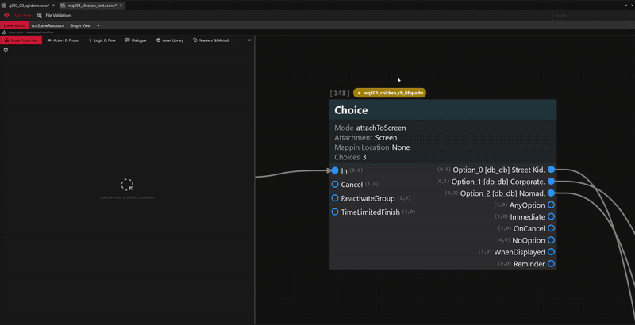

# Scene Editor

The Scene Editor is designed to work .scene files. It enables a node-based workflow: you select a node on the graph editor to edit and inspect its properties.

<figure><figcaption>
Wolvenkit's Scene Editor
</figcaption></figure>


Undo and redo actions are currently **not supported** but are planned.&#x20;

Be careful with your edits and it wouldn't hurt to make periodical backups anyways!


## What do the tabs mean?

<figure><figcaption></figcaption></figure>

The first tab is the Node Properties tab where properties are dynamically shown and edits are synced with the Graph Editor. This is likely where you'll spend most of your time in.

<figure><figcaption></figcaption></figure>

Special nodes like a Section node (which are probably the most used node in scenes, used to orchestrate dialogue, animations, workspots, vfx etc) will also show up with a timeline where you can drag, rearrange, and extend events.

Here is a breakdown of the other tabs:

### Actors & Props

This tab displays the definitions for actors, props, and other entities that are physically represented in the game world. Use this tab to add new actors or check existing actors in a scene.&#x20;

Use the 'Add Actor' and 'Add Prop' buttons to add new actors and props to your scene. These buttons automatically create corresponding entries in the actors/props arrays as well as debugSymbols > performerDebugSymbols. After creation, you can rename the actors and define them (for instance you will need to specify how the actor is going to be spawned for the actor to actually work and show up) &#x20;

<figure><figcaption></figcaption></figure>

### Logic & Flow

This tab provides a global view of the logic and flow-control elements for the entire scene. This includes collections of data such as EntryPoints, ExitPoints, NotablePoints and other structures that define how the scene starts, ends, and progresses.

When looking at big scenes, it can be useful to look through the entries here to identify the major points in the scene.

<figure><figcaption></figcaption></figure>


Use Ctr + G (Goto Node) to go to a specific node ID


### Dialogue

This tab contains the scene's entire dialogue repository. It provides access to the scene's embedded LocStore (localization strings) and actual localised ScreenplayStore (screenplay data), which include all dialogue lines, player choices, and associated metadata for the whole scene.

Use the 'Add Dialogue' button to add a new dialogue entry that can be used in Section nodes to play dialogue. You will need to provide a Locstring ID and optionally, an embedded text to display within the editor. Once created and before you try to use it, you will need to fill out more details such as the lipsync animation names, speaker, addresee, etc for the dialogue to work.&#x20;

Similary the 'Add Option' button adds a new option entry that can be used in a Choice node.&#x20;

<figure><figcaption></figcaption></figure>


Use SoundDB to grab locstringIDs of existing voicelines: [https://sounddb.redmodding.org/subtitles](https://sounddb.redmodding.org/subtitles)


### Asset Library

This tab serves as a central library for all external assets referenced within the scene file. This includes animations, effects, workspots. Each of these resource also have buttons to add new entries to.&#x20;


For animations - remember you still need to assign the specific animation asset to actors before using them in the actors tab


<figure><figcaption></figcaption></figure>

### Markers & Metadata

This tab displays misc metadata associated with the scene, including scene category, localMarkers, version, etc

***

## **Right-click context menu**

<figure><figcaption>
Wolvenkit Scene Editor: Right-click context menu
</figcaption></figure>

### **Common actions:**

* Duplicate Node: Creates an exact copy of the selected node in the same file, including all its properties, but with a new unique ID and no connections.
* Copy Node: Copies the selected node to the clipboard. The copied node can then be pasted in the same file or a different scene or questphase file by right clicking -> Paste Node in the target file.&#x20;


FYI: When a node from a questphase is copied from a questphase file and pasted into a scene file, the resulting scene node is automatically wrapped in a `scnQuestNode` &#x20;


* Goto Node: Navigates the graph editor view and selects the specified node ID &#x20;
* Detach Node: Removes all incoming and outgoing connections from the selected node.
* Delete Node (Soft Delete): Replaces the selected node with a special '[Deletion Marker](https://nativedb.red4ext.com/c/5548111434222821)' node.  This is the default deletion for any signal-stopping node such as a PauseCondition, Choice, etc. This is the recommended way to remove such nodes from quests that have already been published, as it prevents users with existing saves from getting stuck in a signal-stopping node.&#x20;
* Destroy Node (Hard Delete): Permanently removes the selected node from the graph. This is safe to use when creating a new scene, but should be used with caution on signal-stopping scene nodes that are already in use, as it can cause user to be stuck in your quest.

**Unique actions:**

* Add Event Socket: creates a new event output socket on Section nodes
* Add Choice: creates a new choice option socket on Choice nodes
* Add Input: creates a new input socket on logical gates such as And, Xor, and routers such as Hub.
* Add Output for Randomizer node - creates a new output node on the Randomizer node

## Shortcuts

| Shortcut                                                     | Action                                                                                                                                                                                                                                                                                                                                                                               |
| ------------------------------------------------------------ | ------------------------------------------------------------------------------------------------------------------------------------------------------------------------------------------------------------------------------------------------------------------------------------------------------------------------------------------------------------------------------------ |
| `Delete`                                                     | 
Performs a "soft delete" by replacing the node with a 'Deletion Marker' (soft delete). This only happens if the editor finds the selected node is a signal-stopping node like a Pause Condition, Choice, etc.

If it's a regular (non signal-stopping) node, it will be permanently deleted. 

If it's already a 'Deletion Marker', it gets permanently destroyed. 
 |
| `Shift` + `Delete`                                           | Permanently destroys the selected node(s) (hard delete).                                                                                                                                                                                                                                                                                                                             |
| `Ctrl` + `D`                                                 | Duplicates the currently selected node.                                                                                                                                                                                                                                                                                                                                              |
| `Ctrl` + `N`                                                 | Opens the dialog to create a new node.                                                                                                                                                                                                                                                                                                                                               |
| `Ctrl` + `G`                                                 | Opens the "Go to Node" dialog to jump to a specific node by its ID.                                                                                                                                                                                                                                                                                                                  |
| `↑` `↓` `←` `→` (Arrow Keys)                                 | Navigates between nodes. The editor uses a "smart walk" system that considers both spatial position and connection history to determine the next node to select.                                                                                                                                                                                                                     |
| `Alt` + `Click` on a socket or `Right-click` on a connection | Deletes connection                                                                                                                                                                                                                                                                                                                                                                   |
| `Ctrl` + `C`                                                 | Copies the currently selected node                                                                                                                                                                                                                                                                                                                                                   |
| `Ctrl` + `V`                                                 | Pastes the copied node                                                                                                                                                                                                                                                                                                                                                               |

