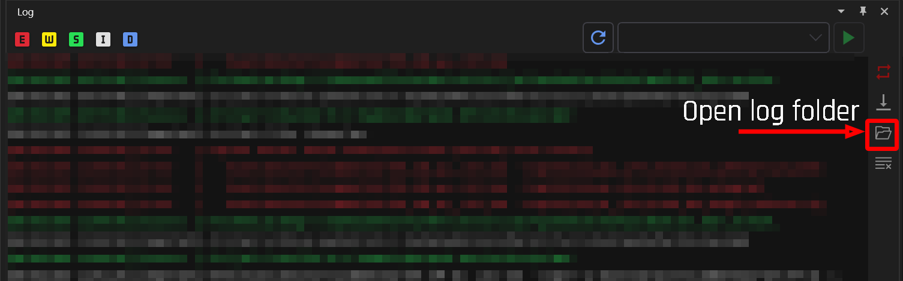

# Error Codes

## Summary

**Published**: May 1 2024 by [mana vortex](https://app.gitbook.com/u/NfZBoxGegfUqB33J9HXuCs6PVaC3 "mention")\
**Last documented update**: Jan 6 2025 by [mana vortex](https://app.gitbook.com/u/NfZBoxGegfUqB33J9HXuCs6PVaC3 "mention")

This page contains an overview about Wolvenkit's internal error codes and what they mean.


For **developers**:&#x20;

When **editing** this page (especially section headers), please update the internal mapping:\
`WolvenKit/Helpers/LogCodeHelper.cs`


## What to do with an error

If you ended up on this page, you ran into a problem that needs to be fixed inside WolvenKit. You now have the following options:

### Install the Nightly

If you are on the stable release, you should try [the-wolvenkit-nightly.md](../getting-started/download/the-wolvenkit-nightly.md "mention"). There's a good chance that your problem is already solved.

### Update all tools involved

Make sure that you are on the most recent version of whatever tool's you're using. This includes, but is not limited to, the [Wolvenkit Blender IO Suite](https://app.gitbook.com/s/4gzcGtLrr90pVjAWVdTc/for-mod-creators-theory/modding-tools/wolvenkit-blender-io-suite "mention") and [MLSETUP Builder](https://app.gitbook.com/s/4gzcGtLrr90pVjAWVdTc/for-mod-creators-theory/modding-tools/mlsetup-builder "mention").

### Find support on Discord

Find our [discord server](http://discord.gg/redmodding) and hit up the **`#wolvenkit-support`** channel. (If you aren't on the Nightly yet, you should really do that now, because it's the first thing everyone will tell you).

### Create a ticket

If your error still happens in the Nightly, you need to **tell us about it**. It's easy: bugs that don't get reported don't get fixed.&#x20;

Head to Wolvenkit's github page and [create a ticket](https://github.com/WolvenKit/Wolvenkit/issues) (you need a github or Google account, but they won't send you spam).&#x20;

To fix the bug, we need to **watch it in action**. Please include everything we need to make it happen — at the very least, we need the **most recent log file**:

<figure><figcaption></figcaption></figure>

## Error code list


If the steps below don't help, please get in touch via [Discord](https://discord.com/invite/redmodding),  [create a ticket](https://github.com/WolvenKit/Wolvenkit/issues), or browse the [troubleshooting.md](../getting-started/troubleshooting.md "mention") page. Keep your most recent log file ready!


### 0x2000: Type not supported (8192)

WolvenKit ran into a problem during internal conversion. Here's what you can do:

1. Install [the-wolvenkit-nightly.md](../getting-started/download/the-wolvenkit-nightly.md "mention")
2. Re-create whatever file you were trying to work on at that time:
   1. A game file from an earlier patch: Add it to your project again
   2. A depot file: Delete the file from the depot and/or [re-create the depot](usage/create-depot.md#steps-partial-depot)
   3. A raw file: re-create the file with the latest version of whatever tool you used (Wolvenkit, the [Wolvenkit Blender IO Suite](https://app.gitbook.com/s/4gzcGtLrr90pVjAWVdTc/for-mod-creators-theory/modding-tools/wolvenkit-blender-io-suite "mention")...)

### 0x3002: Resources plugin

The [Wolvenkit Resources plugin](home/home-plugins.md#wolvenkit-resources) may have become corrupted. Open Home -> Plugins and remove it, then restart Wolvenkit, reinstall the plugin, and try again.

### 0x5000: Invalid settings

You have an unspecified issue with your settings. Double-check them and make sure that everything is configured correctly.&#x20;

If that doesn't help, remove or re-name your settings file and restart WolvenKit:

```
C:\Users\<yourusername>\AppData\Roaming\RedModding\Wolvenkit\config.json
```

### 0x5001: Invalid Game File Executable

Check your [settings.md](settings.md "mention") ->[#game-executable-.exe-path](settings.md#game-executable-.exe-path "mention") and make sure that it points at your `Cyberpunk2077.exe`. For more information, check the wiki link.

### 0x5002: Failed to launch game executable

Check [#id-0x5001-invalid-game-file-executable](error-codes.md#id-0x5001-invalid-game-file-executable "mention") and make sure that all your settings are valid. If that doesn't fix your problem, you may have to reset your settings, see [#id-0x5000-invalid-settings](error-codes.md#id-0x5000-invalid-settings "mention") for detes.


## MTO requirement

You are here because a popup in Wolvenkit told you to install Material and Texture Override. You can [get it on Nexus](https://www.nexusmods.com/cyberpunk2077/mods/5266).

This is necessary because Cyberpunk caches all of the base game's `.mlsetup` files, so your changes won't be visible without it.&#x20;


MTO can under certain circumstances cause crashes in Japantown. You may want to remove it again after you're custompathed your mlsetup:


To get rid of the requirement, you can [custompath](https://app.gitbook.com/s/4gzcGtLrr90pVjAWVdTc/modding-guides/items-equipment/custompathing-assets) your files:

1. Find your .mlsetup in the [asset-browser.md](editor/asset-browser.md "mention")
2. Right-Click and select [#find-files-using-this](editor/asset-browser.md#find-files-using-this "mention")
3. Temporarily add these files to your mod


If you intend to publish your mod on Nexus, **don't do this**, since it will break refits for body mods. In this case, you have no choice but to add a dependency to MTO.


