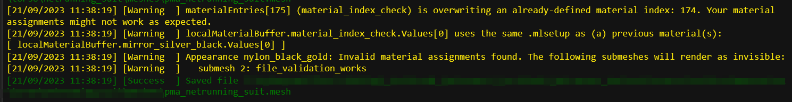
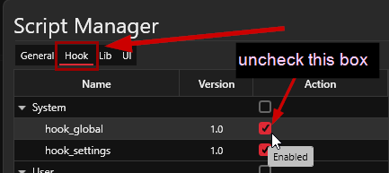
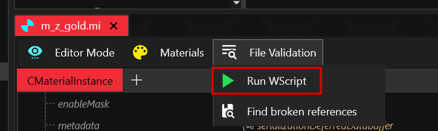
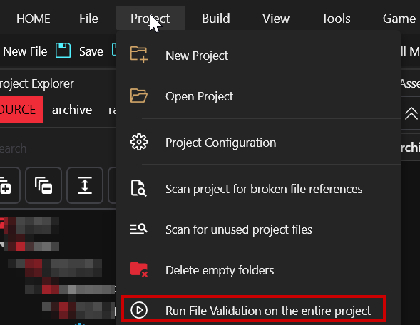
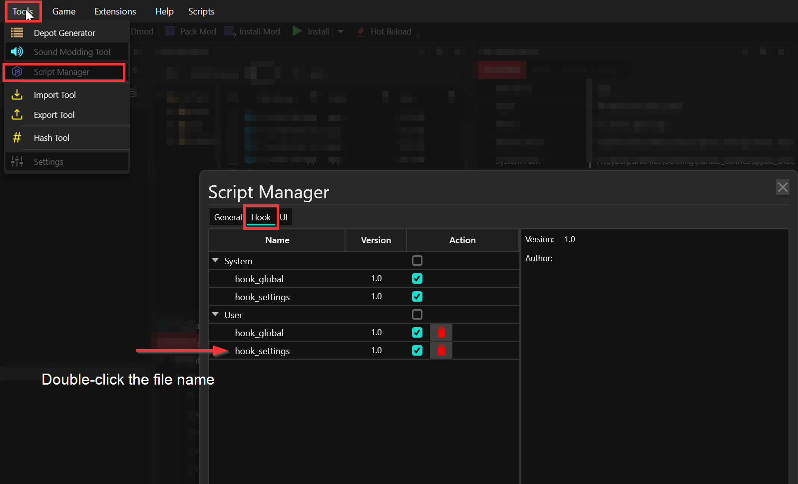
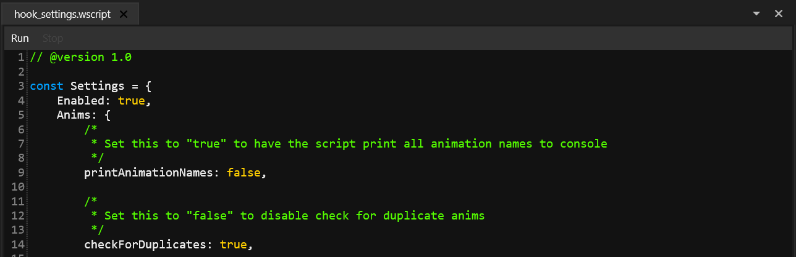

# File Validation

## What is it?

File validation was added in Wolvenkit 8.9.1. When you save a file, it will try to validate the internal structure and — based on your settings — dependent files.


This feature has an **impact on performance** — every time you save, there will be a short lag while the file validation does its thing. If you can't live with that, find below how to [turn it off](file-validation.md#configuring-file-validation).


<figure><figcaption>
The log will yell at you if your files have issues now
</figcaption></figure>

##

The automatic hook

By default, File Validation will trigger every time you save. Since this can impact performance for larger files, you might want to disable it.

### I don't want it, how do I get rid of it?

In the [Script Manager](tools/script-manager.md), switch to the `Hooks` tab and uncheck the box behind `hook_global`:

<figure><figcaption></figcaption></figure>

For details, see [Configuring File Validation](file-validation.md#configuring-file-validation) below.

## Running File Validation

### In the editor

Inside the [editor](editor/), you can run File Validation from the menu bar:&#x20;

<figure><figcaption></figcaption></figure>

### On the entire project

From the Project Menu in the main bar, you can run File Validation on the entire project.

Since this can take a long time, Wolvenkit will show you a warning first.

<figure><figcaption></figcaption></figure>

## There was an error

If you're here because of a link in the Wolvenkit console, there's nothing to worry about, your file saved fine! However, you've managed to run into something that the program isn't equipped to handle yet.

If you would like to help us fix it, you can open a ticket on [github](https://github.com/WolvenKit/Wolvenkit/issues) or create a forum post on our [Discord server](https://discord.gg/redmodding) in #wkit-bugs-and-requests.&#x20;

Please attach a minimal version of your project's source folder (we only need `archive`, but all involved files have to be present, or we won't be able to reproduce your exact error).

## Configuring File Validation

There is no fancy UI for the configuration right now (sorry for that), but you can fine-tune file validation via [Script Manager](tools/script-manager.md).&#x20;

You need to change the settings in`hook_settings.wscript`. This is how you open it:

<figure><figcaption></figcaption></figure>

That will open the script editor panel, which looks like this:

<figure><figcaption>
You can toggle features on and off by switching values between <code>true</code> and <code>false</code>. Be careful that you don't delete any commas!
</figcaption></figure>


In an ideal world, this wiki is always up-to-date with the existing source code. However, that doesn't happen automatically (and can't easily be made that way), and the Wolvenkit team focuses on fixing bugs and developing new features.&#x20;

The most up-to-date documentation will always be **in the source code**. Read the comment blocks (green in the screenshot above) for a description of what a flag does.


Here, you will see a list of settings, which are documented in the next section.

### Global and shared settings

#### Depot paths

File Validation will check if any given depot path exists, and warn you if the file could not be found.&#x20;


This **will** give false positives if you're on the mod browser!


#### Enabled

The flag `Enabled` in line 4 will enable/disable file validation globally.&#x20;

Each entry in the list has an individual `Enabled` flag that lets you turn off validation for this particular type of file.

#### DisableAutofix

File validation can automatically correct certain errors for you. There are certain advanced use cases where you'd want to turn this off — if you don't know about them, then you'll probably want this.

Right now, this is set to `false` by default and affects the following toggles:

* [Workspot.fixIndexOrder](file-validation.md#fixindexorder)
* [Workspot.autoReopenFile](file-validation.md#autoreopenfile)

#### validateRecursively

This is the reason behind the micro freeze each time you save a file. If it is enabled, then Wolvenkit will also look at included files — for example, if you save an .app file, it will collect all included meshes (via components or via root entity) and warn you about missing appearances.

You can disable this to save performance, but that will reduce file validation to a glorified typo checker for your file paths. Its developer strongly advises against it, as the feature has saved her **hours** of frustration already, and at the point of writing it hasn't even been released.

### Anims: animation files (.anim)

Checks if all animation names are unique. Since animations are targeted by name, this is the #1 reason why your mod will show the wrong animation.

#### **checkForDuplicates**

Will warn you about duplicate animation names (e.g. animations 2 and 31 are both named "facepalm")

### App: app files (.app)

Checks all appearances and their associated `partsOverrides` and `partsValues`.

#### **checkComponentNameDuplication**

Will warn you about duplicate component names. Components are targeted by name, so they should be unique for each appearance or mesh entity.

#### checkForCrashyDependencies

inplaceResources can crash your game (it's complicated and has something to do with timing and async loading). This flag will toggle the check.

#### checkPotentialOverrideCollisions

Will warn you if components with the same name are pointing to different meshes.&#x20;

#### checkCookPaths

Will print a warning if you have cookedOverrides set in the root or in individual appearances. These things are the reason why mods such as cookedAppsNulled exist.

### csv (ArchiveXL factory files)

File validation assumes that this is a **factory** for ArchiveXL or similar. If it isn't, you can ignore any warnings, or [create an issue](https://github.com/WolvenKit/WolvenKit/issues) so that we can add your use case.&#x20;

#### checkProjectResourcePaths

Assumes that entries are file paths. Will print a warning if the files can't be found.

#### warnAboutInvalidDepotPaths

Prints warnings for everything that doesn't look like it's a file path (by regular expression checking, there should be at least one slash)

### ent: Root or mesh entity

Similar to the .app file, this will validate nested files, basically checking the entire ArchiveXL chain of dependencies.

#### validateRecursively

This is really performant and will only look into each file once. That being said, the more files you pull in, the longer it takes, and you might want to disable this feature. On the other hand, saving the root entity is a great way to find out what exactly is broken about your ArchiveXL project.

#### checkComponentNameDuplication

Same as in the app file: will warn you about duplicate component names. Components are targeted by name, so they should be unique for each appearance or mesh entity.

#### checkDynamicAppearanceTag

Will print a warning that you might have forgotten to add a DynamicAppearances tag to your root entity if either of the following conditions is true:

* There are empty appearance names in your root entity
* Your .app partsOverrides appearance names or your mesh entity use dynamic string substitution

… since ArchiveXL won't work its magic if you haven't set the tag.&#x20;

### Json: Localization files

Will try to warn you about issues that will cause empty or incorrect strings to be displayed

#### checkDuplicateKeys

This will warn you if any entries will overwrite each other due to shared key data.

#### checkEmptyFemaleVariant

By default, the game uses `femaleVariant` - `maleVariant` will only be considered if you use either the [gender suffix](https://app.gitbook.com/s/4gzcGtLrr90pVjAWVdTc/for-mod-creators-theory/files-and-what-they-do/entity-.ent-files#what-are-suffixes) or [dynamic ArchiveXL appearances](https://app.gitbook.com/s/4gzcGtLrr90pVjAWVdTc/for-mod-creators-theory/core-mods-explained/archivexl#dynamic-variants).

### Mesh: 3d object

Will check your mesh's internal material assignment. Will warn you about missing files, unresolved dependencies or errors with definitions and file types (some of which might potentially crash your game).

#### validateMaterialsRecursively

Will also check .mi files and their material setup. As the .mi chains can be quite long, this can cause performance issues.

#### checkDuplicateMaterialDefinitions

Will warn you if two of your materials appear to be identical

### Mi: Material Template

Will check the material setup.

#### validateMaterialsRecursively

Will check nested .mi files and their material setup, if you are using any.

### Workspot: loading .anim files

Mostly for use with [this tutorial](https://app.gitbook.com/s/4gzcGtLrr90pVjAWVdTc/modding-guides/animations/animations/amm-collab-anims-poses). Will check if the workspot pulls in existing .anim files, warning you about duplicate definitions.

#### fixIndexOrder

Convenience: Will automatically set indices of defined animations for you. There are advanced use cases where you might not want this. If you don't know what they are, you might want to turn on [#autoreopenfile](file-validation.md#autoreopenfile "mention") in addition to this.

#### autoReopenFile

More convenience: Automatically close and re-open the file after using `fixIndexOrder` (instead of bothering you about it). Default is `false`.

#### showUnusedAnimsInFiles

Will warn you about animations in the included .anim files that aren't used by the workspot, in case you want to delete them.

#### showUndefinedWorkspotAnims

Shows animations that you include in your workspot, but which aren't defined in any of the included .anims files.

#### checkIdleAnimNames

Will warn you if the idle anim name deviates from the appearance anim name. This isn't strictly necessary, but since the idle anim name is displayed in the list, you will never find the right appearance otherwise.

#### checkIdDuplication

Only triggers if you aren't using `fixIndexOrder`: this will warn you about duplicate numeric ID assignments. These will cause the game to mix up your animations.

#### checkFilepaths

Checks the files included via `finalAnimSets`, warning you about any loading errors (invalid file paths, invalid extensions, you forgot to add the entry to loadingHandles)
