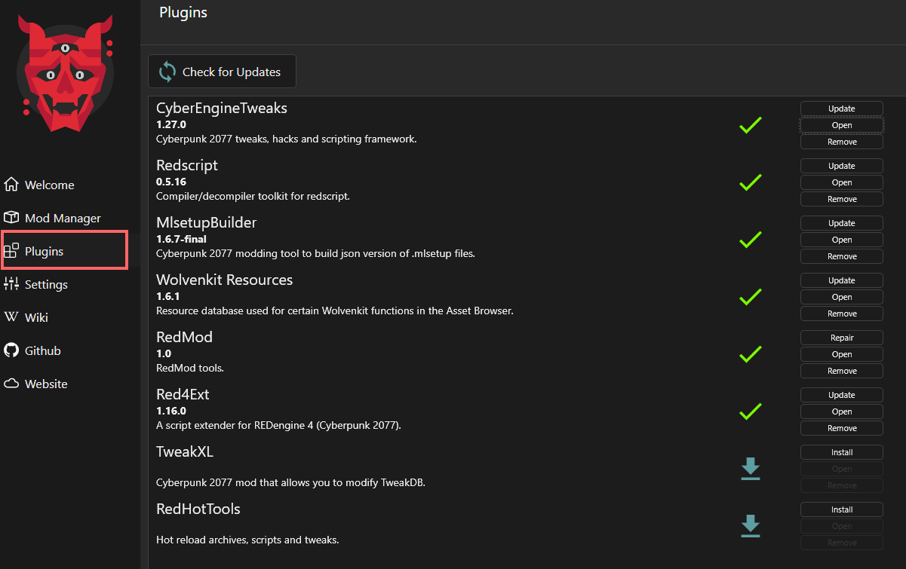

# Home: Plugins

As of version 8.11.1, Wolvenkit offers the following plugins:

<figure><figcaption></figcaption></figure>

## Cyber Engine Tweaks

One of Cyberpunk's core mods ([wiki](https://wiki.redmodding.org/cyber-engine-tweaks/) | [Nexus page](https://www.nexusmods.com/cyberpunk2077/mods/107)). Will install the latest version for you.

## Redscript

Another of Cyberpunk's core mods ([Redscript](http://127.0.0.1:5000/o/-MP5ijqI11FeeX7c8-N8/s/-McniwB8YOK2HnJ7SYg\_/ "mention") wiki | [Nexus page](https://www.nexusmods.com/cyberpunk2077/mods/1511)). Will install the latest version for you.

## [MLSETUP Builder](http://127.0.0.1:5000/s/4gzcGtLrr90pVjAWVdTc/for-mod-creators/modding-tools/mlsetup-builder "mention")

Written and developed by Neurolinked ([github](https://github.com/Neurolinked/MlsetupBuilder/releases/)): A tool for Cyberpunk-specific "texture" editing. Click on the heading to see the wiki documentation.

## Wolvenkit Resources

This plugin is necessary to use the [asset-browser.md](../editor/asset-browser.md "mention")'s context menu functionality of "find used files" and "find files using this". It provides the information that Wolvenkit needs to connect those files.

## RedMod

CDPR's official interface for modding. Check the yellow wiki for documentation: [REDmod](http://127.0.0.1:5000/s/4gzcGtLrr90pVjAWVdTc/for-mod-users/users-modding-cyberpunk-2077/redmod "mention")

## Red4Ext

One of Cyberpunk's core mods ([Nexus page](https://www.nexusmods.com/cyberpunk2077/mods/2380)). This will install the latest version for you.

## TweakXL

One of Cyberpunk's core mods ([Nexus page](https://www.nexusmods.com/cyberpunk2077/mods/4197)). This will install the latest version for you.

## RedHotTools

Will install the Wolvenkit plugin of [psiberx's modding utility](https://github.com/psiberx/cp2077-red-hot-tools/) for you. Please note that you need to [download the mod](https://wiki.redmodding.org/cyberpunk-2077-modding/for-mod-creators/references-lists-and-overviews/reference-world-sectors/places#getting-an-items-world-sector) and the optional CET integration separately!
