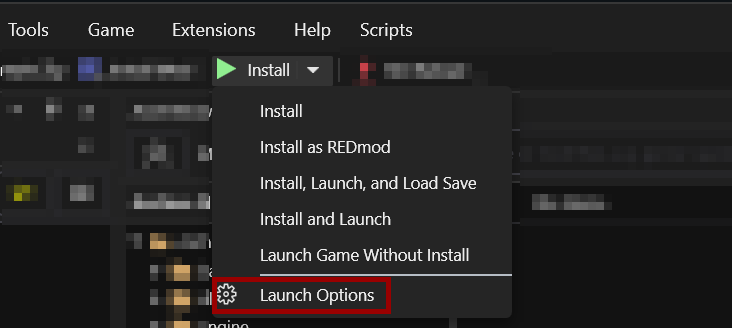

# Launch Profiles

## Summary

Created: Jun 17 2024 by [manavortex](https://app.gitbook.com/u/NfZBoxGegfUqB33J9HXuCs6PVaC3 "mention")\
Last documented update: Jun 17 2024 by [manavortex](https://app.gitbook.com/u/NfZBoxGegfUqB33J9HXuCs6PVaC3 "mention")

## Launch Profiles

You can set up different profiles to launch Cyberpunk 2077 from inside Wolvenkit. Via Launch Profiles, you can select what should happen when you press the button.

## Configuration

### Where to configure

With a long click on the `Install` button, you can open a dropdown menu that lets you pick a `launch profile`:

<figure><figcaption></figcaption></figure>

### Available options

#### Create Backup of previous build


This will not work in combination with[#clean-after-build-to-save-disk-space](launch-profiles.md#clean-after-build-to-save-disk-space "mention")


#### Create zip file

Same as the [#create-zip](toolbar.md#create-zip "mention") button in the toolbar: Will generate a zip file ready for Nexus upload.

#### Install to Game directory

Installs your mod to your Cyberpunk 2077 directory

#### Clean before build to prevent errors

Clears the `packed` directory before building. Not doing this may lead to leftover files in the resource directories or have other side effects, so you'll want to keep this checked.

#### Clean after build to save disk space

Clears the `packed` directory after building/installing/creating a zip file. \
Check this to save diskspace, but note that it will disable [#create-backup-of-previous-build](launch-profiles.md#create-backup-of-previous-build "mention").

#### Pack as REDmod

Check this to pack your mod as REDMod rather than as a legacy mod. You don't generally want this, as it can lead to load order issues and increase your users' demands for support.

#### Deploy as REDmod

Check this to deploy your mod as REDMod rather than as a legacy mod. You don't generally want this, as it's not compatible with [RHT: Hot Reload](https://app.gitbook.com/s/4gzcGtLrr90pVjAWVdTc/for-mod-creators-theory/modding-tools/redhottools/rht-hot-reload "mention")

#### Launch Game

Launch the game after installing the mod. Without this, the next three options will do nothing.

#### Load last savegame

When you start the game, it will load your last savegame (by timestamp).&#x20;


This is slightly faster than mods that auto-trigger save-load, as it skips the start-up menu completely.


#### Load specific savegame

Loads a specific savegame by name (or tries to).


This is slightly faster than mods that auto-trigger save-load, as it skips the start-up menu completely.


#### Game Commandline Arguments

You can specify additional [Launch parameters](https://app.gitbook.com/s/4gzcGtLrr90pVjAWVdTc/for-mod-users/users-modding-cyberpunk-2077/the-cyberpunk-2077-game-directory/launch-parameters "mention"), which will be merged with those from the settings

## Default profiles

WolvenKit will create the following profiles if it can't find them:&#x20;

* Install
* Install as REDMod
* Install, Launch, and Load Save
* Install and Launch
* Launch Game Without Install

To disable this behaviour, go to the [settings.md](../settings.md "mention") and disable [#append-default-launch-profiles](../settings.md#append-default-launch-profiles "mention")

