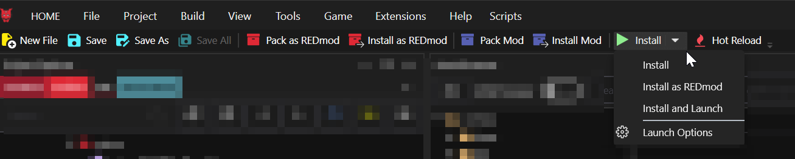
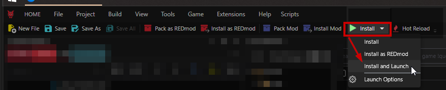

# Toolbar


The toolbar buttons are convenience shortcuts to menu functions. Find the full documentation there.


You can find the toolbar below the [.](./ "mention").

<figure><figcaption></figcaption></figure>

## New File

Same as the menu entry [#file](./#file "mention")-> [#new-file](./#new-file "mention")

## Save

Same as the menu entry [#file](./#file "mention")-> [#save](./#save "mention")

## Save As

Same as the menu entry [#file](./#file "mention")-> [#save-as](./#save-as "mention")

## Save All

Same as the menu entry [#file](./#file "mention")-> [#save-all](./#save-all "mention")

## Pack as REDMod

Same as the menu entry [#build](./#build "mention") -> [#pack-as-redmod](./#pack-as-redmod "mention")


As a rule of thumb, you **generally don't want this**. Vortex can auto-convert to REDMod on install. Packing your mod in the legacy format will save work for those people who don't want to use REDMod.&#x20;


## Install as REDMod

Same as the menu entry [#build](./#build "mention") -> [#install-as-redmod](./#install-as-redmod "mention")

## Pack Mod

Same as the menu entry [#build](./#build "mention") -> [#pack-project](./#pack-project "mention")

## Install Mod

Same as the menu entry [#build](./#build "mention") -> [#install](./#install "mention")

## Install

Same as the menu entry [#build](./#build "mention") -> [#install](./#install "mention")

### Install and launch

Like Install, but launches the game afterwards.&#x20;

<figure><figcaption>
Find it in your toolbar
</figcaption></figure>

## Hot Reload

Same as the menu entry [#build](./#build "mention") -> [#hot-reload](./#hot-reload "mention")

