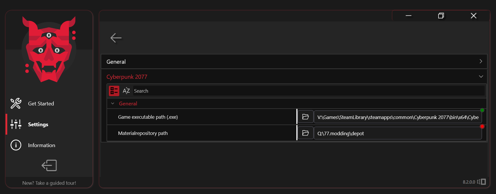
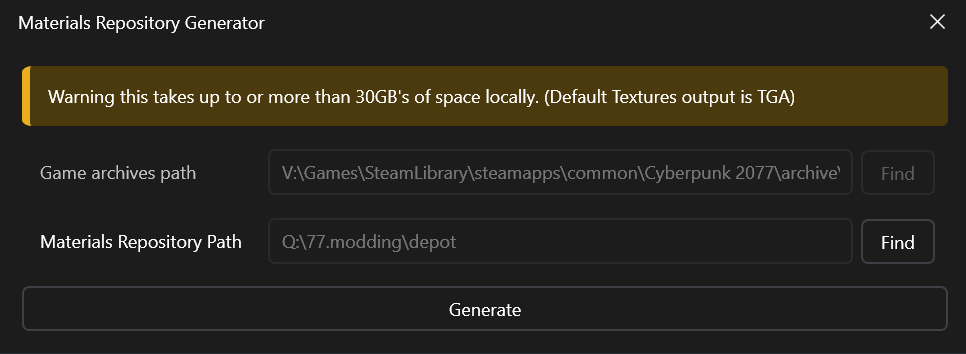

# Material Repository


THIS WIKI PAGE IS CURRENTLY BEING UPDATED FOR WOLVENKIT 8.4+


## What is the Material Repository?

The Material Repository is a local "cache" of all shader related assets including mt, mi, mltemplate, mlsetup, mlmask, and texture files. You can choose any path for your Material Repository that has the required space, although generally speaking it's recommended to use shorter paths and unprotected folders. The complete local repository will generate around \~32GB of files.\
\
&#x20;It's not completely necessary to generate the full repository in advance, however this will impact your export times. After setting a path to the Material Repository, each `WithMaterials` export will begin dumping these files into your local repository.


The Material Repository should be deleted and recreated for each new Cyberpunk game patch to include any updates to assets.


### Setting up the Material Repository

The Material Repository destination is initially set while configuring WolvenKit on first startup. The destination is set by default to `...AppData/Roaming/REDModding/WolvenKit/MaterialDepot`, however any custom folder can be substituted.

The Material Repository destination can be adjusted from the [**Settings**](../../settings.md#material-repository) page, or the Generate Repository button within the Tools Ribbon.


Remember it's only required to set a path to your repository. The full 30gb version is optional to reduce export times.

