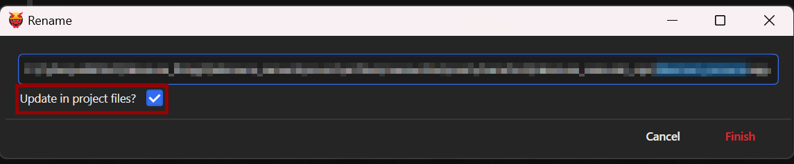
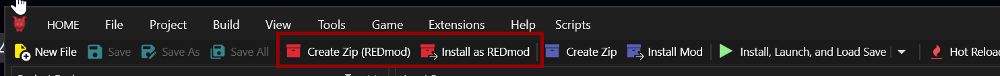

# Settings

## Summary

Last documented update: Jun 17 2024 by [manavortex](https://app.gitbook.com/u/NfZBoxGegfUqB33J9HXuCs6PVaC3 "mention") (Wolvenkit 8.14 Nightly)

This page documents Wolvenkit's settings menu, and what the individual entries mean.&#x20;

## TL;DR

You **must** make sure that your Game Executable Path is set. Wolvenkit will not work otherwise.

<table><thead><tr><th width="281">Setting</th><th>value</th></tr></thead><tbody><tr><td>Game Executable Path (.exe)</td><td>
Path to the game's executable file on your hard drive, e.g. 

<code>C:\Games\Cyberpunk 2077\bin\x64\Cyberpunk2077.exe</code>
</td></tr><tr><td>Depot Path</td><td>
Defaults to <code>C:\Users\yourusername\AppData\Roaming\REDModding\WolvenKit\Depot</code>

 A folder where Wolvenkit can store all its clutter.  <strong>NOT</strong> your game directory.
</td></tr></tbody></table>

## Settings: Overview

For a textual explanation of the seettings, see [the next section](settings.md#settings-explained)

<figure><figcaption>
Example settings window for 8.9.1
</figcaption></figure>

## Cyberpunk

### Game Executable Path


You **must** set this.


The path to your `Cyberpunk2077.exe` , inside  [The Cyberpunk 2077 Game Directory](https://app.gitbook.com/s/4gzcGtLrr90pVjAWVdTc/for-mod-users/users-modding-cyberpunk-2077/the-cyberpunk-2077-game-directory "mention") under `bin\x64`.


If Cyberpunk is installed within Program Files, we recommend running WolvenKit as administrator.


### Launch Command


Optional


The path to your `Cyberpunk2077.exe` , inside  [The Cyberpunk 2077 Game Directory](https://app.gitbook.com/s/4gzcGtLrr90pVjAWVdTc/for-mod-users/users-modding-cyberpunk-2077/the-cyberpunk-2077-game-directory "mention"). Will be auto-generated from [#game-executable-path](settings.md#game-executable-path "mention").

You can also put the path to the REDLauncher here, if you want that (but why would you?)

### Launch Options


Optional


Arguments for the executable. You can find a list in [the yellow wiki](https://app.gitbook.com/o/-MP5ijqI11FeeX7c8-N8/s/4gzcGtLrr90pVjAWVdTc/) on the [Launch parameters](https://app.gitbook.com/s/4gzcGtLrr90pVjAWVdTc/for-mod-users/users-modding-cyberpunk-2077/the-cyberpunk-2077-game-directory/launch-parameters "mention") page.

### Depot Path


You **should** set this, or Wolvenkit will default to your AppSettings directory. Since this is on the same drive as your Windows install, it can clutter up your harddrive.


The **Depot Path** is a WolvenKit system folder for caching game assets. It serves as a cache for mesh exports with materials. WolvenKit builds a repository of visual assets within the Depot for usage with external applications such as MLSetupBuilder or Blender.&#x20;

By default, it is set to `C:\Users\yourusername\AppData\Roaming\REDModding\WolvenKit\Depot`, but you can pick any location. It does not need to be on an SSD, although Wolvenkit might load faster if it is.

Learn more about the [**Material exports here**](usage/blender-integration.md)**.**

### Additional Mod Directory


Optional


A directory for .archive mods outside of your game directory, for example for resources that you want to load for multiple projects. Mods inside this folder will show up in the [Mod Browser](editor/asset-browser.md#mod-browser) **after** your installed mods.

## Display

### Show CName hashes as hex

Display hashes for CNames as hexadecimal (rather than decimal)

### Show ResourcePath hashes as hex

Display hashes for ResourcePaths as hexadecimal (rather than decimal)

### Show NodeRef hashes as hex

Display hashes for NodeRefs as hexadecimal (rather than decimal)

### Show TweakDBID hashes as hex

Display hashes for TweakDBID entries as hexadecimal (rather than decimal)

### Show reference graph

### Game language used for LocKeys

Lets you customize the language for the [lockey-browser.md](editor/lockey-browser.md "mention"). Default: `en_us`

### Show Graph Editor Node Properties

Graph Editor: Detailed display?

## File Editor

### Group Large Collections

Toggles limited collections for improved performance within the File Editor when working when navigating large files.

### Group Size

Adjusts the amount of elements of in a limited collection within the File Editor.

### Default to Simple Mode

Starting with 1.14, Wolvenkit offers multiple editor modes. You can find details under [#switching-editor-modes](editor/file-editor/#switching-editor-modes "mention").

### Ignored Extensions

File extensions that you want to open in an external editor

## General

### **Do not check for updates**

Will disable Wolvenkit's auto-update

### **Show Guided Tour**

UNKNOWN FUNCTIONALITY\
This toggle may not work in the latest WolvenKit build.

### **Update Channel**

The update channel determines which type WolvenKit updates are received.

* **Stable**    WolvenKit will only show prompts when new releases are published (recommended)
* **Nightly**    WolvenKit will show the latest development builds which may be unstable

### Your name

Will be used when creating new projects.

### Your e-Mail

Will be used when creating new projects.

### **Theme Accent**

Changes the accent color of UI elements throughout WolvenKit.

## Interface

Lets you customize Wolvenkit's interface.

### Import/Export: Show advanced options

Turn this off unless you know what you're doing

### Update references on rename

The default state of this box when you open the rename dialogue (shortcut: `F2`)

<figure><figcaption></figcaption></figure>

### Show REDMod in Ribbon

Adds the REDMod buttons back to the ribbon. (Why do you want this?)

<figure><figcaption></figcaption></figure>

### Show File Preview


You can disable this feature to save performance, or simply hide the panel.


Enables interactive Quick Previews within the Properties panel when navigating the Asset Browser and Project Explorer.

### Append default launch profiles

Will append the [#default-profiles](menu/launch-profiles.md#default-profiles "mention") to the list of launch profiles if they are not defined (this will not overwrite your custom profiles)

