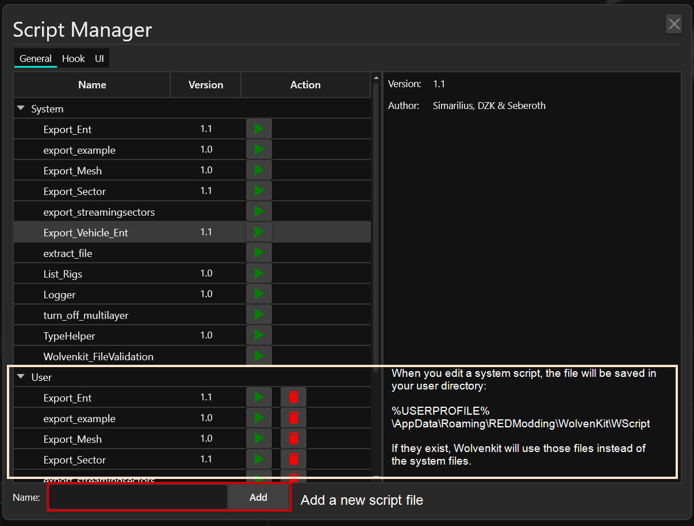

# Script Manager


For more information, see [scripting-with-wscript.md](../usage/scripting-with-wscript.md "mention")

For a step-by-step walkthrough on how to edit a script file, see [#configuring-file-validation](../file-validation.md#configuring-file-validation "mention").


You can toggle the script manager via Tools -> Script Manager.&#x20;

It looks like this:

<figure><figcaption></figcaption></figure>

## Adding scripts

Enter a name in the box at the bottom of the panel and click the "Add" button. That will create a new script file in your [#script-file-path](../usage/scripting-with-wscript.md#script-file-path "mention").

## Tabs

### General

Contains a selection of runnable scripts for various workflows, e.g.

* Export\_Vehicle\_Ent when [exporting-vehicles.md](../../modding-community/exporting-vehicles.md "mention")
* Export\_Ent for characters (see [exporting-to-blender.md](../../guides/modding-community/exporting-to-blender.md "mention"))
* export\_streamingsectors for [World Editing](http://127.0.0.1:5000/s/4gzcGtLrr90pVjAWVdTc/for-mod-creators/modding-guides/world-editing "mention")

### Hook

This section contains the settings for [file-validation.md](../file-validation.md "mention")

### UI

This section lets you add your own UI items.
