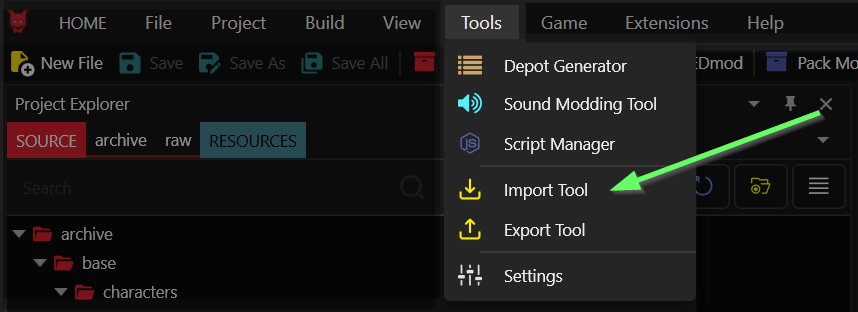
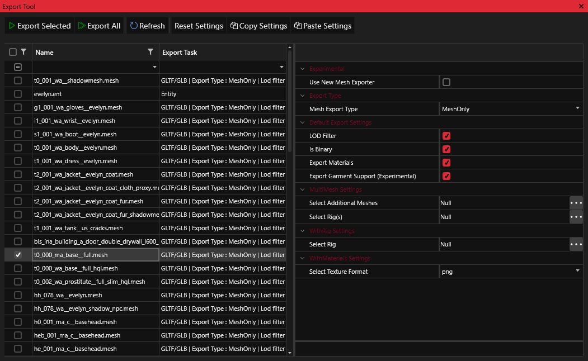
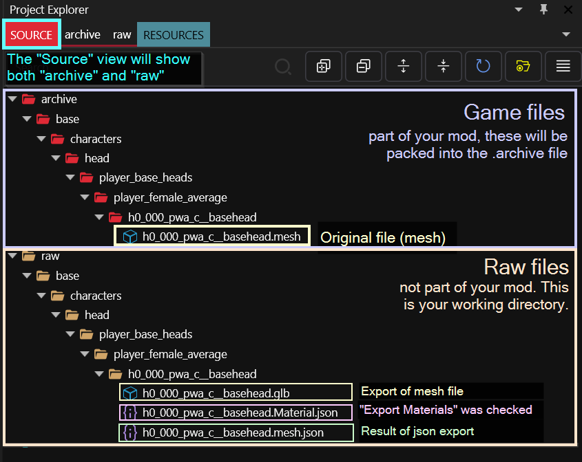
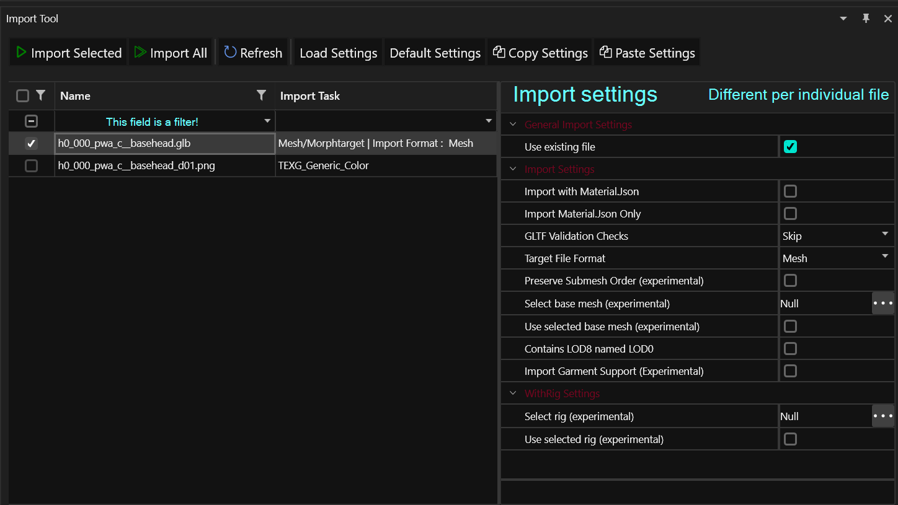
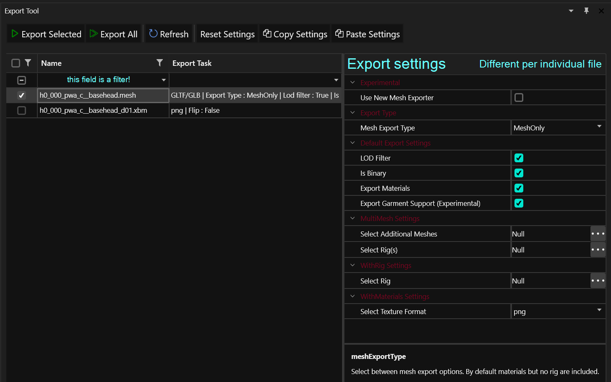

# Tools: Import/Export UI


This page provides the UI documentation for the Import/Export tool. For a documentation of the functionality, see [import-export](../../usage/import-export/ "mention")


## What are the Import Export tools?

To edit a REDengine file, it first needs to be converted to a more accessible format. This is where the Import/Export tools come in.

Before moving files (or in cases of OCD), please note the [#file-structure](./#file-structure "mention")section.

As of Wolvenkit 8.9.0, you can find both the import and the export tool in the menu "Tools":&#x20;

<figure><figcaption></figcaption></figure>

<figure><figcaption></figcaption></figure>

### UI Preview

You can browse the file structure via Wolvenkit's **Project Explorer**. Here's how it looks:

<figure><figcaption>
Annotated example. For more information about the files, see below.
</figcaption></figure>

## Import Tool


Importing will overwrite files in `archive` without a prompt. Do a backup from time to time!

If you mess up a file beyond repair, you can  restore it to default by selecting the "`replace with original`" option from the right-click menu.


<figure><figcaption>
This is your import tool. For detailed documentation of the different export settings, check the corresponding <a href="../../usage/import-export/import-settings.md">subpage</a>.
</figcaption></figure>


For detailed documentation of the different import settings, check the [corresponding subpage](../../usage/import-export/import-settings.md).


<table><thead><tr><th width="225">UI element</th><th>Explanation</th></tr></thead><tbody><tr><td>Import Selected</td><td>Imports anything you checked in the left-hand list</td></tr><tr><td>Import All</td><td>Imports all files in your project.  ⚠ This button will always export everything, <strong>regardless of your filter</strong>.</td></tr><tr><td>Refresh</td><td>Refreshes the file list on the left</td></tr><tr><td>Reset Settings</td><td>Restores the Import Settings to default</td></tr><tr><td>Copy Settings</td><td>Copies the Import Settings of your currently selected file (<code>h0_000_pwa_c__basehead.glb</code> in the screenshot above) so that you can paste them to other files.</td></tr><tr><td>Paste Settings</td><td>
Pastes the Import Settings from the previous step to the currently active file. 

<em>This will not work if you copy/paste between incompatible file types.</em>
</td></tr></tbody></table>

### Export Tool


Exporting will overwrite already-existing files in `raw` without a prompt.


The **Export Tool** lets you export any files in your project's `archive` directory:

<figure><figcaption>
This is your export tool. For detailed documentation of the different export settings, check the corresponding <a href="export-settings.md">subpage</a>.
</figcaption></figure>


For detailed documentation of the different export settings, check the [corresponding subpage](export-settings.md).


<table><thead><tr><th width="225">UI element</th><th>Explanation</th></tr></thead><tbody><tr><td>Export Selected</td><td>Exports anything you checked in the left-hand list</td></tr><tr><td>Export All</td><td>Exports all files in your project.  ⚠ This button will always export everything, <strong>regardless of your filter</strong>.</td></tr><tr><td>Refresh</td><td>Refreshes the file list on the left</td></tr><tr><td>Reset Settings</td><td>Restores the Export Settings to default</td></tr><tr><td>Copy Settings</td><td>Copies the Export Settings of your currently selected file (<code>h0_000_pwa_c__basehead.mesh</code> in the screenshot above) so that you can paste them to other files.</td></tr><tr><td>Paste Settings</td><td>
Pastes the Export Settings from the previous step to the currently active file. 

<em>This will not work if you copy/paste between incompatible file types.</em>
</td></tr></tbody></table>

