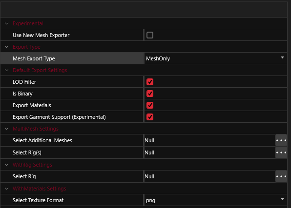

# Blender Integration


For a documentation of the Blender Plugin's features, see the [yellow wiki](http://127.0.0.1:5000/s/4gzcGtLrr90pVjAWVdTc/for-mod-creators/modding-tools/wolvenkit-blender-io-suite).




### How do I use the Blender integration features?

If the `Export Materials` checkbox in the mesh export settings is enabled, WolvenKit will create a `Material.json` file under `raw`. You can find it in the same directory as the mesh.

<figure><figcaption></figcaption></figure>

For further documentation, see the [yellow wiki](http://127.0.0.1:5000/s/4gzcGtLrr90pVjAWVdTc/for-mod-creators/modding-tools/wolvenkit-blender-io-suite).
