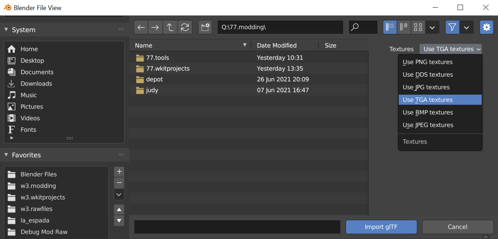

# Blender Integration



## How does it work?

WolvenKit is able to generate a bespoke **material json** file when exporting mesh files using the **WithMaterials** argument. The material json file writes the REDengine shader values and paths to a plaintext json file which can be used in conjunction with the Cyberpunk Blender add-on.

_For the latest info about the Cyberpunk Blender add-on please visit the GitHub page directly._



### How do I use the Blender integration features?

Preparing a material json with WolvenKit is simple, when exporting a mesh just check the Export Materials checkbox:

<figure><figcaption></figcaption></figure>

Material export now works will all export modes. You will see a material json file created within the Raw directory with the exported glb mesh file.

### Importing Cyberpunk meshes with Blender

After installing and enabling the Cyberpunk Blender add-on, simply navigate to **File** tab, navigate to **Import** then select **Cyberpunk GLTF**. Entity and Streaming sector import are also available in the latest plugin, see the plugin page for details.


Not all Cyberpunk shaders are supported! Programming shaders can be very tedious. If you're interested in contributing a new shader please consider reaching out on Discord!


<figure><figcaption></figcaption></figure>


Be sure to select the same Image Extension used during the WithMaterials export! The default extension is PNG.


### Viewing material meshes with Blender

We recommend using Blender Cycles to view meshes with Cyberpunk materials. While some materials can be previewed with Eevee, the multilayered supershader often exceeds the hard-coded limit of 24 image resources.


Cycles viewport performance can be dramatically improved by upgrading to Blender 3.0, using Optix rendering with RTX, and using the Optix viewport denoiser.

