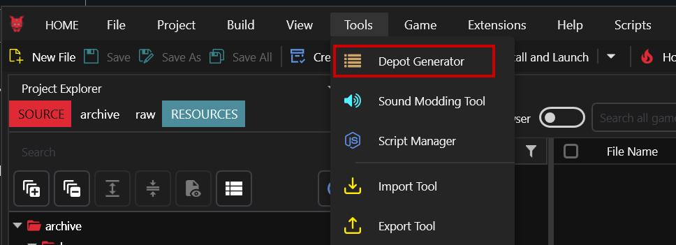
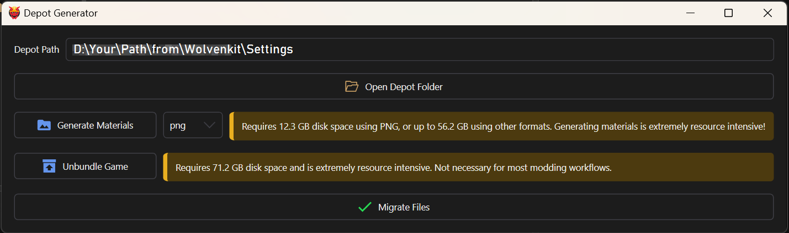

# The Wolvenkit Depot

<figure><figcaption></figcaption></figure>

<mark style="color:orange;">**As of 8.13,**</mark> Wolvenkit supports the [#adhoc-depot](create-depot.md#adhoc-depot "mention"). This means that you don't have to do anything besides configuring your [#depot-path](../settings.md#depot-path "mention") — dependencies will be handled as needed.&#x20;

## What is the depot?

The depot is the folder where Wolvenkit stores anything it needs to export your project files. As of version 8.13, it can handle everything by itself, and you don't need a depot unless you want to browse game data outside of Wolvenkit.&#x20;

### How to generate a depot?

Use the Depot Generator from Wolvenkit's Tools tab:

<figure><figcaption></figcaption></figure>

## Generating a depot

You can export materials, or unbundle the whole game:

<figure><figcaption></figcaption></figure>

### Generate Materials

Exports the game's **materials** (textures, gradients, mlmasks...). This used to be required by MLSetupBuilder, but is no longer necessary.

### Unbundle Game

This will extract every file in the game files to your depot folder. You only need this to browse Cyberpunk's files outside of Wolvenkit (but why would you want that anyway?)
