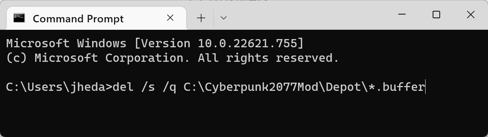

# Legacy: Full depot


This page is archived. Use a [partial depot](./#steps-partial-depot) instead of following these steps.


The full depot extracts every asset available to us. It will use \~160GB of disk space, and in October 2023, it is **not required** for any single workflow.&#x20;

If you want to extract it anyway, you need to use [Wolvenkit.CLI](broken-reference).&#x20;

1.  Run CMD.EXE

    <figure><figcaption></figcaption></figure>
2.  Change directory to WolvenKit.CLI

    <figure><figcaption></figcaption></figure>
3.  Run the following command to unbundle all assets. You can ignore any red failures and purple warning message. Just wait for 99% and press Ctrl+C

    `WolvenKit.CLI unbundle -p "C:\Program Files (x86)\Steam\steamapps\common\Cyberpunk 2077\archive\pc\content" -o "C:\Cyberpunk2077Mod\Depot"`

    <figure><figcaption></figcaption></figure>
4.  Run the following command to uncook all normal map assets. You can ignore any red failures and purple warning message. Just wait for 99% and press Ctrl+C

    `WolvenKit.CLI uncook -p "C:\Program Files (x86)\Steam\steamapps\common\Cyberpunk 2077\archive\pc\content" -o "C:\Cyberpunk2077Mod\Depot" --uext png`

    <figure><figcaption></figcaption></figure>
5.  Run the following command to uncook all mask assets. You can ignore any red failures and purple warning message. Just wait for 99% and press Ctrl+C

    `WolvenKit.CLI uncook -p "C:\Program Files (x86)\Steam\steamapps\common\Cyberpunk 2077\archive\pc\content" -o "C:\Cyberpunk2077Mod\Depot" --uext dds`

    <figure><figcaption></figcaption></figure>
6.  Run the following command to delete all the failed uncook attempts. This commend will delete all the buffer files without prompting you and will recursively search in all subfolders for more buffer files that need to be deleted.

    `del /s /q C:\Cyberpunk2077Mod\Depo*.buffer`

    <figure><figcaption></figcaption></figure>
