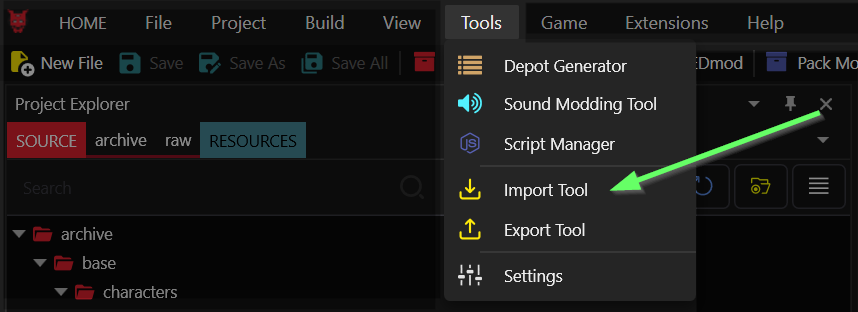
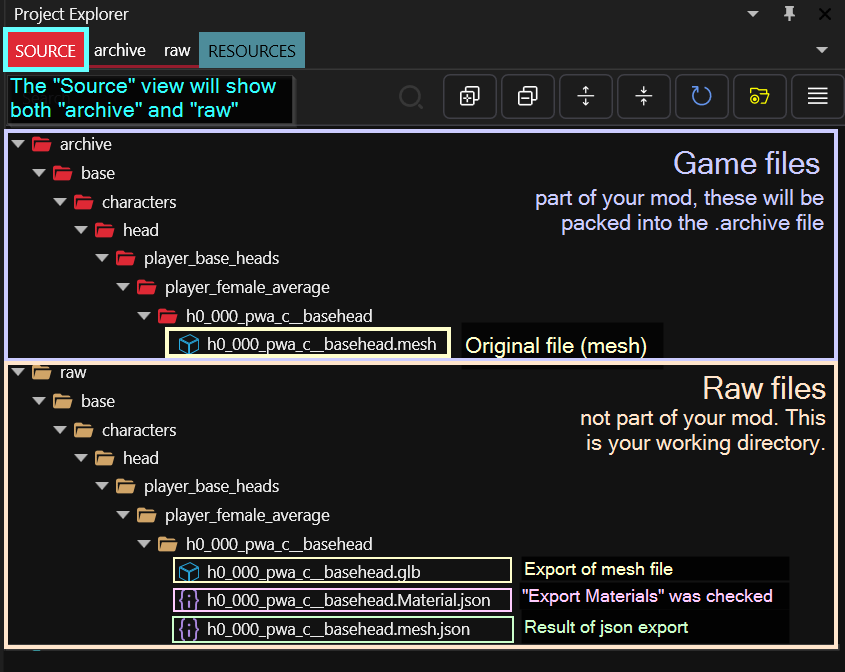
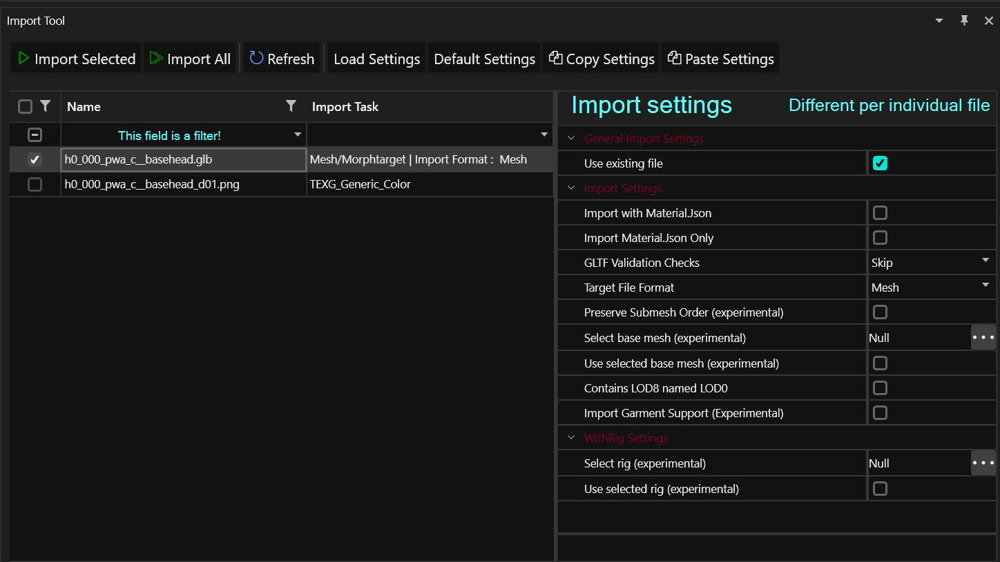

# Import/Export

## UI location: Tools

As of Wolvenkit 8.9.0, you can find both the import and the export tool in the menu "Tools":&#x20;

<figure><figcaption></figcaption></figure>

## File Structure


You browse the file structure via Wolvenkit's **Project Explorer**. Here's how it looks:


<figure><figcaption>
Annotated example. For more information about the files, see below.
</figcaption></figure>

Your Wolvenkit project will have several folders inside of `source`. As of 8.9.1, these are:

| Folder name  | Explanation                                                                                                                                                                                                                |
| ------------ | -------------------------------------------------------------------------------------------------------------------------------------------------------------------------------------------------------------------------- |
| archive      | Part of your mod: Files in this folder will become part of your .archive file                                                                                                                                              |
| customSounds | A directory for custom sound files                                                                                                                                                                                         |
| raw          | 
Your (dirty?) work folder. 

This is where Wolvenkit will create any files that you generate through <strong>exporting</strong>. Unless you import them again, they will not affect your mod's content.
 |
| resources    | Part of your mod: Files in this folder will be mapped to Cyberpunk's folder structure. This is where you put script files and tweaks.                                                                                      |

## Exporting

Wolvenkit knows to ways of exporting files: [to JSON](./#export-as-json), or via the [Export Tool](./#export-tool).

Exported files will be created in your project's **raw** folder. The [relative path](#user-content-fn-1)[^1] will be the same.

### Export as JSON

This option is **in the right-click menu**:

<figure><figcaption></figcaption></figure>

Converting files to JSON is not only the easiest way to [quickly change paths in projects](https://wiki.redmodding.org/cyberpunk-2077-modding/modding-guides/everything-else/moving-and-renaming-in-existing-projects), but also a perquisite for several modding workflows.

### Export Tool


For detailed documentation of the different export settings, check the corresponding [subpage](export-settings.md).



Exporting will overwrite already-existing files in `raw` without a prompt.


The **Export Tool** lets you export any files in your project's `archive` directory:

<figure><figcaption>
This is your export tool. For detailed documentation of the different export settings, check the corresponding <a href="export-settings.md">subpage</a>.
</figcaption></figure>

| UI element      | Explanation                                                                                                                                                                  |
| --------------- | ---------------------------------------------------------------------------------------------------------------------------------------------------------------------------- |
| Export Selected | Exports anything you checked in the left-hand list                                                                                                                           |
| Export All      | 
Exports all files in your project.  ⚠ This button will always export everything, <strong>regardless of your filter</strong>.
                                    |
| Refresh         | Refreshes the file list on the left                                                                                                                                          |
| Reset Settings  | Restores the Export Settings to default                                                                                                                                      |
| Copy Settings   | Copies the Export Settings of your currently selected file (`h0_000_pwa_c__basehead.mesh` in the screenshot above) so that you can paste them to other files.                |
| Paste Settings  | 
Pastes the Export Settings from the previous step to the currently active file. 

<em>This will not work if you copy/paste between incompatible file types.</em>
 |

## Importing


You can only import files that are in your project's **raw** folder.


Wolvenkit knows to ways of importing files: [from JSON](./#import-from-json), or via the [Import Tool](./#import-tool).

### Import from JSON

This option is **in the right-click menu.**


JSON import will be available for any file in your `raw` folder with the extension `.json`. **However**, if the file hasn't been created via "`Convert to JSON`", the import will fail.&#x20;


<figure><figcaption></figcaption></figure>

### Import Tool


Importing will overwrite already-existing files in `raw` without a prompt. If you mess up a game file, you can always select the "`replace with original`" option from the right-click menu.


<figure><figcaption>
This is your import tool. For detailed documentation of the different export settings, check the corresponding <a href="import-settings.md">subpage</a>.
</figcaption></figure>


For detailed documentation of the different import settings, check the corresponding [subpage](import-settings.md).


| UI element      | Explanation                                                                                                                                                                  |
| --------------- | ---------------------------------------------------------------------------------------------------------------------------------------------------------------------------- |
| Import Selected | Imports anything you checked in the left-hand list                                                                                                                           |
| Import All      | 
Imports all files in your project.  ⚠ This button will always export everything, <strong>regardless of your filter</strong>.
                                    |
| Refresh         | Refreshes the file list on the left                                                                                                                                          |
| Reset Settings  | Restores the Import Settings to default                                                                                                                                      |
| Copy Settings   | Copies the Import Settings of your currently selected file (`h0_000_pwa_c__basehead.glb` in the screenshot above) so that you can paste them to other files.                 |
| Paste Settings  | 
Pastes the Import Settings from the previous step to the currently active file. 

<em>This will not work if you copy/paste between incompatible file types.</em>
 |

[^1]: Path inside the game files, e.g. `tutorial\my_first_mod\meshes\my.mesh`
