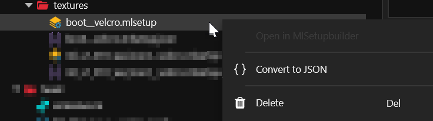
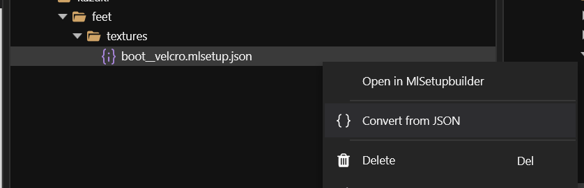

# Import/Export: MLMask and MLSetup

## MultilayerMask

You can export and import MultilayerMasks via Wolvenkit.


For the UI documentation, check [tools-import-export.md](../../tools/tools-import-export.md "mention")

For general information such as the file structure and output directory, check [.](./ "mention")

[Learn more about the functionality of mlmask files on the REDengine 4 Wiki](https://wiki.redmodding.org/cyberpunk-2077-modding/for-mod-creators/materials/multilayered)


### Exporting MLMASK files

Mask files can be exported with the Import/Export tool in a similar fashion to [texture files](textures.md). Additionally, WolvenKit will automatically create a custom `masklist` file, which can be used for importing modified mlmask files.


Masklist files can be opened and modified with any text-editing program.

You can use absolute or relative texture paths.


### Importing MLMASK files

Use the **import** tool to select any `masklist` file within the _raw directory_ of the Project Explorer. If you don't have one, export an MLMask first.

## MultilayerSetup

You can export and import MLSetup files via JSON and edit them with the MLSetupBuilder.

### Export:

<figure><figcaption></figcaption></figure>

### Import:

<figure><figcaption></figcaption></figure>

