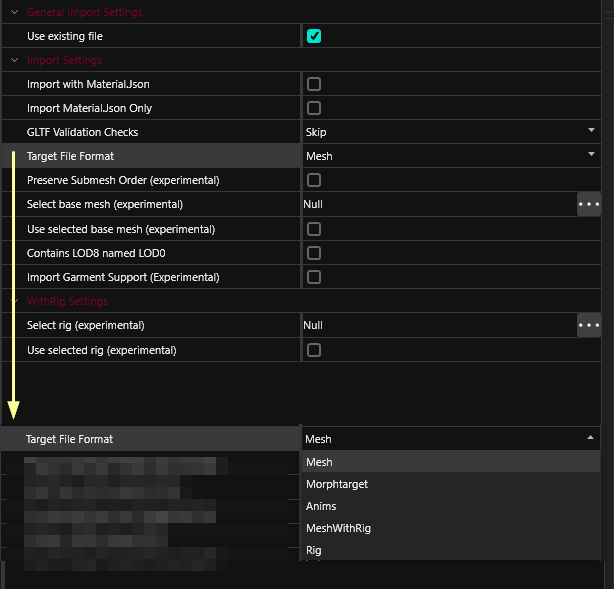

# Import Settings


This page provides documentation by file type for the [import tool](./#import-tool)'s settings.


## Shared settings

|                   |                                                                                                                     |
| ----------------- | ------------------------------------------------------------------------------------------------------------------- |
| Use existing file | If checked, this option will overwrite an existing game file. If the game file doesn't exist, the import will fail. |
|                   |                                                                                                                     |

## .glb

A 3d file. Can import to the following game files:

* .mesh
* .morphtarget
* anims

<figure><figcaption></figcaption></figure>

#### Import with Material.Json

Will re-import the Material.json file that has been generated on export, overwriting any changes you have made in the meantime. \
If you've exported from Blender via [plugin](../blender-integration.md#how-does-it-work), material changes may have been written back.

#### Import Material.Json Only

Will **only** import the Material.json, ignoring the .glb file. Handy for resetting material edits that you did by accident.

#### GLTF Validation Checks

* **Skip**: Will not validate
* **TryFix**: Will attempt to fix issues with your file
* **Strict**: Will not attempt to fix anything, but yell at you for anything that might cause issues.

#### Target File Format

* **Mesh**: Imports over a mesh
* **Morphtarget**: Imports over a morphtarget (the file that deforms a mesh). Necessary for e.g. custom body morphs.
* **Anims**: Imports over an animation file. Necessary for [custom animations](https://wiki.redmodding.org/cyberpunk-2077-modding/modding-guides/animations).
* **Rig**: Attempts to import the associated armature to a .rig
* **MeshWithRig**: Combines the **Mesh** and the **Rig** option.

#### Preserve Submesh Order&#x20;

_(experimental as of 8.9.1)_\
Will ignore submesh names, instead using the **order** inside the armature to generate numbered submeshes.

#### Select base mesh

_(experimental as of 8.9.1)_ \
See [#use-selected-base-mesh](import-settings.md#use-selected-base-mesh "mention")

#### Use selected base mesh

_(experimental as of 8.9.1)_\
Instead of importing directly over the target file, this option will pull the `.mesh` file that you have picked in `Select base mesh`  (e.g. if you run into [bone problems](https://wiki.redmodding.org/cyberpunk-2077-modding/modding-know-how/3d-modelling/troubleshooting-your-mesh-edits#bone-neutral\_bone-not-present-in-export-rig-s-import-mesh)).

#### Contains LOD8 named LOD0

Will treat the submesh LOD0 as having the lowest level of detail rather than the highest

#### Import Garment Support

_(experimental as of 8.9.1)_\
Will try importing Blender shapekeys as [garment support](https://wiki.redmodding.org/cyberpunk-2077-modding/modding-know-how/3d-modelling/garment-support-how-does-it-work).&#x20;

#### Select Rig

_(experimental as of 8.9.1)_ \
See [#use-selected-rig](import-settings.md#use-selected-rig "mention")

#### Use selected rig

_(experimental as of 8.9.1)_ \
Instead of importing over the target file's associated rig, this option will pull the `.rig` file that you have picked in `Select base rig` (e.g. if you run into [bone problems](https://wiki.redmodding.org/cyberpunk-2077-modding/modding-know-how/3d-modelling/troubleshooting-your-mesh-edits#bone-neutral\_bone-not-present-in-export-rig-s-import-mesh)).

## .png, .dds

An image file. Can import to the following game files:

* .xbm

For more documentations on texture files, [see here](https://wiki.redmodding.org/cyberpunk-2077-modding/modding-know-how/files-and-what-they-do/textures-.xbm-files). \
For instructions on how to import/export them, [see here](https://wiki.redmodding.org/cyberpunk-2077-modding/modding-know-how/textures/images-importing-editing-exporting).

<figure><figcaption></figcaption></figure>

#### Texture Group

Select a preset for import. **This will preselect the options below**, so pick  the right one for your use case!


Wolvenkit will try to guess the right preset from your file name, so you'll want to stick to the game's naming conventions.


Possible values are:

* TexG\_Generic\_Color
* TexG\_Generic\_Grayscale
* TexG\_Generic\_Normal
* TexG\_Generic\_Data
* TexG\_Generic\_UI
* TexG\_Generic\_Font
* TexG\_Generic\_LUT
* TexG\_Generic\_MorphBlend
* TexG\_Multilayer\_Color
* TexG\_Multilayer\_Normal
* TexG\_Multilayer\_Grayscale
* TexG\_Multilayer\_Microblend

#### VFlip (Default: True)

Should the image be v-flipped?


The game saves images as upside-down. Wolvenkit will fix that for you, so unless your texture is already flipped, you'll want to leave this alone.


#### RawFormat

_as of 8.9.1_

Raw format for export. Possible values are:

* TRF\_Invalid
* TRF\_TrueColor
* TRF\_DeepColor
* TRF\_Grayscale
* TRF\_HDRFloat
* TRF\_HDRHalf
* TRF\_HDRFloatGrayscale
* TRF\_Grayscale\_Font
* TRF\_R8G8
* TRF\_R32UI
* TRF\_Max

#### Generate MipMaps

Should [MipMap](https://en.wikipedia.org/wiki/Mipmap)s be created?


The \
This requires the texture width and height to be potencies of 2!


#### IsStreamable

???

#### PremultiplyAlpha

???

