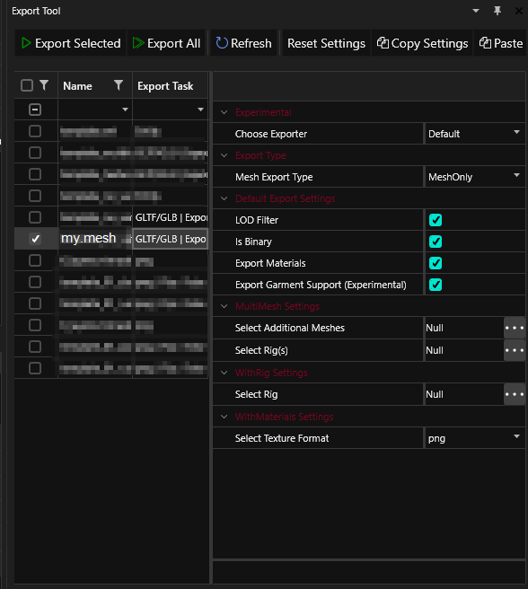

# Import/Export: Mesh (3d Model)


For the UI documentation, check [tools-import-export.md](../../tools/tools-import-export.md "mention")

For general information such as the file structure and output directory, check [.](./ "mention")

For a step-by-step workflow and troubleshooting, see \
[Cyberpunk 2077 Modding](https://app.gitbook.com/o/-MP5ijqI11FeeX7c8-N8/s/4gzcGtLrr90pVjAWVdTc/ "mention")-> [WKit Blender Plugin: Import/Export](https://app.gitbook.com/s/4gzcGtLrr90pVjAWVdTc/for-mod-creators-theory/modding-tools/wolvenkit-blender-io-suite/wkit-blender-plugin-import-export "mention") -> [Meshes](https://app.gitbook.com/s/4gzcGtLrr90pVjAWVdTc/for-mod-creators-theory/modding-tools/wolvenkit-blender-io-suite/wkit-blender-plugin-import-export#meshes "mention")


WolvenKit is capable of exporting Cyberpunk mesh files (with their armatures and materials) _natively_ to glTF format, preserving Cyberpunk's separation into distinct submeshes with different materials.

We can import those .glb files into the following game files:

* .mesh
* .morphtarget
* anims

## Exporting mesh file


After exporting, your files can be found in your project's [raw](../../editor/project-explorer.md#raw) section.


Morph targets are automatically included inside the glTF file. You can find the morphs as shapekeys within Blender or blendshapes with Maya.

<figure><figcaption>
mesh export settings as of 8.1.11
</figcaption></figure>

### Default Export Settings

#### LOD Filter (default)

If selected, models for LOD > 0 will not be included with the export.

#### Is Binary (default, recommended)

Select to export in binary from as **GLB** rather than **glTF** format. (Recommended)

#### Export Materials (default)

create a `meshName.Material.json` file for the [Wolvenkit Blender IO Suite](https://app.gitbook.com/s/4gzcGtLrr90pVjAWVdTc/for-mod-creators-theory/modding-tools/wolvenkit-blender-io-suite "mention")


Turn this off if the file export fails.


#### Export Garment Support (default)

Exports garment support to shapekeys for Blender.


Turn this off if the file export fails.


### Export types

#### <mark style="color:red;">MeshOnly</mark>

The default export is versatile enough for most use cases. Any mesh, static or skinned can be exported and imported with this setting. For skinned meshes the bone parenting hierarchy will not be included, however this does not matter for importing meshes. Meshes will be divided into submeshes by material.

#### <mark style="color:red;">WithRig</mark>


Bone parents are not required for successful mesh imports


Using the `WithRig` export option allows us to export skinned meshes with parented bones. By default exported meshes are correctly skinned, but the skeleton contains no parenting information. Bone-parented rigs are especially useful for posing/animating using a 3d software.

Mesh files themselves do not contain the bone parents, so it's required to select a **rig** file to accompany each mesh export. To select a rig, in the `WithRig Settings` section of the right panel press the **`...`** (Collections) button. This opens the collections menu where you will select your rig file.

#### WithRig usage

Choose a rig file from the panel on the left side, then use the opposing left/right arrows to add or remove a rig. The selected rig will be added to the right panel. Only one rig can be used, so adding more than one rig will result in the 1st rig in the list being selected.

#### Choosing rigs correctly

Generally for NPC heads, weapons, or vehicle meshes you can find the associated rig file similarly named to the mesh in the same or nearest directory. For other meshes such an NPC body, a more generic rig is used.\
\
e.g. Johnny Silverhand is a man with average body proportion so his body uses the following rig:\
`base\characters\base_entities\man_base\deformations_rigs\man_base_deformations.rig` \
\
If the wrong/incompatible rig is used, an error will be displayed within the [**Log**](../../editor/log.md)**.**

#### <mark style="color:red;">MultiMesh</mark>

The `MultiMesh` export option is similar in functionality to [**WithRig**](models.md#withrig)**,** with the addition of support for multiple rigs and meshes. This option was implemented because some meshes use more than one rig.\
\
e.g. Judy's mesh **l1\_001\_wa\_pants\_\_judy** uses the following rigs:`base\characters\base_entities\woman_base\deformations_rigs\woman_base_deformations.rig` \
`base\characters\main_npc\judy\l1_001_wa_pants__judy_dangle_skeleton.rig`\
\
Where the dangle rig is used in addition to the base rig to animate Judy's belt.

#### MultiMesh usage

Navigate to the `MultiMesh Settings` and configure the export options for additional meshes and rigs. The functionality is identical to [**WithRig**](models.md#withrig-usage), so the same instructions should be followed.

## Importing mesh files

WolvenKit is able to import custom mesh files. The Import/Export tool expects meshes to be in the glTF format, stored as a .glb file (binary format). The tool supports skinned (animated) or rigid (static) models.


You have to import your `.glb` into an existing `.mesh` file!


### Guidelines for successful imports


We **strongly** recommend the [Wolvenkit Blender IO Suite](https://app.gitbook.com/s/4gzcGtLrr90pVjAWVdTc/for-mod-creators-theory/modding-tools/wolvenkit-blender-io-suite "mention"), which will automate the following checks for you:


* Be sure your mesh is **triangulated** and does not contain loose geometry
* Submeshes are ordered by name and are called submesh01, submesh\_02, submesh\_03, etc.
* Individual meshes have < **65535** triangles

### Import Settings

<figure><figcaption>
Import settings as of ~2.12
</figcaption></figure>

#### Import with Material.Json

Will re-import the Material.json file that has been generated on export, overwriting any changes you have made in the meantime. \
If you've exported from Blender via [plugin](../blender-integration.md#how-does-it-work), material changes may have been written back.

#### Import Material.Json Only

Will **only** import the Material.json, ignoring the .glb file. Handy for resetting material edits that you did by accident.

#### GLTF Validation Checks

* **Skip**: Will not validate
* **TryFix**: Will attempt to fix issues with your file
* **Strict**: Will not attempt to fix anything, but yell at you for anything that might cause issues.

#### Target File Format

* **Mesh**: Imports over a mesh
* **Morphtarget**: Imports over a morphtarget (the file that deforms a mesh). Necessary for e.g. custom body morphs.
* **Anims**: Imports over an animation file. Necessary for [custom animations](https://wiki.redmodding.org/cyberpunk-2077-modding/modding-guides/animations).
* **Rig**: Attempts to import the associated armature to a .rig
* **MeshWithRig**: Combines the **Mesh** and the **Rig** option.

#### Preserve Submesh Order&#x20;

_(experimental as of 8.9.1)_\
Will ignore submesh names, instead using the **order** inside the armature to generate numbered submeshes.

#### Select base mesh

_(experimental as of 8.9.1)_ \
See [#use-selected-base-mesh](models.md#use-selected-base-mesh "mention")

#### Use selected base mesh

_(experimental as of 8.9.1)_\
Instead of importing directly over the target file, this option will pull the `.mesh` file that you have picked in `Select base mesh`  (e.g. if you run into [bone problems](https://wiki.redmodding.org/cyberpunk-2077-modding/modding-know-how/3d-modelling/troubleshooting-your-mesh-edits#bone-neutral\_bone-not-present-in-export-rig-s-import-mesh)).

#### Contains LOD8 named LOD0

Will treat the submesh LOD0 as having the lowest level of detail rather than the highest

#### Import Garment Support

_(experimental as of 8.9.1)_\
Will try importing Blender shapekeys as [garment support](https://wiki.redmodding.org/cyberpunk-2077-modding/modding-know-how/3d-modelling/garment-support-how-does-it-work).&#x20;

#### Select Rig

_(experimental as of 8.9.1)_ \
See [#use-selected-rig](models.md#use-selected-rig "mention")

#### Use selected rig

_(experimental as of 8.9.1)_ \
Instead of importing over the target file's associated rig, this option will pull the `.rig` file that you have picked in `Select base rig` (e.g. if you run into [bone problems](https://wiki.redmodding.org/cyberpunk-2077-modding/modding-know-how/3d-modelling/troubleshooting-your-mesh-edits#bone-neutral\_bone-not-present-in-export-rig-s-import-mesh)).

#### Import Material.json Only

Useful for updating material information only, without disturbing the original geometry data.

#### GLTF Validation Checks

Use the GLTF library to run some basic checks to detect bad geometry.

#### Import As REDengine File Format

Select the desired destination format. (mesh/morphtarget)

#### Use existing file

Rebuild the existing mesh file. (Required)


Having trouble modifying a mesh file? Keep in mind WolvenKit always uses an existing mesh file for each import. Once a mesh file is corrupted, all subsequent imports will be corrupted as well. [**Try replacing the source mesh with the original!**](../../editor/project-explorer.md#replace-with-original)


## Blender glTF Settings

### Import

Meshes can be imported with the pre-installed Blender glTF add-on with the default glTF import options. To learn about importing models with the Cyberpunk Blender add-on for shader previews, visit the [**Blender Integration page.**](../blender-integration.md)&#x20;

### **Export**

The following settings are _recommended_ for using Blender with WolvenKit. Unlisted export options can use the **Operator Default** preset (no change). These options may not cover all cases, however it's a good baseline for getting started.

*   Geometry

    * [x] Apply Modifiers
    * [x] Tangents

    &#x20;** Materials:** No Export
* Shape Keys
  * [x] Shape Key Tangents


New to Blender and/or modding? Remember to remove all extra assets before exporting! Do not include lights, cameras, or other meshes such as the default cube.


## Submeshes

Meshes are sorted and given materials based on the submesh index. LOD variants are numbered as 1, 2, 4, and 8 which corresponds to the REDengine value. _These are not the distances at which the LOD is applied._


It's important to remember the submesh name is determined by the **Data Block** not the **Object Name**. The orange colored icon represents the Blender object name, while the green polygon represents the _actual_ name of the mesh.


It's possible to reference the material structure of the original mesh file using WolvenKit to see how each submesh is mapped to a distinct material.

In the example above, you can see the material list which repeats after reaching `glass1` meaning this is the final submesh. We now know this mesh has 12 distinct submeshes (0-11). It also contains four LOD's because each material list is repeated for a total of four lists.


For a detailed breakdown of each material, use the [**WithMaterials**](models.md#withmaterials) option for mesh exports.


## Material JSON I/O

WolvenKit supports importing and exporting REDengine material information in the form of a bespoke **material json** file.  [**Learn more above**](models.md#withmaterials)

The material json file is necessary for previewing meshes with the [**Cyberpunk Blender add-on**](../blender-integration.md). The REDengine data written to json is interpreted by Python script to setup _somewhat_ accurate representations of REDengine shaders.


Just looking to edit materials? WolvenKit can directly edit materials within **.mesh** or **.mi** files using the File Editor.


### Technical Details

A bespoke json file will be generated from the material dependency stack and exported alongside the raw mesh file. The entire daisy chain of materials is analyzed and written to file top-down, meaning all properties are written as they appear in game. The material json file can be edited with any text-based editor. Any changes saved to the json file will be written to the mesh file upon each import.

* We rely on the [**Depot**](../../settings.md#depot-path) (a local file cache) which contains all material dependencies for any given mesh.\

* For each `WithMaterials` mesh export, the material dependencies are analyzed and missing resources are dumped to the Depot.\

* The material json is generated by looking at the complete daisy chain of materials. Meaning every single dependency is reviewed and the top-most properties that REDengine sees are written to the material json file.\

* The REDengine values written into the material json file can be interpreted by the Blender Cyberpunk glTF importer to automatically set up shaders within Blender Cycles. [**Read more about Blender integration here**](../blender-integration.md#importing-cyberpunk-meshes-with-blender).

## MorphTargets


Morphtarget I/O is highly experimental, some assets are not handled correctly


WolvenKit can export **morphtarget** files from the game to glTF format, these morphtargets files are used to morph a base mesh that exists in the game. For example, the character that you create in the game with different types of nose, eyes, and mouth is formed using the shape keys that exists in the morphtarget files. **You can use Import/Export Tool to export them to glb/glTF,** any morph texture(s) existing in file will also export along in dds format.

