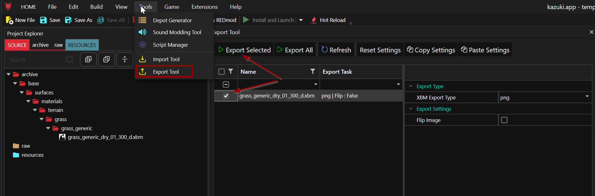
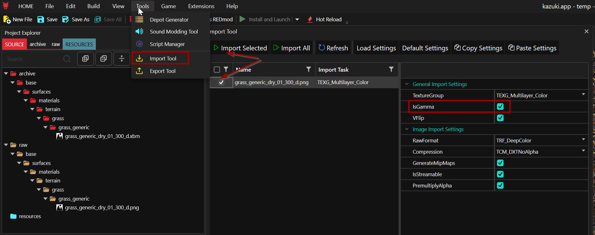
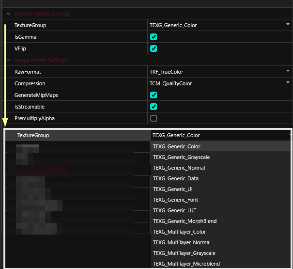

# Import/Export: Textures

WolvenKit is capable of exporting Cyberpunk XBM files to common formats like png. It will try and automatically determine the correct import settings based on the file name.&#x20;


For the UI documentation, check [tools-import-export.md](../../tools/tools-import-export.md "mention")

For general information such as the file structure and output directory, check [.](./ "mention")

For a step-by-step workflow and troubleshooting, see [Cyberpunk 2077 Modding](https://app.gitbook.com/o/-MP5ijqI11FeeX7c8-N8/s/4gzcGtLrr90pVjAWVdTc/ "mention") ->  [Textures: Importing, editing, exporting](https://app.gitbook.com/s/4gzcGtLrr90pVjAWVdTc/modding-guides/textures-and-luts/images-importing-editing-exporting "mention")


## Exporting a texture from Wolvenkit

1. Add the xbm file to your project
2. Open the Export tool (Tools -> Export Tool)
3. Select your texture
4. Click "Export Selected"

<figure><figcaption></figcaption></figure>

This will generate a png file in your project's raw folder.

### Export Options

#### XBM Export Type

Choose a common image format for exported textures. Possible options (as of 8.9.1):

* png
* dds
* tga
* bmp
* jpg
* png

#### Flip Image

Vertically invert textures for convenience

## Importing textures

WolvenKit is capable of importing custom images as Cyberpunk XBM files. The Import/Export Tool can replace an existing XBM or generate new standalone XBM.&#x20;


For compatibility reasons, you might want to stick to **png** files.


The easiest way to go about it is this:

1. Add an existing xbm file of the same type that you want to import to your Wolvenkit project.&#x20;
2. [Export](textures.md#exporting-a-texture-from-wolvenkit) the xbm file: this adds a png file with the same name to your project's raw folder.
3. Overwrite the png with your edited texture.
4. Open the Import tool, and select your png file. \
   &#xNAN;_&#x54;he correct settings should be applied automatically._&#x20;
5. Click "Import Selected".

<figure><figcaption></figcaption></figure>

### Import Options

<figure><figcaption></figcaption></figure>

#### Advanced Options

By default advanced XBM options are hidden. This can be changed by modifying WolvenKit [**Settings**](../../settings.md).&#x20;


TODO: Is this still the case? Double-check!


#### Texture Group

Select a preset for import. **This will preselect the options below**, so pick  the right one for your use case!


Wolvenkit will try to guess the right preset from your file name, so you'll want to stick to the game's naming conventions.


<table><thead><tr><th width="268">Name</th><th></th><th></th></tr></thead><tbody><tr><td>TexG_Generic_Color</td><td>Used for colour textures inside the world (for use as <a data-mention href="https://app.gitbook.com/s/4gzcGtLrr90pVjAWVdTc/for-mod-creators-theory/materials/textures#diffuse-albedo">Diffuse/Albedo</a>)</td><td>Transparency: from texture's alpha channel SRGB: true</td></tr><tr><td>TexG_Generic_Grayscale</td><td>Used for greyscale textures (for use as <a data-mention href="https://app.gitbook.com/s/4gzcGtLrr90pVjAWVdTc/for-mod-creators-theory/materials/textures#roughness">Roughness</a> or metalness)</td><td></td></tr><tr><td>TexG_Generic_Normal</td><td>used for normal maps (for use as <a data-mention href="https://app.gitbook.com/s/4gzcGtLrr90pVjAWVdTc/for-mod-creators-theory/materials/textures#normal">Normal</a>)</td><td>No transparency Will be <strong>swizzled</strong> on import (green channel dropped), which will turn blue maps yellow</td></tr><tr><td>TexG_Generic_Data</td><td>???</td><td></td></tr><tr><td>TexG_Generic_UI</td><td>Used for UI textures that do not consider in-world lighting</td><td>like generic_color, but without isSRGB</td></tr><tr><td>TexG_Generic_Font</td><td>for fonts</td><td>???</td></tr><tr><td>TexG_Generic_LUT</td><td>for LUTs</td><td>???</td></tr><tr><td>TexG_Generic_MorphBlend</td><td>???</td><td></td></tr><tr><td><em>TexG_Multilayer_Color</em></td><td>not used for any workflows,use <code>Generic_Color</code> instead</td><td></td></tr><tr><td><em>TexG_Multilayer_Normal</em></td><td>not used for any workflows,use <code>Generic_Normal</code> instead</td><td></td></tr><tr><td><em>TexG_Multilayer_Grayscale</em></td><td>not used for any workflows,use <code>Generic_Grayscale</code> instead</td><td></td></tr><tr><td>TexG_Multilayer_Microblend</td><td>used for microblends</td><td>tileable normal maps with transparency for use in microblends</td></tr></tbody></table>

#### SRGB (isGamma)

Sets isGamma boolean upon import. Color textures (such as diffuse) must be set as true, or they will appear blown-out or too bright in-game.

#### VFlip (Default: True)

Should the image be v-flipped?


The game saves images as upside-down. Wolvenkit will fix that for you, so unless your texture is already flipped, you'll want to leave this alone.


#### RawFormat

_as of 8.9.1_

Raw format for export. Possible values are:

* TRF\_Invalid
* TRF\_TrueColor
* TRF\_DeepColor
* TRF\_Grayscale
* TRF\_HDRFloat
* TRF\_HDRHalf
* TRF\_HDRFloatGrayscale
* TRF\_Grayscale\_Font
* TRF\_R8G8
* TRF\_R32UI
* TRF\_Max

#### Generate MipMaps

Should [MipMap](https://en.wikipedia.org/wiki/Mipmap)s be created?


The \
This requires the texture width and height to be potencies of 2!


#### IsStreamable

???

#### Transparency from Alpha Channel (formerly PremultiplyAlpha)

Should the image consider **transparency**?&#x20;


Transparency must be read from a png's alpha channel. If you don't know how to create one, see the guide about texture editing on [the yellow wiki](https://app.gitbook.com/s/4gzcGtLrr90pVjAWVdTc/modding-guides/textures-and-luts/images-importing-editing-exporting).


