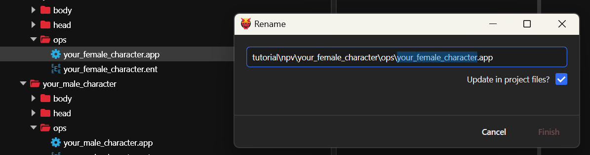
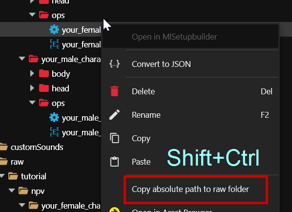
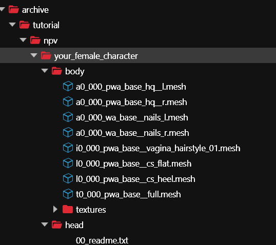
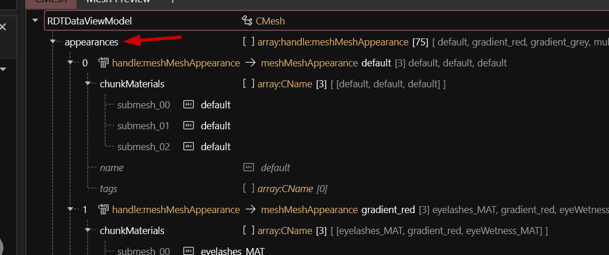
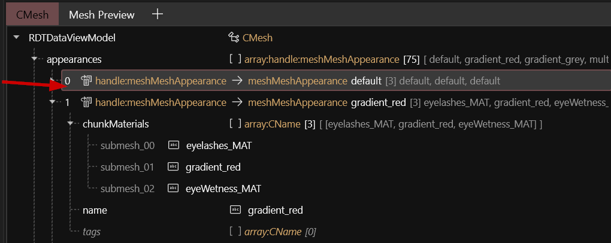

# Navigating Wolvenkit

**Created:** Dec 03 2024 by [manavortex](https://app.gitbook.com/u/NfZBoxGegfUqB33J9HXuCs6PVaC3 "mention")\
**Last documented update:** Dec 03 2024 by [manavortex](https://app.gitbook.com/u/NfZBoxGegfUqB33J9HXuCs6PVaC3 "mention")

This page will tell you about keyboard shortcuts and nifty tricks that make working with Wolvenkit easier.

## Project Browser

The context menu in the project browser reacts to `Shift` and `Ctrl`, making other operations available. Check it out!

### Drag and drop

You can drag and drop files and folders to move them. Hold the `Ctrl` key to copy them instead.

### Rename and refactor

You can call up the rename dialogue by pressing f2, as long as you have a node in the project browser selected.

<figure><figcaption></figcaption></figure>

If you check the `Update in project files?` box, Wolvenkit will **automatically** try to update all references in your project to the new file path.

### Copy relative path

The context menu's `Copy Relative Path` action will show you other options if you hold `Shift` and/or `Ctrl`:

<figure><figcaption></figcaption></figure>

### Collapse/expand a folder and its children

By holding the `Ctrl` key when you click on a folder, you can collapse or expand the whole folder and its children.

<figure><figcaption></figcaption></figure>

## File Editor

The file editor's context menu and menu bar react to `Shift` and `Ctrl`, making other operations available. Check it out!

### Difficulty mode


If you're a beginner, stick to **Easy** mode — the person who implemented the feature does the same.


Check [editor-difficulty-mode.md](../editor/file-editor/editor-difficulty-mode.md "mention") for the full documentation.&#x20;

### Delete all but selection

Holding the `Shift` key while an array element is selected will offer you `Delete all but selection`  instead of `Delete selection`.

### Overwrite with selection

Holding the `Shift` key while pasting into an array will let you overwrite the current selection with your clipboard.

Holding down the `Ctrl` key as well will let you overwrite the entire array with your clipboard.

### Shift: Recursively fold/unfold

By holding `Shift` while  expanding a node, you can fold/unfold all of its children (and their children) according to specified rules for the most common node types:

<figure><figcaption>
Shift-unfolding 
</figcaption></figure>

### Double-Click: Fold/unfold all siblings

Double-clicking a node in an array will toggle the expansion state of all siblings to the expansion state of the node.

<figure><figcaption>
This will collapse all other appearances in the list
</figcaption></figure>

### f2: Search and replace in selection

You can search and replace in selection by using the context menu or pressing the f2 key.&#x20;


This can take a long time if your file is big, so you should use the search box first!


### Clean up

Especially in mesh files, the Clean Up menu is your friend.&#x20;

**Clean up empty submeshes** will delete extra chunks from old templates.&#x20;

**Delete unused materials** will drop any material entries that aren't used by any of your appearances.
