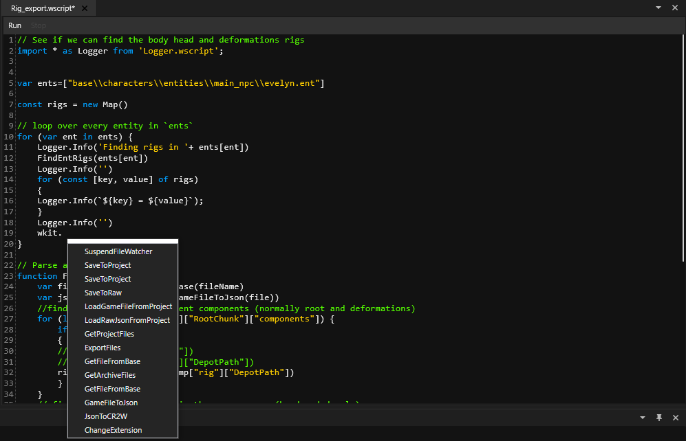

# Scripting with wscript

Wolvenkit is scriptable using javascript and its internal API. With it you can automate tasks such as exporting, as well as make changes to files programmatically.


For documentation of the [script-manager.md](../tools/script-manager.md "mention"), check the corresponding sub-page.


## Adding Scripts

See [script-manager.md](../tools/script-manager.md "mention") -> [#adding-scripts](../tools/script-manager.md#adding-scripts "mention")

## Script file path

Any .wscript files you have created or edited will be stored in the following location:

```
%APPDATA%\REDModding\WolvenKit\WScript
```

You can delete or edit them via [script-manager.md](../tools/script-manager.md "mention").

## Editing Scripts

The editor shows your source code with code formatting and includes code suggestion for the Wolvenkit api.&#x20;

<figure><figcaption></figcaption></figure>

For questions or suggestions about the scripting interface please visit the #wolvenkit-scripts channel on the [Discord server](../../help/community.md).

## API Commands

Documentation of the API can be found at [https://wolvenkit.github.io/WolvenKit/index.html](https://wolvenkit.github.io/WolvenKit/index.html)

This documentation is generated by Doxygen from the codebase so will update as the API evolves.


## Utility Functions

There is also a utility library called Logger.wscript shipped with wolvenkit that assists with writing messages to the wolvenkit Log. It can be included with the following statement:

```javascript
import * as Logger from 'Logger.wscript';
```

it provides the following functions:

**Logger.Info(obj)**

Prints the supplied object or text in yellow in the log window.

**Logger.Warning(obj)**

Prints the supplied object or text in purple in the log window.

**Logger.Error(obj)**

Prints the supplied object or text in red in the log window.

**Logger.Success(obj)**

Prints the supplied object or text in light blue in the log window.

**Logger.Debug(obj)**

Prints the supplied object or text only to the log file.
