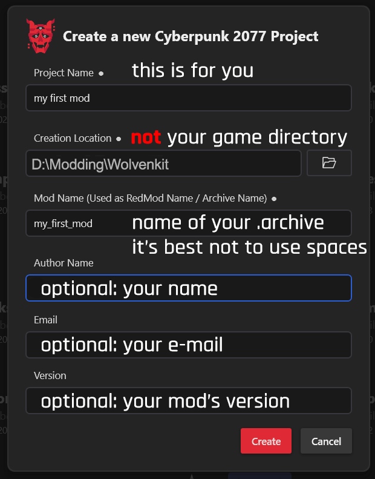

# WolvenKit Projects

## What is a WolvenKit project?

To access most WolvenKit features, it's necessary to create a Project first. Projects are primarily used to separate and organize source and game files into distinct directories. Each project can be thought of as the source code for any given mod.


Check [asset-browser.md](../editor/asset-browser.md "mention") -> [#adding-files-to-projects](../editor/asset-browser.md#adding-files-to-projects "mention") to learn about adding files.


## Create a new WolvenKit mod project

You have two means of creating one:&#x20;

* From the [menu](../menu/ "mention"): [#file](../menu/#file "mention") -> [#new-project](../menu/#new-project "mention")
* From Wolvenkit's [Home](../home/) view via the Create New Project button

You will see something like this:

<figure><figcaption></figcaption></figure>

<table><thead><tr><th width="180">Field</th><th>explanation</th></tr></thead><tbody><tr><td>Project name</td><td>The name of your mod. This will only be used internally, so name it what you lke.</td></tr><tr><td>Creation location</td><td>The location where you keep your Wolvenkit projects. A subfolder with the project name will be created automatically.   Do <strong>not</strong> put this in your game directory!</td></tr><tr><td>Mod name</td><td>
name of your .archive or redmod folder. 

This should be unique, as this will be used to generate your mod's structure, and it would be awkward to overwrite someone else's mod.   Although special characters are supported, it's a good habit to avoid them.
</td></tr><tr><td>Author name</td><td>Optional — What it looks like - who made this?</td></tr><tr><td>Email</td><td>Optional — can people send you mails about your mod? </td></tr><tr><td>Version</td><td>Optional — if you want to maintain versioning yourself</td></tr></tbody></table>

Click **Finish.** WolvenKit will now open the new project and proceed to the [**Editor**](../editor/)**.**

### How it looks like:


To learn more about the [**Editor**](../editor/), please check the corresponding wiki page.


<figure><figcaption></figcaption></figure>

## Opening an existing WolvenKit mod project

1. From the [**Menu**](../menu/#new-project) or the [**Home**](../home/) page, click the "Open Project" button
2. Select a .modproj file to open with WolvenKit
3. WolvenKit will now open the project and proceed to the [**Editor**](../editor/)

## File structure explained

Your project will contain the following folders:

<table><thead><tr><th width="238">Folder name</th><th>Explanation</th></tr></thead><tbody><tr><td>source</td><td>
This is where your mod's <strong>unbundled</strong> files are. 
<ul><li>Game resources under <code>archive</code></li><li>control files in <code>resources</code></li><li>exported files that you're modifying in <code>raw</code> </li></ul></td></tr><tr><td>packed</td><td>Contains both the control files and the bundled archive files inside their folder hierarchy. You can copy this directly to your game directory (or have Wolvenkit do it for you via Install).  This folder will be deleted and re-created every time you install or pack your mod. </td></tr></tbody></table>

### Subdirectories in source

Your Wolvenkit project will have several folders inside of `source`.&#x20;

As of 8.9.1, these are:

#### Archive

**Location:** `your_wolvenkit_project/source/archive`

This directory contains game files in the REDengine [**CR2W**](../../help/glossary.md#cr-2-w) format, which you can add via [**Asset Browser**](../editor/asset-browser.md)**.**&#x20;

Everything in this folder will be packed into your mod's .archive file.

#### Raw

**Location:** `your_wolvenkit_project/source/raw`

This is your working directory. Keep any files here that you don't want to end up on Nexus.

When you [export files](import-export/) via Wolvenkit, the exports will be placed in a [mirrored folder structure](import-export/#file-structure-the-raw-folder). Unless you import them again, they will not affect your mod's content.\
\
You can keep .blend and texture files here.

#### customSounds

A directory for custom sound files.

#### Resources

**Location:** `your_wolvenkit_project/source/resources`

This folder contains other files for your mod.&#x20;

Any of its contents will be [packed](../menu/toolbar.md#pack-mod) so that they extract directly into the Cyberpunk directory. For that reason, you (or Wolvenkit) should create the following subdirectories:

|                                                                                                                                              |                                                        |
| -------------------------------------------------------------------------------------------------------------------------------------------- | ------------------------------------------------------ |
| script (.reds, [RedScript](https://app.gitbook.com/s/4gzcGtLrr90pVjAWVdTc/for-mod-creators-theory/references-lists-and-overviews/scripting)) | r6/scripts                                             |
| tweaks (.yaml, [TweakXL](https://app.gitbook.com/s/4gzcGtLrr90pVjAWVdTc/for-mod-creators-theory/core-mods-explained/archivexl))              | r6/tweaks                                              |
| CET (.lua, [Cyber Engine Tweaks](https://wiki.redmodding.org/cyber-engine-tweaks/))                                                          | `bin/x64/plugins/cyber_engine/tweaks/mod/your_mod_dir` |

## Project naming and mod load order


For more details on [Archive files Load Order](https://app.gitbook.com/s/4gzcGtLrr90pVjAWVdTc/for-mod-users/users-modding-cyberpunk-2077/load-order "mention"), see the yellow wiki


If your mod contains an `.archive` file, then it will have the same name as your Wolvenkit project. Since `.archive` files will be loaded in alphabetical order (ASCII):

<figure><figcaption>
Source: <a href="https://www.academia.edu/19644191">https://www.academia.edu/19644191</a>
</figcaption></figure>

If you are creating a **compatibility mod** (something that modifies the files of another installed mod), then yours needs to load **first**.

For example, if you want to do a custom recolour of the mod [`_ArchiveXL_Netrunner_Variants.archive`](https://app.gitbook.com/s/4gzcGtLrr90pVjAWVdTc/modding-guides/items-equipment/recolours-and-refits), then your Wolvenkit project could be named `_00_ArchiveXL_Netrunner_Variants`, or `_ArchiveXL_Netrunner_00_Recolour`.

## Building a mod project


For full documentation of the [toolbar.md](../menu/toolbar.md "mention")and the [menu](../menu/ "mention"), see the corresponding wiki pages.


From the [**Menu**](../menu/#new-project) click on the [**Pack Project**](../menu/#pack-project) button**.** The [**Log**](../editor/log.md) will display a result to indicate packing was successful. All files within the **archive directory** of the [**Project Explorer**](../editor/project-explorer.md) will now be packed into archive format. The packed files can be found in the **packed** (`.../modname/packed`) directory of the mod project.

## See also


[project-explorer.md](../editor/project-explorer.md)

