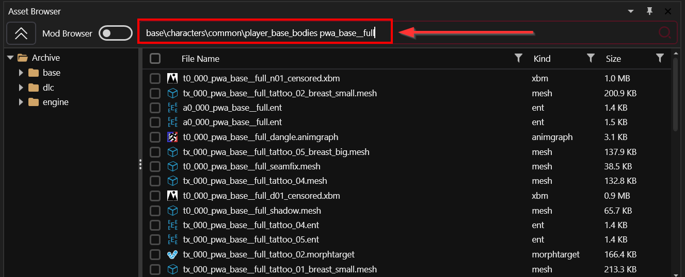
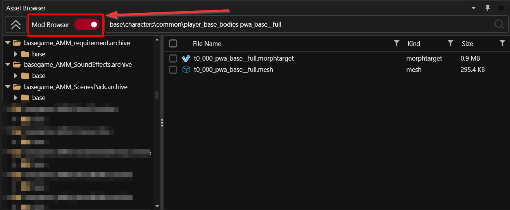

# Wolvenkit Search: Finding files


For help finding an item, check [Spawn Codes (BaseIDs/Hashes)](https://app.gitbook.com/s/4gzcGtLrr90pVjAWVdTc/for-mod-creators-theory/references-lists-and-overviews/equipment/spawn-codes-baseids-hashes "mention") on the yellow wiki.


You can use the search bar at the top of the asset browser to search the game files:

<figure><figcaption><p>Here, you can search through game files.</p></figcaption></figure>

To search in your currently installed mods instead, switch to Mod Browser:

<figure><figcaption><p>Your currently installed mods will show up on the left</p></figcaption></figure>

## Operators

You can chain the search operators below with the `>` character, which will run the results of the first search through the second search.

#### Examples:

```
// find all .mesh files in mod archives matching ArchiveXL_Netrunner
archive:ArchiveXL_Netrunner > .mesh

// find all textures with "steel" outside of "Characters"
// (have negative matches last, as they're expensive)
.xbm > steel > !characters
```

Let's get to the meat of the matter.

### By archive

This is mostly useful for the mod browser, as it allows you to e.g. retrieve files from your other mods without switching projects or digging through your mod directory.&#x20;

Use the `archive` switch to show only files in a certain archive (name or path):

```
a:ArchiveXL_Netrunner
archive:ArchiveXL_Netrunner
```


This operator **has** to be chained via `>` if you want to refine it.

`a:ArchiveXL_Netrunner .mesh` will show nothing\
`a:ArchiveXL_Netrunner > .mesh` will show all mesh files by archive match `ArchiveXL_Netrunner`.


### By full / partial path

#### Full

This is the default search behaviour, and you don't need to include these operators.&#x20;

Search will only show you files under this path.

```
path:base\characters\common\player_base_bodies\player_female_average\t0_000_pwa_base__full.mesh
@base\characters\common\player_base_bodies\player_female_average
```

#### Partial

To limit your search to a certain folder, you can put the folder path **and** the search term:

```
base\characters\common\player_base_bodies\player_female_average t0_000_pwa_base
```

You don't need to include slashes. These search terms below will yield the same results:

```
base\characters\common\player_base_bodies\player_female_average arms
base characters common player_base_bodies player_female_average arms

// or simplify it to
player_base_bodies player_female_average arms
```

### File Extension

You can limit your search to certain file extensions:

```
player_female_average .mesh
player_female_average .xbm
```

### Hash

If you only know a file's hash, you can still search for it:

```
hash:9872775577851133397
```

### Or

You can search for multiple terms by using the `|` operator:&#x20;

```
player_base_bodies\player_female_average > .mesh|.xbm
```


This does **not** like spaces. `word1|word2` will work, `word1 | word2` will not.


### Not

You can exclude terms from the search by prefixing them with `!`:

```
player_base_bodies\player_female_average arms > !morphtarget
```

### Regular Expression

Wolvenkit lets you search for regular expressions. The main limitation is that you can't use spaces:

```
regexp:^.*main_npc.*judy.*\.mesh
r:^.*main_npc.*judy.*\.mesh
```

`.*` will work by default.
